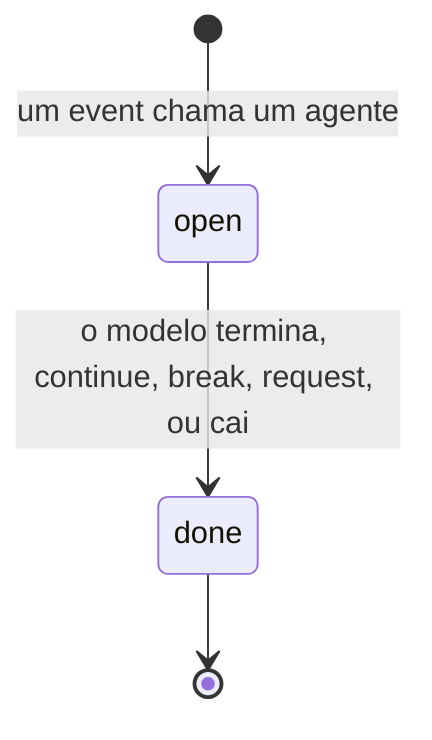
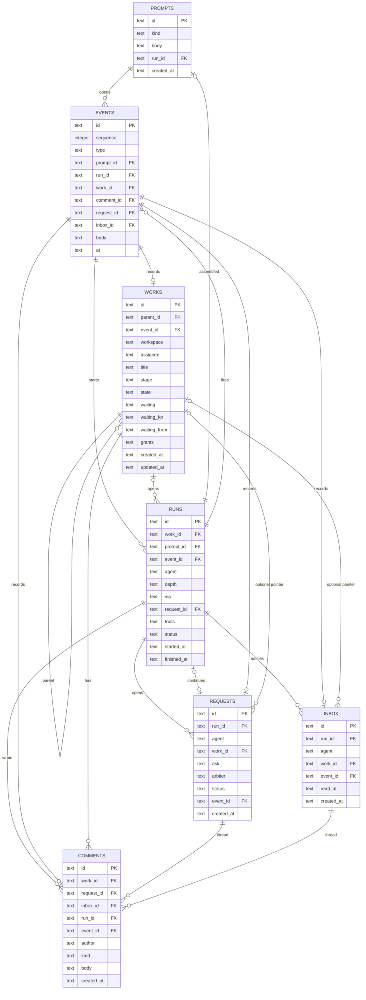

# Spec do harness

CLI-only. Substitui as premissas de `docs/to-be/`. Implementação: [roadmap.md](roadmap.md). Etapas: [steps/](steps/).

Vocabulário alinhado às tabelas. Uma palavra por coisa. Sem ticket, cartão, juntado, solicitação, aviso, teto, vale, plugin.

## 1. O que o harness é

Orquestra modelos, cumpre etapas, aplica permissão e segue o estado do **work**.

O harness emite **events**. Um event pode ter **hooks**. Um hook pode ser configurado para **chamar um agente**. Esse agente ganha uma **run** igual a qualquer outra.

O harness **não implementa** `read`, `send`, `inbox`, `request_access`, `delegate`, `break`, `continue` nem compactação. Isso é **tool**. O binário só despacha o `name`. O harness implementa o **contrato**, o **store** (tabelas + regras + **sequência** do workflow) e o ciclo: descobrir → autorizar → chamar → append `EVENTS` → se a action pedir, preparar a próxima run → hooks daquele `type`.

## 2. Premissas

1. Toda interação grava. A espinha é `EVENTS`.
2. Quem continua lê o **work** e o último **comment** — não o log.
3. Três textos distintos: **message** (`send`), texto do agente (TOML), **title** do work. Nenhum é o outro.
4. Prompt é tabela: a message e o que o modelo viu nesta run. A próxima run junta de novo; não reusa o prompt velho.
5. Event → hooks daquele event. Hook **reage** (encaminha, log). Quem **abre** a próxima run é a action (`continue`, `request`, `delegate`, `reply` grant, `send`) — não o hook.
6. Nenhum processo espera. O work espera filho, acesso ou a próxima etapa. A pessoa decide no **request**. A pessoa é avisada no **inbox**.
7. **Ceiling** novo: escreve o arquivo. Acesso agora: **grant** no work.
8. `REQUESTS` pede uma decisão. `INBOX` avisa, sem travar. Nenhum dos dois é o work.
9. Tool e hook falam o mesmo contrato. O schema que o modelo vê é da tool. O store que a tool chama é do harness.
10. A sequência do workflow (backlog → … → done) mora no TOML. Só a tool `continue` pede “próximo”. A tool não nomeia stage, agent nem model.
11. CLI é o mesmo contrato. `send`, `inbox`, `inbox_read`, `reply` são tools (`trigger = cli` e/ou `model`). Trocar o `send` = outra pasta. O núcleo não tem verbos de CLI.
12. Permissão **custom** é tool que **pede** (outro `ask.kind`, outro grant). Classificar have / askable / sealed / blocked é o store. A tool não decide o ceiling.

## 3. Ciclo

```text
event
    → hooks daquele event (reagem; não sequenciam)
    → se a action pedir run (send, continue, delegate, request, reply grant)
        → abrir run → start-run → agente da etapa / do ceiling → end-run
            → cada tool dispara um event
```

### 3.1 Três textos

| Peça | Quem escreve | Onde mora |
| --- | --- | --- |
| **message** | você | `PROMPTS` (`kind = message`) |
| **agent text** | quem edita o TOML | arquivo |
| **title** | quem criou o work | `WORKS.title` |
| **assembled** | o harness, na abertura da run | `PROMPTS` (`kind = assembled`) |
| **comment** | agente ou humano | `COMMENTS` |
| **request** | cabeçalho de um pedido de decisão | `REQUESTS` |
| **inbox** | cabeçalho de uma notificação | `INBOX` |

`send` não cria work. Não copia a message para o title. Se o modelo quiser que aquilo vire work, ele cria o work e escreve o title.

### 3.2 Prompt

Toda interação começa num prompt gravado. Duas espécies, mesma tabela:

- `message` — o que o `send` entregou
- `assembled` — o que o modelo viu nesta run

```text
pessoa (ou script) chama a tool send
    emit prompt → store: PROMPTS(message) + EVENTS(prompt) + primeira run
    hooks daquele event (reagem)
abrir run
    lê o arquivo agora
    intersecta os ceilings; soma grants do work e dos ancestrais
    junta e grava PROMPTS(assembled):
         agent text
         + message desta abertura, se houver
         + se há work: title + último comment
         + se há request: comments com esse `request_id`
         + se há inbox: comments com esse `inbox_id`
         + cards das tools (name + description curta) e que estão em `tools.*`
    grava RUNS, grava EVENTS(start-run)
    o modelo vê o assembled e chama via código no sandbox
cada tool
    uma chamada (simple) ou load → commit (composite)
    grava EVENTS(tool) — name, args, resultado
    persistir tabela: `emit` → store aplica a action
        se a action for continue / break / request / delegate / reply-grant:
            encerra esta run e, se couber, prepara a próxima
    hooks daquele `type`
terminar run
    grava EVENTS(end-run)
    status = done
```

A próxima run não lê o `assembled` velho. Junta de novo e grava outro. Sem `message` quando a abertura veio de `continue`, `delegate`, `request` ou `reply`.

### 3.3 Run



Sem work a run existe. Request ou inbox não exigem work. Inbox não termina a run. Hook não inventa outro tipo de run. `via` guarda o name do hook.

### 3.4 Work

```mermaid
stateDiagram-v2
    [*] --> open: tool work / delegate; stage = primeiro do TOML
    open --> waiting: break ou request (access | child)
    waiting --> open: reply grant ou filho done — mesmo stage
    open --> open: continue — próximo stage, nova run
    open --> done: continue no último stage
```



Quem continua o **work** lê o work e o último comment. Quem continua um **request** lê o request.

Workflow on: a sequência está no TOML (`backlog` → `in_progress` → `in_review` → `done`). Criar o work (ou a primeira run ligada a ele) **não** escolhe etapa — o harness grava o **primeiro** stage, atribui o agent daquela linha, remonta o ceiling, abre a run.

**continue** (tool) — emite “próximo”. Não manda o name do stage, nem agent, nem model. O harness encerra a run, valida a saída, grava o próximo stage, remonta ceiling + agent, abre a próxima run. Último stage → `state = done`, sem run nova.

**break** (tool) — emite “estaciona”. Não anda a sequência. `waiting` + comment; a run acaba. Volta ao mesmo stage quando a causa fecha e uma action abrir run de novo (`reply` grant, filho `done`).

**delegate** (tool) — emite filho. Pai `waiting = child`. O harness prepara a primeira run do filho (primeiro stage dele).

Workflow off: não há sequência. `continue` / `break` recusam ou o ceiling não as lista.

### 3.5 Request

O modelo não escreve um texto para o harness “adivinhar”. Ele chama a tool `request_access` (default do pacote) com schema. A tool emite `request`. **Todo pedido de decisão passa por `REQUESTS`** — outro agente ou pessoa. O comment é a prosa para quem decide. O store classifica o `name` no ceiling e aplica a action; o harness não implementa a tool.

```text
request_access (default)
    kind = tool | path | directory
    name = write | ./db.sqlite | ./secrets
    reason = texto
```

Outra tool pode emitir `request` com outro `ask.kind`. O store classifica `ask.name` nas listas do ceiling. Grant = aquele `name`. A tool não amplia ceiling sozinha.

```text
modelo chama request_access → emit request
store classifica o name nos ceilings desta run
    have        → não abre REQUESTS; output “já tem”
    blocked     → EVENTS(deny); a run termina
    askable e existe agente acima com autoridade
        → action request: REQUESTS (arbiter = esse agente, waiting_agent)
    sealed, ou askable sem de cima
        → action request: REQUESTS (arbiter = human, waiting_human)
grava ask, COMMENTS(reason), EVENTS(request)
work ligado → waiting = access
a run que pediu termina
action request prepara a run do arbiter (se agente)
quem decide (agente na run dele, ou pessoa)
    tool reply → action reply: grant | deny + comment
    EVENTS(reply)
    grant + work ligado → WORKS.grants ganha ask.name; waiting volta a open
    action reply grant prepara run no **mesmo** stage (não é continue)
```

Exemplo — worker pede `write` ao concierge:

```text
request_access kind=tool name=write reason="preciso gravar o relatório"
→ REQUESTS.ask = { kind = "tool", name = "write" }
→ REQUESTS.arbiter = concierge
→ COMMENTS.body = "preciso gravar o relatório"
→ concierge reply grant → WORKS.grants inclui "write"
```

Exemplo — pedir um directory à pessoa (sealed ou depth 0):

```text
request_access kind=directory name=./secrets reason="ler as chaves"
→ arbiter = human
→ ask = { kind = "directory", name = "./secrets" }
```

### 3.6 Inbox

Notificação ao humano. A run segue. O work não espera.

```text
modelo chama notify (default) → emit notify
store aplica: INBOX + COMMENTS (agente, `inbox_id`) + EVENTS(notify)
a run continua
humano (tools CLI)
    inbox lista INBOX sem `read_at`
    inbox_read marca `read_at`
    pode comentar no inbox (COMMENTS, `inbox_id`) — isso não vira request
```

Toda fala é `COMMENTS`. O alvo é `work_id`, `request_id` ou `inbox_id`. `work_id` em `REQUESTS` / `INBOX` é ponteiro, não dono.

## 4. Modelo de dados

O arquivo SQLite é o projeto. Toda interação passa por `EVENTS`. Work e comment são o que continua. O resto é registro e disco.

```text
PROMPTS → EVENTS → RUNS → COMMENTS → WORKS
                              ↘ REQUESTS
                              ↘ INBOX
```



### PROMPTS — registro

| Coluna | O que é |
| --- | --- |
| `id` | prompt |
| `kind` | `message` · `assembled` |
| `body` | texto |
| `run_id` | a run que viu o `assembled`; vazio na `message` até uma run nascer |
| `created_at` | |

### EVENTS — espinha

Uma linha por emissão. Hook lê daqui. Replay lê daqui. Nada se reconstrói daqui para continuar o work.

| Coluna | O que é |
| --- | --- |
| `id` | event |
| `sequence` | ordem total no projeto; o replay segue isto, não o relógio |
| `type` | `prompt` · `start-run` · `model` · `tool` · `end-run` · `comment` · `work` · `request` · `reply` · `notify` · `grant` · `deny` · `compact` · `continue` · `break` · … |
| `prompt_id` / `run_id` / `work_id` / `comment_id` / `request_id` / `inbox_id` | o que este event tocou |
| `body` | payload: texto do modelo, tool (name, args, resultado), etc. |
| `at` | quando |

Tool não tem tabela. Cada chamada é `type = tool`. Cada fala do modelo nesta run é `type = model`. Sem isso o replay perde o meio da run.

### Replay

Igual ao de hoje: ler o log, sem executar. Sem tabela extra.

Uma run completa:

```sql
SELECT body FROM PROMPTS WHERE id = :run.prompt_id;          -- assembled
SELECT * FROM EVENTS WHERE run_id = :run.id ORDER BY sequence;
```

A sequência mostra `start-run`, cada `model`, cada `tool`, `comment`, `end-run`. A `message` do `send` é o prompt `kind = message` ligado ao event `prompt` que abriu o ciclo.

Um work: `WHERE work_id = ? ORDER BY sequence`. Um request: `WHERE request_id = ?`. Um inbox: `WHERE inbox_id = ?`. O projeto inteiro: `ORDER BY sequence`.

### WORKS — work

O work. Próximo agente lê isto + o último comment.

| Coluna | O que é |
| --- | --- |
| `id` | work |
| `parent_id` | work pai; vazio = raiz. `grants` descem para filhos, não para irmãos |
| `event_id` | event que o criou |
| `workspace` | workspace deste work |
| `assignee` | agente que mexe agora |
| `title` | title — não é o `send` |
| `stage` | etapa do workflow; vazio se workflow off |
| `state` | `open` · `waiting` · `done` |
| `waiting` | vazio · `access` · `child` |
| `waiting_for` | o que falta (tool, path, …), se `waiting = access` |
| `waiting_from` | quem pediu |
| `grants` | grants temporários deste work (tool, path, …) |
| `created_at` / `updated_at` | |

Work não fala com o humano. Se o work precisa de um acesso, `waiting = access`; a decisão, se for da pessoa, é um request.

Montar permissão: config atual ∩ ceilings ∩ (`grants` deste work ∪ dos ancestrais).

### COMMENTS — comment

Toda fala do harness. O alvo é que muda.

| Coluna | O que é |
| --- | --- |
| `id` | comment |
| `work_id` | work |
| `request_id` | request |
| `inbox_id` | inbox |
| `run_id` | run que escreveu, se veio do modelo |
| `event_id` | event que o gravou |
| `author` | `agent` · `human` |
| `kind` | `note` |
| `body` | texto |
| `created_at` | |

Pelo menos um alvo. A prosa do pedido está no `body`. O que o harness aplica está em `REQUESTS.ask`.

### REQUESTS — request

Cabeçalho do request. `ask` é o schema, não uma coluna `tool`. A prosa está em `COMMENTS`.

| Coluna | O que é |
| --- | --- |
| `id` | request |
| `run_id` | run que abriu o fio |
| `agent` | quem pediu |
| `work_id` | opcional; aponta, não dono |
| `ask` | `{ kind, name }` — `tool` · `path` · `directory` |
| `arbiter` | name do agente, ou `human` |
| `status` | `waiting_human` · `waiting_agent` · `closed` |
| `event_id` | event que a abriu |
| `created_at` | |

### INBOX — inbox

Notificação. Não espera decisão. Não trava run nem work.

| Coluna | O que é |
| --- | --- |
| `id` | inbox |
| `run_id` | run que avisou |
| `agent` | quem avisou |
| `work_id` | opcional; aponta, não dono |
| `event_id` | event `notify` |
| `read_at` | vazio = não lido |
| `created_at` | |

### RUNS — run

| Coluna | O que é |
| --- | --- |
| `id` | run |
| `work_id` | work, se já existir |
| `prompt_id` | o `assembled` que o modelo viu |
| `event_id` | o `start-run` |
| `request_id` | request que esta run continua, se veio de um `reply` |
| `agent` | quem rodou |
| `depth` | depth |
| `via` | vazio, ou o hook que chamou este agente |
| `tools` | **effective** desta run |
| `status` | `open` · `done` |
| `started_at` / `finished_at` | |

### Onde mora

| Isto | Onde |
| --- | --- |
| Inbox | `INBOX` — não lido: `read_at` vazio |
| Fala num inbox | `COMMENTS` com `inbox_id` |
| Request | `REQUESTS` — à pessoa: `waiting_human`; ao agente: `waiting_agent` |
| Fala num request | `COMMENTS` com `request_id` |
| O que se pede (máquina) | `REQUESTS.ask` + `EVENTS(request).body` |
| Por que se pede (pessoa) | `COMMENTS.body` do request |
| Work apontado | `REQUESTS.work_id` ou `INBOX.work_id` — opcional |
| Tools habilitadas nesta run | `RUNS.tools` — snapshot do **effective** na abertura |
| Tools que o modelo chamou | `EVENTS` `type = tool` |
| Tools askable / sealed nesta run | `EVENTS` `start-run` `body` (askable, sealed). Sem coluna extra |
| Ceiling do arquivo | TOML |
| Grant temporário | `WORKS.grants` (+ ancestrais na hora de abrir) |
| Message do `send` | `PROMPTS` `kind = message` |
| O que o modelo viu | `PROMPTS` `kind = assembled` (`RUNS.prompt_id`) |
| Agent text | TOML |
| Fala no work | `COMMENTS` com `work_id` |
| Title do work | `WORKS.title` |
| Quem mexe agora | `WORKS.assignee` |
| Stage do workflow | `WORKS.stage` — a sequência está no TOML; só `continue` pede próximo |
| Por que o work espera | `waiting` + `waiting_for` + `waiting_from` |
| Hook | pasta (`kind = hook`); reage ao event. Não sequencia. `RUNS.via` = tool cuja action abriu a run |
| Fala do modelo no meio da run | `EVENTS` `type = model` |
| Replay | `EVENTS` `ORDER BY sequence`, mais o `assembled` |
| Lista de tools no assembled | card: `name` + `description` curta. Schema e dado pesado não entram aqui |
| Recorte que a tool lê | função do store (`view`) — comments do work, events da run, … |
| Persistência que a tool pede | action do store (`emit`) — o harness aplica a regra |

### O que não tem tabela

Config, workflow, agente, ceiling, quais hooks/agentes ligar: arquivo TOML.

Implementação de tool e hook: pasta. Cada chamada de tool é `EVENTS` `type = tool`. Sem tabela `TOOLS`. Sem archive.

Sem `PROJECTS`, `WORK_ITEM_DEPENDENCIES`, `PROJECTION_CURSORS`, `SESSION_WORKSPACES`. Sem checkpoint, versão, claim, tools pinadas de run velha.

## 5. Permissões

Não é RBAC de papéis. São **camadas de ceiling**; o **effective** é a **interseção**.
Uma camada de config nunca amplia outra.

Antes de **cada** run o harness lê o arquivo **agora** e o work **agora**. Não reusa `RUNS.tools` da run anterior.

```text
ceiling = workspace ∩ depth ∩ stage(work.stage) ∩ agente
effective = (ceiling ∪ grants deste work ∪ grants dos ancestrais) − deny de qualquer camada
grava RUNS.tools = effective
```

O stage entra porque está no work (`WORKS.stage`). O TOML diz o ceiling daquele stage. `continue` grava o próximo stage; a run que o harness preparar depois do emit já vê o ceiling novo — tools a mais ou a menos — sem ninguém editar `grants`.

### Três modos

Cada camada (`workspace`, `depth`, stage, agente) tem um `mode`. O que não foi citado cai num saco só.

| `mode` | Nome | O que não foi citado |
| --- | --- | --- |
| `allowlist` | só o listado | blocked. Alias: `deny` |
| `blocklist` | catálogo menos as listas | have (já pode usar). Alias: `allow` |
| `auto` | negociável entre agentes | askable — o de cima decide, **via `REQUESTS`** |

Listas, em qualquer modo:

| Lista | Destino |
| --- | --- |
| `granted` / `tools` | have — já pode usar |
| `negotiable` | askable — outro agente |
| `human` | sealed — só a pessoa, via `REQUESTS` |
| `deny` | blocked — ninguém |

Precedência no effective: `deny` > `human` > `negotiable` > `granted`. Uma camada `human` vence `auto` das outras.

Quem atende um `emit` `request` (a tool default é `request_access`) — sempre `REQUESTS`, se for pedido:

```text
blocked     → deny; não abre
have        → já tem; não abre
askable + agente acima com autoridade (have ∪ askable dele)
            → REQUESTS arbiter = esse agente
askable sem de cima, ou sealed
            → REQUESTS arbiter = human
```

`auto` só muda o saco do não-citado para askable. Não pula `REQUESTS`. Não grava grant sozinho.

`[policy] mode = "auto"` é o padrão do projeto: tudo que não for `deny`/`human` vira pedido ao agente acima. Uma camada pode apertar. Depth 0 não tem de cima: o pedido vai à pessoa.

```toml
[policy]
mode = "auto"

[workspaces.app]
deny = ["delete"]
human = ["deploy"]

[policy.depth.1]
mode = "allowlist"
granted = ["counter"]
negotiable = ["write"]
```

### Onde a aprovação mora

Grant (agente acima ou pessoa) grava três coisas no **work**, não na run:

1. `WORKS.grants` ganha `ask.name` (`write`, `./secrets`, …)
2. `EVENTS` `grant`
3. `COMMENTS` no fio do request

A run velha não ganha a tool. `reply` grant prepara uma run **no mesmo stage**; essa run remonta e soma o grant.

### Temporária e permanente

O `reply` escolhe o modo.

**Temporária** — default. `ask.name` entra só em `WORKS.grants` daquele `work_id`. Sem work ligado, não grava grant em work nenhum. O TOML não muda. A próxima run **deste** work (e filhos, na hora de montar) vê o grant. Os outros works não leem essa linha.

**Permanente** — escreve o arquivo na camada que a pessoa indicar (agente, depth, stage ou workspace). Não grava em `grants`. Toda run seguinte que cair nessa camada ganha o acesso, em qualquer work. Por isso permanente não é “grant neste work”: é ceiling novo.

O harness não copia `grants` para o filho quando o filho nasce. Na abertura da run ele **sobe** `parent_id`:

```text
grants(W) = W.grants ∪ grants(W.parent) se houver pai
```

Não anda para irmão, não anda para primo, não lê outro `work_id`. `RUNS.tools` é snapshot daquela run; a run de outro work remonta do work dele.

`deny` de qualquer camada ainda corta. Grant de `counter` não fura stage `review` que lista `deny = ["counter"]`. Grant de `delete` não fura workspace que `deny = ["delete"]`.

Pedido blocked: não abre request, não grava grant.

### Stage e grant no mesmo work

```toml
[workspaces.app]
mode = "allow"
deny = ["delete"]

[agents.worker]
tools = ["counter"]
negotiable = ["write"]
human = ["delete"]

[workflows.delivery]
steps = [
  { name = "to_do", agent = "worker", granted = ["counter"], negotiable = ["write"] },
  { name = "review", agent = "reviewer", deny = ["counter", "write"] }
]
```

| Momento | stage | grants | effective |
| --- | --- | --- | --- |
| Run 1 | `to_do` | `[]` | `counter` |
| pede `write`, pessoa concede | `to_do` | `["write"]` | — |
| Run 2 | `to_do` | `["write"]` | `counter`, `write` |
| agent chama `continue` | `review` | `["write"]` | nem `counter` nem `write` — o stage corta |

O grant continua no work. O stage é que some do effective. `continue` não escolhe `review` — o TOML é que manda. Voltou a `to_do` (se a sequência permitir), `write` reaparece sem novo grant.

Pedido a outro agente: mesmo grant no work, se o de cima tiver autoridade.
Inbox sem request: `INBOX`, não mexe em ceiling nem em `grants`.

## 6. Matriz

Três eixos. Cada célula é um cenário. Não misturar workspace, grant, etc. aqui.

Tarefa de referência: message `conte até 5`.

| Eixo | Valores | O que muda |
| --- | --- | --- |
| Depth | `0` / `1` / `2` | Quantos andares. Fundo executa; cima gerencia. Configurável. |
| Hook | `off` / `on` | Off: sem agente extra no event. On: hook **reage** (pode chamar um agente; essa run é igual a qualquer outra). Hook não sequencia nem abre a próxima run — isso é a action. |
| Workflow | `off` / `on` | Off: sem sequência; `continue` / `break` recusam ou o ceiling não as lista. On: TOML `backlog` → … → `done`; só `continue` pede “próximo”. |

| ID | Depth | Hook | Workflow |
| --- | --- | --- | --- |
| D0-H0-W0 | 0 | off | off |
| D0-H1-W0 | 0 | on | off |
| D0-H0-W1 | 0 | off | on |
| D0-H1-W1 | 0 | on | on |
| D1-H0-W0 | 1 | off | off |
| D1-H1-W0 | 1 | on | off |
| D1-H0-W1 | 1 | off | on |
| D1-H1-W1 | 1 | on | on |
| D2-H0-W0 | 2 | off | off |
| D2-H1-W0 | 2 | on | off |
| D2-H0-W1 | 2 | off | on |
| D2-H1-W1 | 2 | on | on |

Ordem: os quatro de D0, depois D1, depois D2. Primeiro `D0-H0-W0`.

## 7. Superfície

O binário despacha um `name` para o mesmo contrato da §8. Gatilho `cli` ou `model` — a tool não distingue o store.

`send` → action `prompt`. `inbox` / `inbox_read` → recorte ou `read_at`. `reply` → action `reply` (pessoa ou concierge). Pedidos de decisão são `REQUESTS`. Trocar qualquer um desses = outra pasta no mesmo `name`.

## 8. Harness e tools

Dois lados. Um contrato.

| | Harness | Tool (e hook) |
| --- | --- | --- |
| Quem | o núcleo | pasta no disco |
| Faz | descobrir, autorizar, chamar o contrato, append `EVENTS`, hooks daquele `type`, montar `assembled`, remount do ceiling, **store** | o trabalho: ler arquivo, request, resumir comments, inbox, … |
| Schema do modelo | não define | `parameters` / `description` / tags — o que a tool quiser |
| Tabelas | dono. Funções e actions com regra | só chama o que o store publicou |
| Trocar | não, para caber outra `edit` | outra pasta no mesmo `name` ou outro `name` |

O pacote default **traz** tools e hooks (`read`, `send`, `inbox`, `request_access`, `delegate`, `continue`, `break`, `tool_search`, `on-request`, …). Continuam tools. Substituir uma pasta não abre o núcleo.

### 8.1 Contrato

Igual para simple, composite, default e terceira.

```text
in:  { name, args, view, run_id, work_id, workspace, roots }
out: { ok, output, emit }
```

`view` — recorte que o harness **já resolveu** (funções do store) antes de spawn. A tool não consulta tabela. O manifesto lista o que essa call pode pedir (`views = ["comments"]`, ou o `load` aponta o recorte). Sem declaração, `view` vem vazio.

`output` — o modelo lê nesta chamada. Não é `PROMPTS.assembled`.
`emit` — actions do store. Fora do catálogo ou fora do schema = a tool falhou; nada grava.

```json
{
  "ok": true,
  "output": "texto para o modelo",
  "emit": [{ "type": "request", "body": { "kind": "tool", "name": "write" } }]
}
```

Dois contratos, não um:

1. **Modelo ↔ tool** — manifesto da tool (`description`, `parameters`, se pede ids, se só manda o resumo). O harness não padroniza.
2. **Tool ↔ store** — funções entram em `in.view`; actions saem em `emit`. O harness publica as duas. A tool mapeia os args dela.

Tool não abre SQLite. Não escreve `PROMPTS`. Não inventa coluna.

Tool e hook são o **mesmo formato**. O modelo chama a tool; o event chama o hook.

### 8.2 Simple e composite

Não são dois núcleos. É o mesmo `in`/`out`. Muda quantas idas o modelo faz.

**simple** — uma chamada. Os args já bastam. Roda, `output`, às vezes `emit`. `read`, `edit`, `tool_search`, `request_access` com o `ask` na mão.

**composite** — a mesma tool, duas chamadas.

```text
modelo → tool({ "op": "load" })    → output: recorte (+ schema, se ainda não foi)
modelo → tool({ "op": "commit", … }) → emit / persist
```

`load` e `commit` são convenção da tool (`op` ou o que o schema dela definir). O harness vê duas calls do mesmo `name`.

Exemplo — reconstruir a linha de comments de um work (o modelo resume; a tool só I/O):

```text
load    → harness põe comments em in.view → output = esse recorte
modelo  → lê, tira ruído, escreve o resumo
commit  → emit compact → store: comment-resumo + apaga os outros daquele work
          EVENTS(tool) + EVENTS(compact)
```

O próximo assemble lê o resumo (último comment). `EVENTS` não apaga: o replay vê o que saiu da linha do work.

Duas tools de compactação podem ter schemas diferentes (`summary` só, ou `summary` + ids). As duas chamam as mesmas actions. O harness não sabe o que é “último atualizado”.

### 8.3 Store

O store é o harness. Metadado + operação, não SQL. Lookup amarrado, delete com regra, action bound em vez de dois CRUDs soltos.

**Funções** (leitura → o harness põe em `in.view` antes do `run`; a tool formata `output`):

| Função | Recorte |
| --- | --- |
| comments do work | `COMMENTS` daquele `work_id` |
| comments do request | daquele `request_id` |
| comments do inbox | daquele `inbox_id` |
| events da run | `EVENTS` daquele `run_id` |
| work | aquele `WORKS` |

**Actions** (escrita → `emit`; o harness aplica o lote ou recusa):

| Action | Efeito | Amarra |
| --- | --- | --- |
| `comment` | cria `COMMENTS` + `EVENTS(comment)` | pelo menos um alvo; o alvo existe |
| `request` | cria `REQUESTS` + comment + `EVENTS(request)`; work ligado → `waiting = access`; encerra a run; se arbiter é agente, **prepara a run dele** | `ask` no schema; have não abre; blocked → `deny` e a run termina |
| `notify` | cria `INBOX` + comment + `EVENTS(notify)` | não trava run nem work |
| `prompt` | `PROMPTS(message)` + `EVENTS(prompt)` + primeira run | tool `send` |
| `inbox.read` | marca `INBOX.read_at` | tool `inbox_read` |
| `reply` | comment + `grant`/`deny` + `EVENTS(reply)`; grant + work → `WORKS.grants`, `waiting` open, **run no mesmo stage** | fio daquele request |
| `work` | cria / atualiza work + `EVENTS(work)`; se stage vazio e workflow on → primeiro stage | |
| `delegate` | cria work filho + comment; pai `waiting = child`; **primeira run do filho** (primeiro stage) | parent existe |
| `continue` | `EVENTS(continue)`; encerra a run; próximo stage do TOML; remount; **próxima run**. Último stage → `done` | workflow on; tool não manda stage/agent/model |
| `break` | `EVENTS(break)`; `waiting`; encerra a run; **não** anda a sequência | |
| `compact` | cria o resumo (comment) e apaga os comments que a action aceitar + `EVENTS(compact)` | só linhas daquele alvo; lote único |
| `comment.delete` | apaga `COMMENTS` daquele alvo | não apaga `EVENTS` |

Regras que o CRUD livre quebraria — o store recusa:

| Peça | Regra |
| --- | --- |
| `EVENTS` | só append. `sequence` o harness preenche. Sem PATCH, sem DELETE |
| `RUNS.tools`, `created_at`, `prompt_id` | coluna de sistema |
| `REQUESTS.ask` | imutável depois do create |
| `COMMENTS` | pelo menos um alvo existente |
| apagar work com run / comments | Restrict (ou sem delete) |
| `compact` / `comment.delete` | só o alvo da action |

Coluna que a action não publicou não se escreve.

### 8.4 Catálogo, lista e busca

Abertura da run: varre de novo pastas **e** adaptadores (MCP, §8.7).

```text
<builtin>/tools/          # default — o harness sozinho
~/.omunculus/tools/       # a pessoa
<projeto>/tools/          # o repo
lista de servidores MCP   # adaptador: cada tool vira name
```

O mais específico ganha no mesmo `name`. Name no ceiling que não está no disco (nem no adaptador) = blocked. Tool blocked não entra na lista nem na busca.

No `assembled` o modelo vê **cards**, não o schema inteiro e não o histórico:

```text
name + description (≤3 linhas) [+ tags]
```

Dado pesado (comments, events) não se injeta na description. Isso é `output` do `load`.

`tool_search` é tool **simple** do pacote. Pesquisa `name`, `description` e `tags` no catálogo **já autorizado** desta run.

```json
{ "q": "limpar histórico", "tags": ["compact"] }
```

Devolve cards. Sem schema, sem persistir, sem furar ceiling. Sem query, o assembled pode trazer só um subconjunto (tools fixas + `tool_search`). Trocar o algoritmo da busca (exato, fuzzy) é outra implementação da mesma tool.

### 8.5 Formato no disco

```text
tools/read/tool.toml
tools/read/run
tools/continue/tool.toml
tools/break/tool.toml
tools/delegate/tool.toml
tools/request_access/tool.toml
tools/send/tool.toml
tools/inbox/tool.toml
tools/on-request/hook.toml
```

```toml
# simple
name = "read"
kind = "tool"
shape = "simple"
triggers = ["model"]
description = "Lê um arquivo."
tags = ["fs", "read"]
groups = ["fs.read"]
command = ["./run"]

[parameters]
type = "object"
required = ["path"]
```

```toml
# composite
name = "compact_comments"
kind = "tool"
shape = "composite"
description = "Resume comments do work e regrava a linha."
tags = ["comments", "compact", "work"]
views = ["comments"]
command = ["./run"]
```

```toml
# CLI — mesmo contrato; o binário despacha o name
name = "send"
kind = "tool"
shape = "simple"
triggers = ["cli"]
description = "Entrega a message e abre a primeira run."
command = ["./run"]
```

```toml
# hook — mesmo formato; o gatilho é o event
name = "on-request"
kind = "hook"
events = ["request"]
command = ["./run"]
```

`shape` só informa o card e a tool. `triggers = ["model"]` | `["cli"]` | os dois. Só `cli` não entra no `assembled`; o binário ainda chama o contrato. O ciclo do harness é o mesmo. `omunculus send "…"` acha a tool `send`.

Escrever uma tool: pasta + `tool.toml` + `run`. O `run` é um programa na linguagem que couber (Python, JS, bash, Elixir, …). Lê o JSON de `in` no stdin, imprime o JSON de `out` no stdout. Sem SQL. Sem escrever `PROMPTS`. Copia a pasta para `~/.omunculus/tools/` ou `<projeto>/tools/`. A próxima run varre e já vê. Default do pacote pode ser módulo Elixir se devolver o mesmo `out`. Hook: `hook.toml` + `run`, mesmo contrato.

`continue` emite “próximo”. `break` emite “estaciona”. `delegate` emite o filho. Nenhuma delas escolhe agent ou model — o store aplica a sequência e, se a action pedir, prepara a run (`via` = name da tool).

`request_access` emite `request`. O store grava as linhas **e** abre a run do arbiter se for agente. O hook `on-request` só **reage** (encaminhar, log). Não abre run. `notify` / `on-notify` iguais. Trocar o que o modelo chama: outra pasta. Encaminhar a um terceiro: outro hook no mesmo `type`.

### 8.6 Como o modelo chama

O modelo executa código. O harness expõe o catálogo autorizado desta run como API no sandbox (uma linguagem, fixa no núcleo):

```js
await tools.read({ path: "x" })
const raw = await tools.compact_comments({ op: "load" })
await tools.compact_comments({ op: "commit", summary: "..." })
```

Cada `tools.<name>(args)` é uma ida ao contrato. Simple = uma call. Composite = `load` depois `commit`. `tool_search` devolve cards; o código chama o `name` que quiser.

O assembled manda os cards + “as tools estão em `tools.*`”. Schema e dado pesado vêm no `output` do `load`. Veio de `tool_calls` ou de uma linha no sandbox — o harness vê `{ name, args }`. A tool não distingue. O código do modelo não abre o store.

### 8.7 Ciclo

```text
abrir run
    varre tools/ + adaptadores → intersecta ceiling → cards + tools.* no assembled
modelo (código no sandbox)
    (opcional) tool_search
    tool simple      → uma call → output [+ emit]
    tool composite   → load (in.view) → output → commit → emit
harness
    cada call: hidrata view se o manifesto pediu → spawn → EVENTS(tool)
    cada emit: valida store → aplica action → EVENTS(type)
              se a action pedir: end-run desta + abrir a próxima (agent/ceiling do TOML)
              hooks daquele type (não sequenciam)
```

### 8.7 MCP

Adaptador de descoberta. Não é tipo novo. Não é pasta por tool do servidor.

Lista de servidores (TOML no projeto ou `~/.omunculus/`):

```toml
[[mcp.servers]]
name = "github"
command = ["npx", "-y", "@modelcontextprotocol/server-github"]
```

Abertura da run: o adaptador pergunta `tools/list` a cada servidor. Cada tool vira um `name` no catálogo (`description` + `parameters` do servidor). O ciclo é o mesmo: classifica no ceiling → contrato → `EVENTS` → `emit`.

```text
in  → tools/call do MCP
out → { ok, output, emit }
```

O modelo chama `tools.<name>(args)` como chama `read`. Sem SQLite, sem `PROMPTS`, sem coluna.

Ligar o servidor **não** amplia o effective. Name no ceiling que o servidor não expôs = blocked. Pedir = `request` com aquele `name`. Outro `ask.kind` = premissa 12.

Não existe tool `mcp` com `{ server, tool, args }`. Um name só fura o ceiling.

Resource do MCP ≠ `view`. É outra tool que lê e devolve `output`. Prompt do servidor ≠ `assembled`. O harness não monta run com isso.

O processo do servidor é da pessoa (daemon) ou vive só nesta run. O harness não espera o MCP. A run acaba; o work espera se alguma action pediu.

## 9. Inventário inicial

Pacote default. Preset (`codex-like`, `pi-like`) troca pasta e TOML, não inventa tipo.

### 9.1 Agents

`human` não é agent. É `arbiter`.

| Agent | Depth | Ceiling (grupos / tools) |
| --- | --- | --- |
| `concierge` | 0 | `store`, `catalog`, `fs.read`, `delegate`, `continue`, `break`, `reply` |
| `worker` | 1 | `fs.read`, `fs.write`, `comment`, `request_access`, `notify`, `continue`, `break` |
| `reviewer` | 1 | só com workflow; `fs.read`, `comment`, `notify`, `continue`, `break` |

Mínimo: `concierge` sozinho (depth 0 faz tudo). Sem `worker` não há filho. `reviewer` só com workflow on. Sem `summarizer` — compactar é tool.

### 9.2 Tools — disco

Grupo `fs.read` / `fs.write`. Todas **simple**.

| Tool | Grupo | Action / efeito |
| --- | --- | --- |
| `read` | `fs.read` | lê arquivo |
| `ls` | `fs.read` | lista dir |
| `grep` | `fs.read` | busca texto |
| `find` | `fs.read` | busca path |
| `write` | `fs.write` | cria / sobrescreve |
| `edit` | `fs.write` | patch |

### 9.3 Tools — store e sequência

| Tool | Shape | Action | Quem |
| --- | --- | --- | --- |
| `comment` | simple | `comment` | todos |
| `work` | simple | `work` | concierge |
| `delegate` | simple | `delegate` | concierge |
| `continue` | simple | `continue` | agent da etapa (workflow on) |
| `break` | simple | `break` | quem precisa estacionar |
| `request_access` | simple | `request` | quem precisa de ceiling |
| `reply` | simple | `reply` | concierge e CLI (`triggers` os dois) |
| `notify` | simple | `notify` | todos |
| `send` | simple | `prompt` | CLI |
| `inbox` | simple | função: lista `INBOX` | CLI |
| `inbox_read` | simple | `inbox.read` | CLI |
| `compact_comments` | composite | `compact` | v1.1 |
| `tool_search` | simple | — (só `output`) | todos com `catalog` |

`request_work` de hoje **não entra**. Vira `work`.

### 9.4 Tools — bateria e workspace

| Tool | Grupo | Quando |
| --- | --- | --- |
| `counter` | `bench` | cenário `conte até 5` |
| `counter_decrement` | `bench` | idem |
| `directory` | — | v1.1 se houver muitos roots |
| `workspaces` | — | v1.1 se houver mais de um workspace |
| `bash` | — | **não** no default. Preset `codex-like` |

### 9.5 Grupos

```text
fs.read   = read, ls, grep, find
fs.write  = write, edit
store     = comment, work, request_access, reply, notify
sequence  = delegate, continue, break
catalog   = tool_search
cli       = send, inbox, inbox_read
bench     = counter, counter_decrement
```

`compact_comments` fora de grupo até entrar no ceiling.

### 9.6 Hooks

Reagem. Não abrem run.

| Hook | Event |
| --- | --- |
| `on-request` | `request` |
| `on-notify` | `notify` |
| `on-continue` | `continue` |
| `on-break` | `break` |

Default pode ser no-op. Preset encaminha.

### 9.7 Não é tool

| Peça | Onde |
| --- | --- |
| Classificar have / askable / sealed / blocked | store |
| Sequência do workflow, remount, preparar run | harness (depois do `emit`) |
| `assembled` | harness |
| O binário que despacha o `name` | harness |
| MCP | descoberta: `tools/list` → names no catálogo |
| Resource / prompt do MCP | tool que lê, ou ignora — não é `view` / `assembled` |

Permissão custom: outra tool (outro `ask.kind`). O store classifica. A tool não amplia ceiling sozinha. Ligar um servidor MCP também não.

### 9.8 Fatias

**v1:** agents `concierge` + `worker`. Tools: disco + `comment` `work` `delegate` `continue` `break` `request_access` `reply` `notify` `tool_search` + CLI `send` `inbox` `inbox_read`. Hooks da §9.6 (mesmo vazios).

**v1 bateria:** + `counter` `counter_decrement`.

**v1.1:** `compact_comments`, `reviewer`, `directory`, `workspaces`.

**Preset:** `bash` e prompts/ceiling Codex ou Pi. Mesmas actions.

**Não v1:** MCP. Adaptador quando houver lista de servidores.
