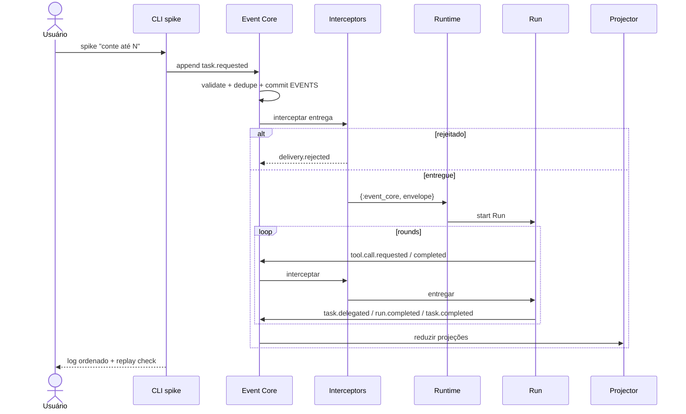

Status: AS-IS — implementado

# Arquitetura atual

Este documento descreve somente o que o código, `omunculus.usage.kdl` e os testes
implementam na branch `spike/event-core`. O índice de decisões planejadas está em
[TO-BE](../to-be/architecture.md).

## Limites

Omunculus é um harness de coding agent em Elixir/BEAM. A superfície pública é a
CLI. Dois caminhos coexistem:

- **`run`**: loop original em memória (`Omunculus.Agent`). Recebe diretório e
  instrução, carrega TOML, chama chat compatível com OpenAI e executa tools de
  filesystem na raiz. Não persiste estado entre invocações.
- **`spike`**: caminho Event Core para a tarefa `conte até N`. Comandos e
  eventos passam por SQLite/WAL, projeções e Runtime com Runs duráveis.

Não executa shell, não cria commits e não oferece API pública HTTP, MCP ou TUI.

## Componentes

- **CLI/parser**: derivado de `omunculus.usage.kdl`. Comandos: `run`,
  `monkey-job`, `benchmark`, `spike`, `events`, `emit`, `config`, `help`,
  `version`. Flags vencem ambiente, que vence configuração, que vence defaults.
- **Config**: lê `~/.omunculus/config.toml` e `<diretório>/omunculus.toml`.
  `--config` sobrescreve o arquivo do projeto (não concatena TOML). Parseia
  `[agents]`, `[teams]`, `[workspaces]`, `[profiles]`/`[presets]`, `[policy.depth]`,
  `[session]`, `[[interceptors]]`, `[[automations]]`. `config check` expande
  bandas de policy e valida módulos de interceptor que existem. `--profile` é
  alias de `--preset`.
- **Event Core** (`Omunculus.EventCore` + `Store`): autoridade local. Valida no
  catálogo `Omunculus.Events`, deduplica por `event_id` e `idempotency_key`,
  faz append+commit em `EVENTS` e só então notifica assinantes
  `{:event_core, envelope}`.
- **Interceptors**: após commit, antes da entrega. Implementados: `Audit`,
  `DepthGate`, `ToolGate`. Rejeição gera `delivery.rejected` com `causation_id`
  no envelope bloqueado; o envelope permanece no log.
- **Automations**: consumidores assíncronos após entrega; cursor em
  `PROJECTION_CURSORS` como `automation:<name>`; sem veto.
- **Projector**: reduz `EVENTS` em `WORK_ITEMS`, `ARCHIVE_RUNS`,
  `ARCHIVE_MODEL_CALLS`, `WORK_ITEM_DEPENDENCIES`, `PROJECTION_CURSORS`. Replay
  reconstrói snapshots idênticos; redelivery do mesmo `event_id` é no-op.
- **Runtime + Run**: `task.requested`/`task.delegated`/`task.resumed` ativam
  Runs. Pedir é concluir: `delegate` grava `task.delegated`, fecha com
  `run.completed` `outcome=waiting` (awaiting + checkpoint), o processo morre.
  `task.completed` do filho abre novo Run `reason=continuation`. Crash →
  `run.failed`; `task.resumed` → `reason=retry`. `pending_continuations` é
  in-memory (não reconstruído no boot).
- **Policy** (`Omunculus.Policy`): normaliza allow/deny em
  granted/negotiable/human/forbidden; agrupa `fs.read`/`fs.write`; tabela
  profile×depth×workspace; hash. `Runtime.start_run` recarrega config, grava
  `policy.loaded` quando o hash muda. `Policy.line` é o conjunto efetivo em cada
  depth (sem interseção com o pai). `run.started.tools` fixa o granted; `--tools`
  no spike restringe. `ToolGate` lê `run.started` via conexão do Store.
- **Agent (legado)**: loop síncrono em memória para `run`/`monkey-job`.
- **SpikeAgents**: `Chat.Fake.for_node` escolhe concierge (depth &lt; max_depth,
  tool `delegate`) ou worker (depth = max_depth, tool `counter`) — não usa
  `[agents]` nem `[session].roles`.
- **Runner/Sandbox, Chat, Tools, Reporter**: inalterados no caminho `run`.

## Fluxo Event Core (`spike`)

O benchmark (`actor-density`, `agent-tree`, `http-load`) permanece diagnóstico do
runtime e não cria persistência durável.

## Ausências verificadas

- **Times**: `[teams]` é parseado e `config check` valida lead/members, mas o
  Runtime não roteia por time; `delegate` não recebe team/agent; `SpikeAgents`
  decide o agente; módulo `TeamGate` não existe; `run.started` não fixa team.
- **Sessão e workspaces como agregados**: sem `session.created` /
  `workspace.attached` / inbox; `session_id`/`workspace_id` reservados no envelope
  (geralmente nil); sem sqlite de sessão padrão; `run <dir>` continua o loop
  efêmero, não atalho de sessão.
- **Permissões com efeito**: schema `request_permission` apenas; sem
  `permission.requested|granted|denied|revoked`, inbox `COMMENTS` ou grants
  temporários/permanentes.
- **request_work / interação entre linhagens**: tool inexistente; sem LCA; sem
  `WORK_ITEM_DEPENDENCIES` cross-team (só pai-depende-de-filho via delegate).
- **WorkspaceGate**; tool `directory`; tool `workspaces` retornando times.
- **Runtime residente observando `emit` em tempo real**: `events follow` faz poll.

O modelo de dados está em [data-model.md](data-model.md); requisitos observáveis
em [requirements.md](requirements.md).
