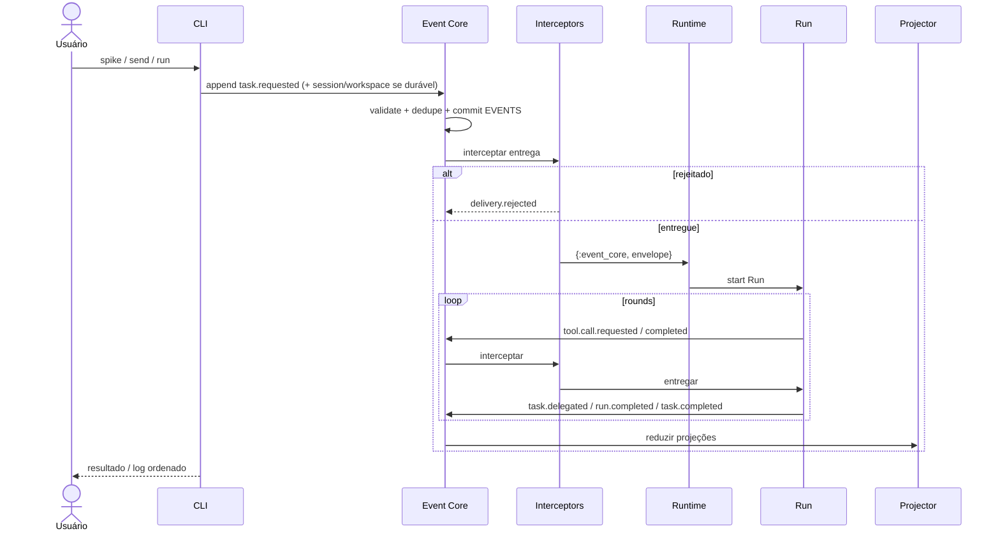

Status: AS-IS — implementado

# Arquitetura atual

Este documento descreve somente o que o código, `omunculus.usage.kdl` e os testes
implementam na branch `spike/event-core`. O índice de decisões planejadas está em
[TO-BE](../to-be/architecture.md).

## Limites

Omunculus é um harness de coding agent em Elixir/BEAM. A superfície pública é a
CLI. Três caminhos de execução coexistem:

- **`run`**: Event Core efêmero (`Omunculus.CLI.Session.ephemeral_run`). Abre
  SQLite temporário, grava `session.created` + `workspace.attached`, inicia
  Runtime/Projector, envia `task.requested` e espera `task.completed`. O arquivo
  é removido ao terminar; não persiste entre invocações.
- **`send` / `session` / `workspace`**: Event Core durável no SQLite padrão
  `~/.omunculus/session.sqlite3` (ou `--db` / `--session` / `OMUNCULUS_SESSION`).
- **`spike`**: caminho Event Core de referência para a tarefa `conte até N`.
- **`monkey-job`**: loop legado em memória (`Omunculus.Agent` via `Runner`).

Não executa shell, não cria commits e não oferece API pública HTTP, MCP ou TUI.

## Componentes

- **CLI/parser**: derivado de `omunculus.usage.kdl`. Comandos: `run`,
  `monkey-job`, `benchmark`, `spike`, `events`, `emit`, `config`, `session`,
  `workspace`, `send`, `help`, `version`. Flags vencem ambiente, que vence
  configuração, que vence defaults. `--session` e `OMUNCULUS_SESSION` selecionam o
  arquivo SQLite da sessão; `--db` é alias explícito com precedência.
- **Config**: lê `~/.omunculus/config.toml` e `<diretório>/omunculus.toml`.
  `--config` sobrescreve o arquivo do projeto (não concatena TOML). Parseia
  `[agents]`, `[teams]`, `[workspaces]`, `[profiles]`/`[presets]`, `[policy.depth]`,
  `[session]`, `[[interceptors]]`, `[[automations]]`. `config check` expande
  bandas de policy e valida módulos de interceptor que existem. `--profile` é
  alias de `--preset`.
- **Event Core** (`Omunculus.EventCore` + `Store`): autoridade local. Valida no
  catálogo `Omunculus.Events`, deduplica por `event_id` e `idempotency_key`,
  faz append+commit em `EVENTS` e só então notifica assinantes
  `{:event_core, envelope}`. Interceptors com `workspaces: [...]` não vazio só
  avaliam envelopes cujo `workspace_id` está na lista.
- **Interceptors**: após commit, antes da entrega. Implementados: `Audit`,
  `DepthGate`, `TeamGate`, `ToolGate`, `WorkspaceGate`. Rejeição gera
  `delivery.rejected` com `causation_id` no envelope bloqueado; o envelope
  permanece no log. `WorkspaceGate` bloqueia `task.requested` e
  `task.delegated` quando o workspace do payload não está em `SESSION_WORKSPACES`
  (attached) ou está em `deny_targets`; lê `SESSION_WORKSPACES` via
  `options[:conn]` quando disponível. `send` injeta `WorkspaceGate` quando há
  workspaces anexados.
- **Automations**: consumidores assíncronos após entrega; cursor em
  `PROJECTION_CURSORS` como `automation:<name>`; sem veto.
- **Projector**: reduz `EVENTS` em `WORK_ITEMS`, `SESSION_WORKSPACES`,
  `ARCHIVE_RUNS`, `ARCHIVE_MODEL_CALLS`, `WORK_ITEM_DEPENDENCIES`,
  `COMMENTS`, `PROJECTION_CURSORS`. `workspace.attached`/`workspace.detached`
  atualizam `SESSION_WORKSPACES`; `task.commented` e `task.completed` escrevem
  `COMMENTS`. Replay reconstrói snapshots idênticos; redelivery do mesmo
  `event_id` é no-op. Store em `user_version` 2.
- **Runtime + Run**: `task.requested`/`task.delegated`/`task.resumed` ativam
  Runs. Pedir é concluir: `delegate` grava `task.delegated`, fecha com
  `run.completed` `outcome=waiting` (awaiting + checkpoint), o processo morre.
  `task.completed` do filho abre novo Run `reason=continuation`. Crash →
  `run.failed`; `task.resumed` → `reason=retry`. `pending_continuations` é
  reconstruído no `init` do Runtime a partir de `WORK_ITEMS` em `waiting` e
  `task.completed` dos filhos (`rebuild_pending_continuations/1`), depois
  `flush_pending_continuations/1`. Envelopes carregam `session_id` e
  `workspace_id`; depth 0 usa `workspace_id` nil no envelope e workspace no
  payload; depth ≥ 1 preenche `workspace_id`. `node_id` depth 0 =
  `hash(session_id, 0)`; depth 1 = `hash(session_id, workspace, 1)` ou com
  `team` quando `scope=node`. `workspace.attached` registra nós depth 1 sem
  iniciar Run; `workspace.detached` encerra Runs ativos no workspace com
  `run.failed` `reason=detached`. Em depth 0, `maybe_prepend_comments/3` injeta
  comentários recentes de `COMMENTS` no checkpoint quando vazio.
- **Policy** (`Omunculus.Policy`): normaliza allow/deny em
  granted/negotiable/human/forbidden; agrupa `fs.read`/`fs.write`; tabela
  profile×depth×workspace; hash. `Runtime.start_run` recarrega config, grava
  `policy.loaded` quando o hash muda. `Policy.line` é o conjunto efetivo em cada
  depth (sem interseção com o pai). `run.started.tools` fixa o granted; `--tools`
  no spike restringe. `ToolGate` lê `run.started` via conexão do Store.
- **Agent (legado)**: loop síncrono em memória para `monkey-job` (e benchmark
  quando usa chat).
- **SpikeAgents**: com `[agents]`/`[session].roles` e `[teams]` no TOML, escolhe
  chat/prompt e roteia `delegate` por time (depth 0) e membro (depth 1); sem essas
  tabelas mantém o heurístico concierge/worker por profundidade.
- **Runner/Sandbox, Chat, Tools, Reporter**: usados no caminho `monkey-job`;
  `run` usa chat opcional via provider no Runtime efêmero.

## Fluxo Event Core (`spike` / `send` / `run` efêmero)

O benchmark (`actor-density`, `agent-tree`, `http-load`) permanece diagnóstico do
runtime e não cria persistência durável.

## Ausências verificadas

- **Permissões com efeito**: schema `request_permission` apenas; sem
  `permission.requested|granted|denied|revoked`, inbox `COMMENTS` request-response
  nem grants temporários/permanentes.
- **request_work / interação entre linhagens**: tool inexistente; sem LCA; sem
  `WORK_ITEM_DEPENDENCIES` cross-team (só pai-depende-de-filho via delegate).
- **tool `directory`** no catálogo de tools do harness.
- **Runtime residente observando `emit` em tempo real**: `events follow` faz poll;
  `send` abre Runtime por invocação.

O modelo de dados está em [data-model.md](data-model.md); requisitos observáveis
em [requirements.md](requirements.md).
