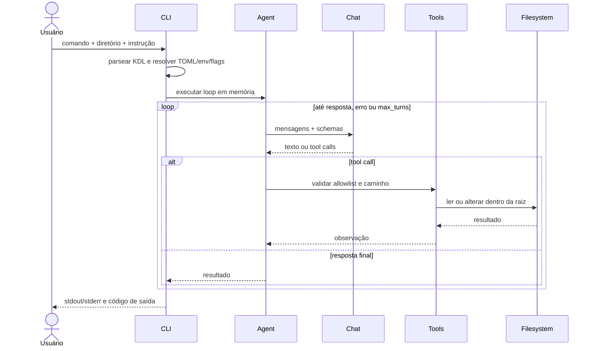

Status: AS-IS — implementado

# Arquitetura atual

Este documento descreve somente o que o código, `omunculus.usage.kdl` e os testes
implementam. O índice de decisões planejadas está em
[TO-BE](../to-be/architecture.md).

## Limites

Omunculus é um harness de coding agent em Elixir/BEAM. A superfície pública é a
CLI. Ela recebe um diretório e uma instrução, carrega configuração TOML, chama
um endpoint de chat compatível com OpenAI e executa tools de filesystem dentro
da raiz do diretório. Não executa shell, não cria commits e não oferece API
pública HTTP, MCP ou TUI.

## Componentes

- **CLI/parser**: o parser é derivado da especificação em
  `omunculus.usage.kdl`; `Spec` define comandos, argumentos, flags e códigos de
  saída. Flags vencem ambiente, que vence configuração, que vence defaults.
- **Config**: lê `~/.omunculus/config.toml` e
  `<diretório>/omunculus.toml` (ou o arquivo de `--config`), presets `coding` e
  `plan`, expansão exata `${VAR}` e opções de chat/output.
- **Runner/Sandbox**: canonicaliza a raiz e fornece `Disk` ou memória através
  de `Tool.Context`; operações que escapam da raiz são recusadas.
- **Chat**: `openai-completions` faz POST não-stream em `/chat/completions`;
  `fake` é usado nos testes. Autenticação disponível: nenhuma ou API key.
- **Agent**: loop recursivo síncrono em memória. Envia mensagens e schemas de
  tools, processa tool calls, anexa observações e para em resposta final,
  erro ou `max_turns` (default 32).
- **Tools**: allowlist padrão `read`, `edit`, `write`, `grep`, `find` e `ls`;
  `counter` é uma tool de diagnóstico explícita.
- **Reporter**: callback recebe transições de run/round/tool e a CLI renderiza
  timeline, resumo e resposta final.
- **Application**: inicia apenas um `Supervisor` `one_for_one` vazio; não há
  árvore de execução residente.

## Fluxo implementado

O benchmark atual é diagnóstico do runtime: `actor-density` mede agentes
provider-free, `agent-tree` mede uma árvore residente sintética e `http-load`
usa um stub Rust e um pool Finch interno. Isso não transforma HTTP em API
pública nem cria persistência.

## Ausências verificadas

Não existem no runtime atual banco/SQLite, tabela `EVENTS`, Event Core, outbox,
Work Items, Runs, Sessions, Archive, requests humanas, delegação de runtime,
hierarquia de reporting, recovery ou replay durável. O modelo de dados atual
está em [data-model.md](data-model.md), e os requisitos observáveis em
[requirements.md](requirements.md).
