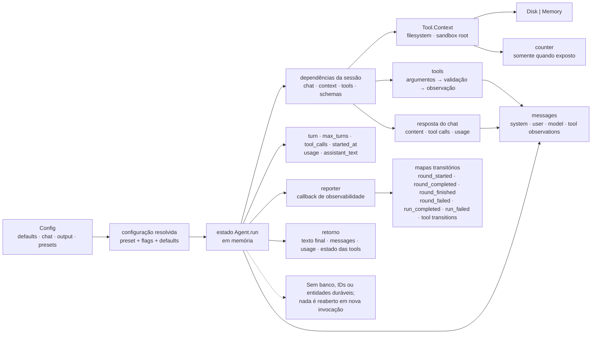

Status: AS-IS — implementado

# Modelo de dados atual

O runtime atual não possui banco de dados nem entidades duráveis. Este modelo é
intencionalmente limitado ao estado que existe durante uma chamada de
`Omunculus.Agent.run/1`. A arquitetura e o fluxo estão em
[architecture.md](architecture.md); o alvo separado está em
[TO-BE data model](../to-be/data-model.md).

## Estado da execução

O fluxo abaixo resume as estruturas transitórias descritas nesta seção:

`Agent.run/1` constrói um mapa em memória contendo:

- `messages`: mensagem de sistema, instrução do usuário, respostas do modelo e
  observações das tools;
- `chat`, `context`, `tools` e `schemas`: dependências resolvidas para a sessão;
- `turn`, `max_turns` (default 32), contagem de `tool_calls` e `started_at`;
- `usage` acumulado e `assistant_text` mais recente;
- `reporter`, callback de eventos de observabilidade.

O retorno bem-sucedido contém o texto final e o estado útil da execução,
incluindo mensagens, uso e estado das tools. Um erro do chat retorna erro; um
limite de turnos retorna sucesso com `outcome: max_turns`. Nada desse estado é
reaberto ou recuperado em uma nova invocação.

## Configuração em memória

`Config` normaliza TOML para mapas de `defaults`, `chat`, `output` e `presets`.
Os presets embutidos são `coding` (tools padrão) e `plan` (somente leitura,
com limite menor). Variáveis `${NAME}` ocupando integralmente uma string são
resolvidas pelo ambiente fornecido; ausência causa erro. A resolução final
combina preset, flags e defaults antes de criar o Agent.

## Filesystem e tools

`Tool.Context` carrega a implementação de filesystem (`Disk` ou memória) e a
raiz sandbox. As tools não têm tabelas ou IDs duráveis: recebem argumentos,
validam allowlist e caminho e devolvem uma observação ao próximo turno.
`counter` mantém seu valor no contexto da execução apenas quando explicitamente
exposto.

## Chat, autenticação e observabilidade

Uma resposta do chat é um mapa transitório com conteúdo, tool calls e usage.
`Auth.None` e `Auth.ApiKey` apenas montam a requisição. O reporter recebe mapas
de eventos como `round_started`, `round_completed`, `round_finished`,
`round_failed`, `run_completed` e `run_failed`, além de transições de tools; a
CLI os renderiza. Esses eventos são observabilidade transitória, não um
histórico consultável nem a tabela `EVENTS` planejada.

## O que não é um registro

Não há `PROJECTS`, `WORK_ITEMS`, `COMMENTS`, `WORK_ITEM_DEPENDENCIES`,
`ARCHIVE_RUNS`, `ARCHIVE_MODEL_CALLS`, `EVENTS`, `Run`, `Session` ou `Work Item`
implementados. Não há chaves, versionamento otimista, estados de workflow,
leases, deduplicação ou replay durável. A separação planejada desses conceitos
está em [execution-model.md](../to-be/execution-model.md).
