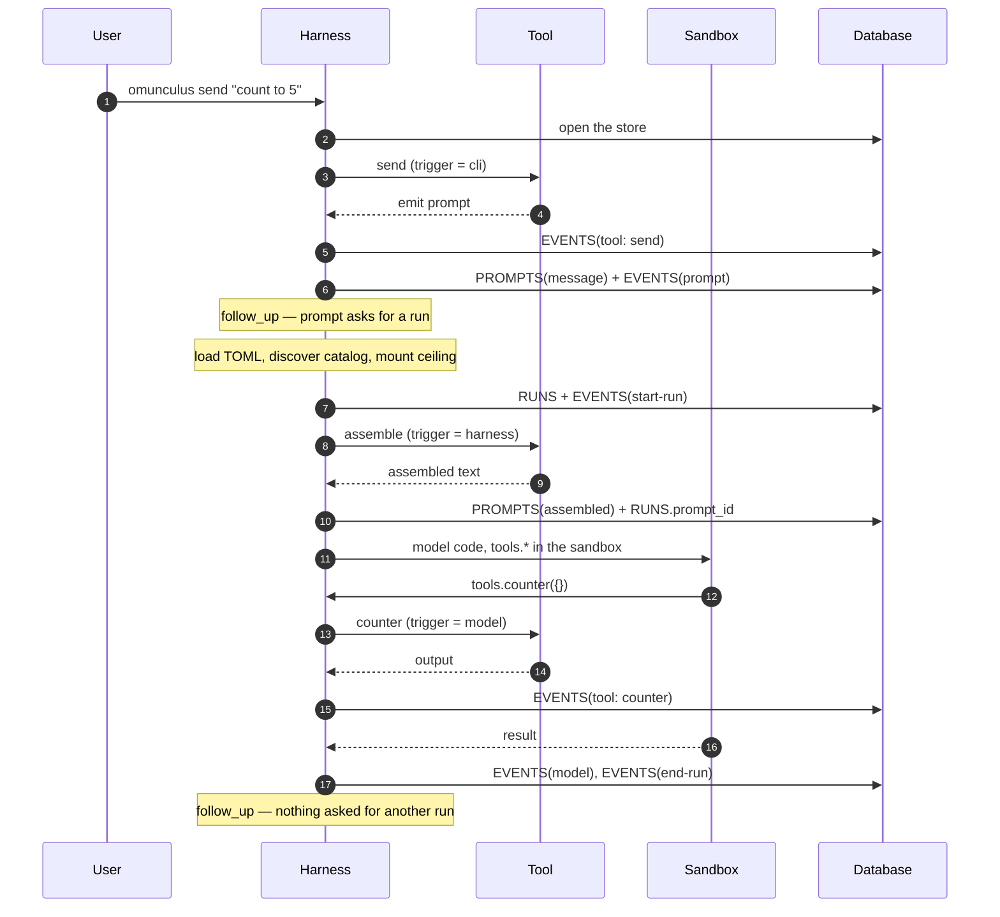

# The cycle

The spine is `EVENTS`. A work continues from the work row and its last
comment, not from a replay of the log. The harness records; it does not
reconstruct a work from history.

```text
event
    → emit → the store applies the action
    → if the action ends the run: EVENTS(end-run) of this one
    → if the action asked for a run (send, continue, delegate, request, reply grant)
        → open the next run (agent and ceiling from the TOML, now)
    → hooks of that terminal event (they see the previous run closed
      and the work already on the next stage)
    → hooks of a non-terminal event still run in the unroll, with the run open
```

A hook is a tool fired by an event: same contract, any `emit`. Who opens
the next run of a work is the action. A hook can open a run too if its
manifest has `agent`, or if it emits one of those actions. Cascades are
the author's.

## Three texts, and a fourth

| Piece | Who writes it | Where it lives |
| --- | --- | --- |
| **message** | you, via `send` | `PROMPTS` (`kind = message`) |
| **agent text** | whoever edits the TOML | the file |
| **title** | whoever created the work | `WORKS.title` |
| **assembled** | the `assemble` tool, at the opening of a run | `PROMPTS` (`kind = assembled`) |

`send` does not create a work and does not copy the message onto the title.

## Opening a run

```text
omunculus send "count to 5"
    emit prompt → PROMPTS(message) + EVENTS(prompt)
    EVENTS(end-run) if a run was still open; otherwise this is the first
    open run → EVENTS(start-run) (prompt_id still empty)
    harness dispatches assemble (name in agents.<x>.assemble or [policy] assemble)
    non-empty output → PROMPTS(assembled) + RUNS.prompt_id
    the model sees the assembled and calls through code in the sandbox
each tool
    one call (simple) or load → commit (composite)
    EVENTS(tool) — name, args, result
    emit → the store applies the action
        if continue / break / request / delegate / reply-grant:
            EVENTS(end-run) of this run; next run if the action asked
            then hooks of that type
    non-terminal hooks still in the unroll
close
    if still open: EVENTS(end-run)
    status = done
```

The TOML is read again at this opening. `RUNS.tools` is a snapshot of the
effective set, not a cache the next run will reuse. Without the assemble
tool named, the opening fails. An empty assemble output fails. The next
run does not reread the old assembled prompt; assemble runs again.

`via` on the run is the `name` of the tool or hook that opened it
(`send`, `continue`, `delegate`, `on-request`, …).

## Assemble

The default `assemble` tool joins, in this order:

```text
agent text
→ message of this opening, if any
→ if there is a work: title + last comment
→ if there is a request: header + comments with that request_id
→ if the opening carried inbox_id: comments with that inbox_id
→ cards of the tools in tools.*
```

Inbox does not appear because the work has unread notifications. Without
`inbox_id` on the opening there is no `## Inbox`. Unread notifications of
a work, if wanted in the prompt, are the `output` of the `inbox` tool.

A card is:

```text
- name: description (≤3 lines) [tags: a, b]
```

No tags, no suffix. What becomes a card is `pinned` ∩ effective. The rest
of the effective set is reached through `tool_search`. Without `pinned` on
a layer, every effective tool is a card. Without `tool_search` in the
effective set, `pinned` is ignored and everything is a card. The `catalog`
view `tool_search` searches is the whole effective set.

There is no `message` section when the opening came from `continue`,
`delegate`, `request` or `reply`.

The model's final text does not reach the terminal. It is `EVENTS(model)`.
`omunculus prompt` prints the assembled prompt, not that text.

## Work

```text
open:     tool work / delegate; stage = first of the TOML
open → waiting:  break, or request (access | child)
waiting → waiting: reply deny — waiting = access, waiting_for intact
waiting → open:    reply grant, or child done — same stage
waiting → open:    send / prompt on a waiting work — reopened_by_prompt
open → open:       continue — next stage, new run
open → done:       continue on the last stage
```

`break` parks. It does not advance the sequence. `deny` does not reopen.
`continue` does not name a stage, an agent or a model — the TOML does.

## Request and inbox

A decision goes through `REQUESTS`. The model calls `request_access`
(`kind` = `tool` | `path` | `directory`) or `request_sandbox` (`kind` =
`resource`, `name` = `sandbox.write` | `sandbox.network`). Have is not a
request: the output is `already granted: <name>`. Blocked is `EVENTS(deny)`
and the run ends. Askable or sealed opens a request; if a work is attached
it becomes `waiting = access`; the asking run ends before the arbiter's
run opens.

`INBOX` notifies and does not wait. It does not park a run or a work.

## The tables

Seven of them: `PROMPTS`, `EVENTS`, `RUNS`, `COMMENTS`, `WORKS`,
`REQUESTS`, `INBOX`. `EVENTS.comment_id` is a weak pointer — no foreign
key — so `compact` can delete comments without taking the event with it.
`EVENTS` is append-only. `REQUESTS.ask` does not change after create.
Tools never open SQLite; they `emit`, and the store applies or refuses
the batch.

## One send, followed through


