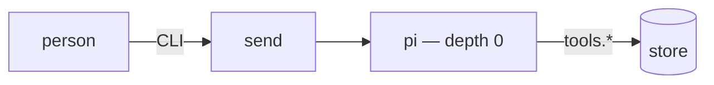
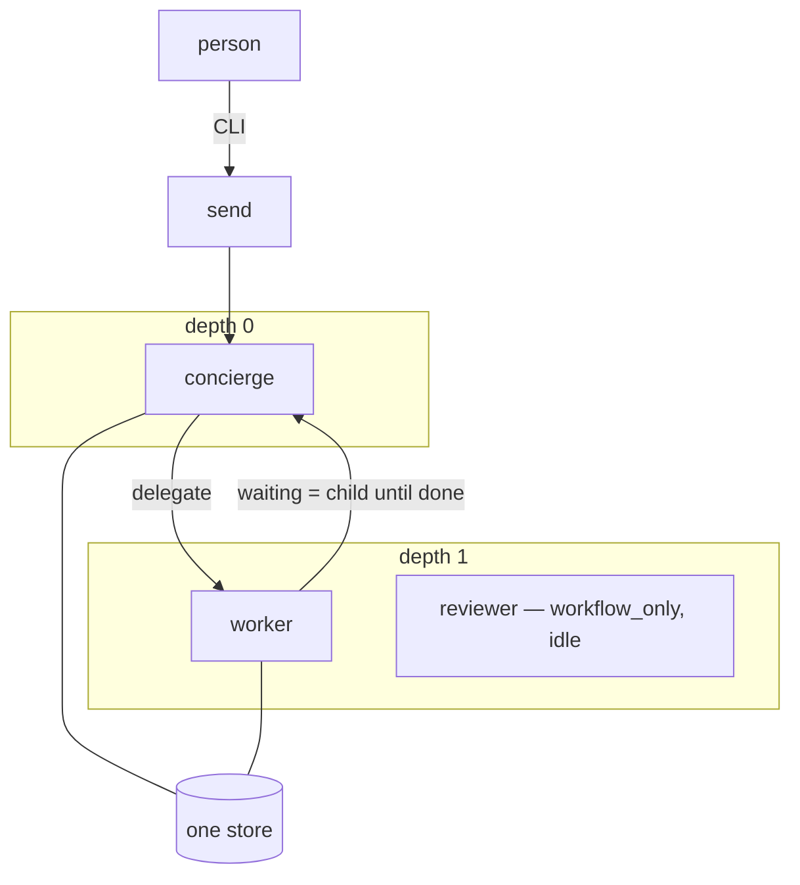
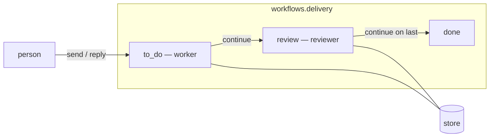
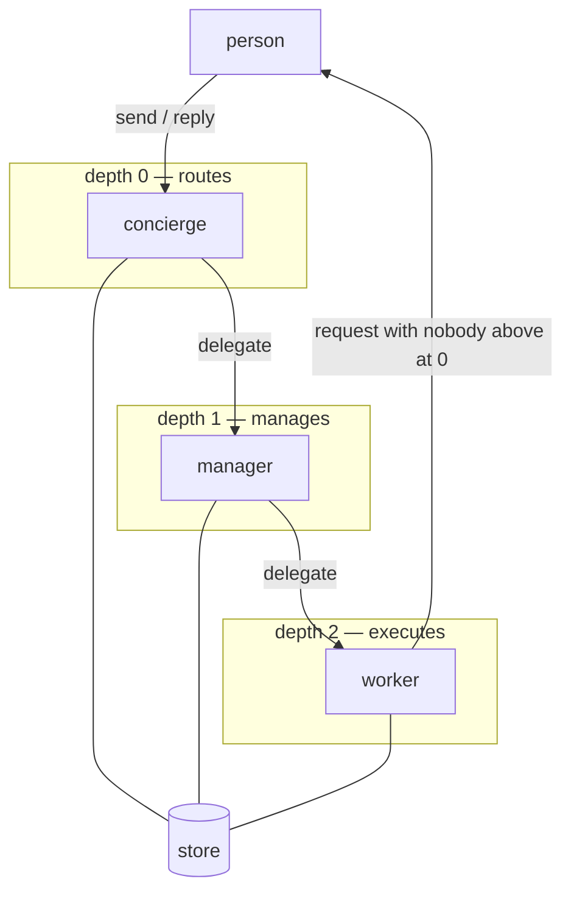
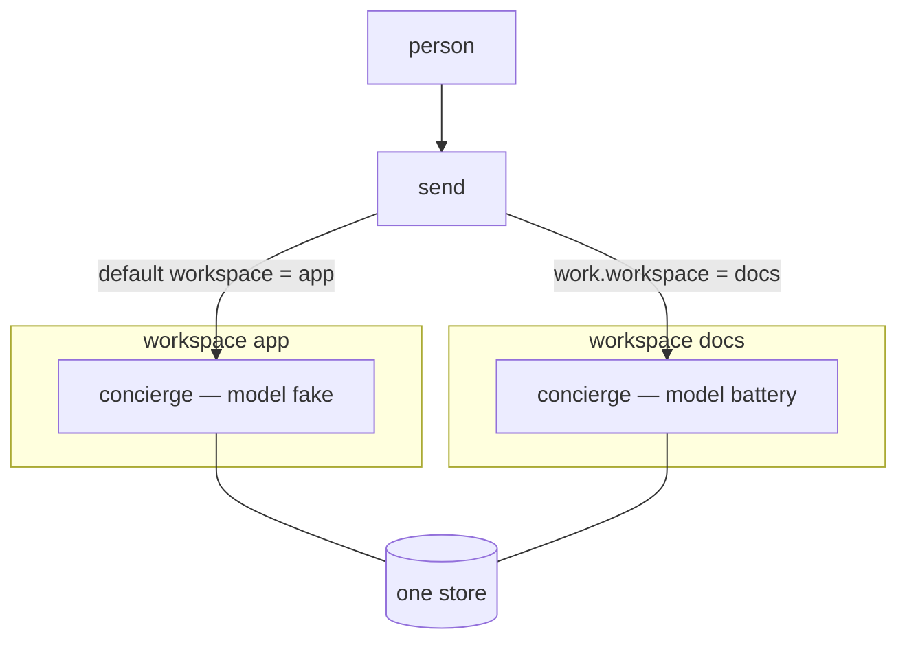
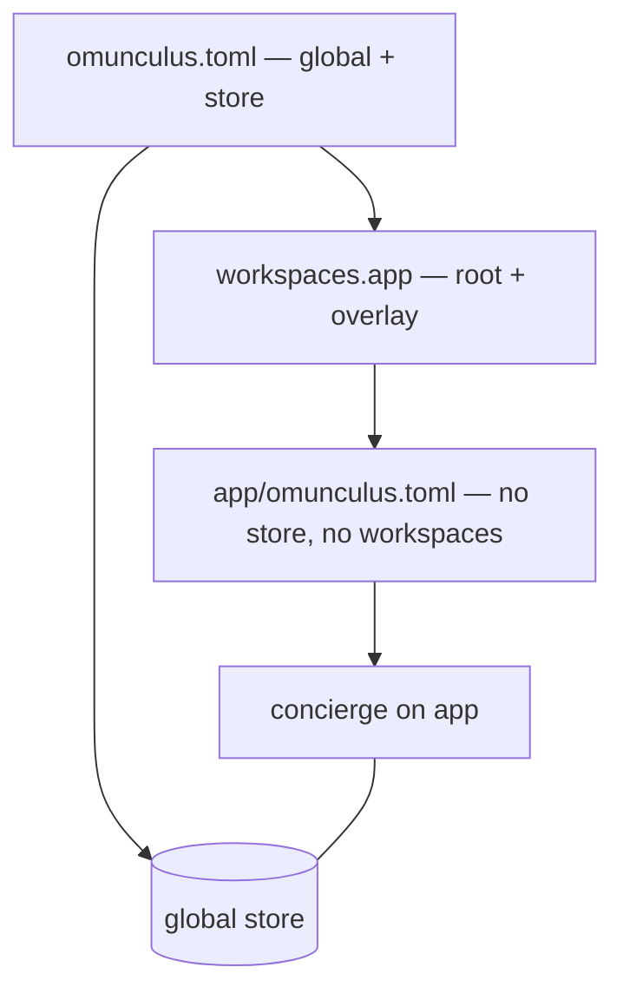
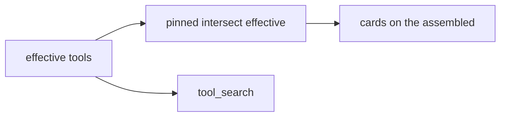
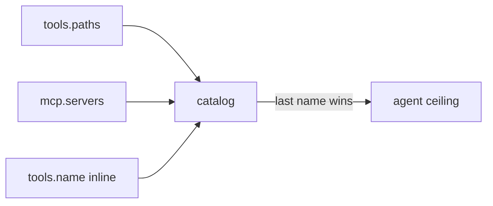
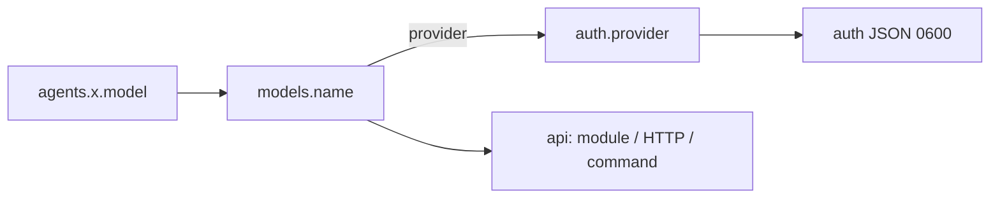

# Possibilities

The harness is one binary and one TOML. What changes between a notebook and a
delivery pipeline is not a mode flag: it is which agents, ceilings, workspaces
and models that file names. These are shapes the file will load today. None of
them invent a table [the TOML](config.md) does not already have.

Each snippet sits on the required tables — `[execution]`, `[execution.sandbox]`,
`[store]`, `[models]`, `[policy] assemble` — and on `[tools] paths` pointing at
the folders you mean to call. The snippets below omit those tables unless they change. A missing
required table is still a refusal, not an implied default.

## 1. One agent, no work

A single depth-0 agent. `send` opens a run; there is no `delegate` and no
sequence. The model reads and edits, and asks when `sandbox.write` is not have.
This is the `pi-like` preset, minus the Anthropic login.



```toml
[tools]
paths = ["../../tools"]

[models.fake]
api = "module"
module = "Omunculus.Model.Fake"

[agents.pi]
depth = 0
model = "fake"
tools = ["catalog", "fs.read", "fs.write", "request_sandbox", "sequence", "store"]
negotiable = ["sandbox.write"]
text = """
You are a Pi-style agent: compact, direct, and without shell access.
"""

[policy]
assemble = "assemble"
```

`continue` / `break` sit in `sequence` but do nothing useful without a work on a
workflow. They are listed so a later `[workflows.*]` can turn them on without
rewriting the agent.

## 2. Concierge that delegates

Depth 0 talks to you. Depth 1 does the work. The child is a `delegate` emit, not
a second CLI. The parent waits (`waiting = child`) until the child is `done`.
The default preset is this, with a reviewer parked behind `workflow_only`.



```toml
[models.fake]
api = "module"
module = "Omunculus.Model.Fake"

[agents.concierge]
depth = 0
model = "fake"
tools = ["break", "catalog", "continue", "delegate", "fs.read", "reply", "store"]
text = """
You are the project concierge. Read the message and delegate when the work is a job.
"""

[agents.worker]
depth = 1
model = "fake"
tools = ["break", "comment", "continue", "fs.read", "fs.write", "notify", "request_access", "request_sandbox"]
negotiable = ["sandbox.write"]
text = """
You are the worker. Complete the assigned work and call continue when the stage is complete.
"""

[policy]
assemble = "assemble"
```

A `workflow_only` agent is parsed and ignored until a step names it. Defining
`[workflows.delivery]` without `[policy] workflow` (or a `[policy.depth.N]
workflow`) leaves the sequence off: the table is inventory, not a running
pipeline.

## 3. A named sequence

`continue` does not pick the next stage. The TOML does. The reviewer never
appears as a free agent at its depth; only the step may call it.



The reviewer is not on the depth-1 free list. `continue` walks this graph; it
does not name the next node.

```toml
[agents.worker]
depth = 1
model = "fake"
tools = ["comment", "continue", "fs.read", "fs.write"]

[agents.reviewer]
depth = 1
model = "fake"
workflow_only = true
tools = ["comment", "continue", "fs.read", "notify"]

[workflows.delivery]
steps = [
  { name = "to_do", agent = "worker" },
  { name = "review", agent = "reviewer", deny = ["fs.write", "sandbox.write"] },
]

[policy]
assemble = "assemble"
workflow = "delivery"
```

A grant of `write` on the work in `to_do` is still on the row in `review`. The
stage `deny` cuts it from the effective set. Back on `to_do` (if the sequence
ever returned there) the grant would show again without a second reply.

Depth can choose a different workflow than `[policy]`:

```toml
[policy.depth.1]
workflow = "delivery"
```

Unnamed depths stay off the sequence.

## 4. Three floors

Depth 0 routes. Depth 1 manages. Depth 2 executes. Each floor is a ceiling
layer: a tool the manager does not have, the worker cannot inherit by existing.



```toml
[agents.concierge]
depth = 0
model = "fake"
tools = ["catalog", "delegate", "reply", "store"]

[agents.manager]
depth = 1
model = "fake"
tools = ["comment", "delegate", "notify", "reply"]

[agents.worker]
depth = 2
model = "fake"
tools = ["comment", "continue", "fs.read", "fs.write", "request_sandbox"]
negotiable = ["sandbox.write"]

[policy]
assemble = "assemble"
mode = "auto"

[policy.depth.2]
mode = "allowlist"
granted = ["comment", "continue", "fs.read"]
negotiable = ["fs.write", "sandbox.write"]
```

`auto` on `[policy]` puts everything uncited in askable. The depth-2 allowlist
then blocks whatever that floor did not name. Depth 0 has nobody above: a
request from the concierge goes to the person.

## 5. Two trees, one store

Workspaces are directories plus a ceiling, not extra databases. `[store]` stays
global. Overlay tables on the section win; a list replaces, it does not
concatenate. Two workspaces can run two models without two SQLite files.



```toml
[project]
root = "."

[models.fake]
api = "module"
module = "Omunculus.Model.Fake"

[models.battery]
api = "module"
module = "Omunculus.Model.Battery"

[agents.concierge]
depth = 0
model = "fake"
tools = ["catalog", "fs.read", "store"]
text = "global"

[policy]
assemble = "assemble"
workspace = "app"

[workspaces.app]
root = "app"
deny = ["delete"]

[workspaces.app.agents.concierge]
model = "fake"
text = "this is the app tree"

[workspaces.docs]
root = "docs"
deny = ["fs.write"]

[workspaces.docs.agents.concierge]
model = "battery"
text = "this is the docs tree"
```

`workspace = "app"` is the default when a run has no work, or a work with no
workspace of its own. A work created with `workspace = "docs"` remounts on
`docs` for every later run of that work. `[store]` on a workspace section is
refused.

## 6. A file per workspace

The section may point at a second TOML, relative to that `root`. Same schema
minus `[workspaces]` and `[store]`. Precedence is global, then the inline
section, then the file. Missing file is an error. A permanent grant with
`--scope workspace` writes that file when it exists.



Precedence: global, then the inline section, then the file.

```toml
[workspaces.app]
root = "app"
config = "omunculus.toml"
```

```toml
# app/omunculus.toml
[models.local]
api = "openai-completions"
url = "http://127.0.0.1:11434/v1"
model = "llama"

[agents.concierge]
depth = 0
model = "local"
tools = ["catalog", "fs.read", "fs.write"]
negotiable = ["sandbox.write"]

[policy]
assemble = "assemble"
mode = "allowlist"
```

The inner file does not get its own store path and does not declare nested
workspaces.

## 7. Who may call what

The same agent list, three policies.

```mermaid
flowchart TB
    call[emit request]
    call --> classify{ceiling}
    classify -->|have| granted["already granted"]
    classify -->|blocked| deny["EVENTS deny"]
    classify -->|sealed or nobody above| human["REQUESTS arbiter = human"]
    classify -->|askable + agent above| above["REQUESTS arbiter = that agent"]
    human --> reply["reply grant / deny"]
    above --> reply
```

**Allowlist** — only what was named is have. Everything else is blocked, not
asked:

```toml
[policy]
assemble = "assemble"
mode = "allowlist"

[agents.concierge]
depth = 0
model = "fake"
mode = "allowlist"
tools = ["catalog", "fs.read", "comment"]
```

**Ask the person** — `delete` is sealed. The model may request it; a grant is a
human `reply`, not an agent above:

```toml
[agents.codex]
depth = 0
model = "fake"
tools = ["bash", "catalog", "fs.read", "fs.write", "request_access", "request_sandbox", "store"]
negotiable = ["sandbox.write"]
human = ["delete"]
```

**Ask the agent above** — `sandbox.write` is have for calling `request_sandbox`,
and negotiable as a resource. Have on the tool is not have on the resource.
Until a grant, the workspace is read-only for external commands.

```toml
[agents.worker]
depth = 1
model = "fake"
tools = ["fs.read", "fs.write", "request_sandbox"]
negotiable = ["sandbox.write"]
```

`[execution] resources` is the universe. A name that is not on that list is an
error at load, not a resource the model can invent.

## 8. Short cards, long catalog

Without `pinned`, every effective tool is a card. With `tool_search` in the
effective set, `pinned` ∩ effective become cards and the rest hide behind
search. Without `tool_search`, `pinned` is ignored.



```toml
[agents.concierge]
depth = 0
model = "fake"
tools = ["store", "sequence", "catalog", "fs.read"]
pinned = ["store", "catalog"]

[workflows.delivery]
steps = [
  { name = "first", agent = "concierge", pinned = ["store"] },
]
```

Stage `pinned` intersects agent `pinned` the same way `granted` does. An empty
list on a layer does not restrict.

## 9. Tools from a server, or from the file

Discovery is `paths`, then MCP, then inline. The last `name` wins. A name the
ceiling listed that nobody exposed is blocked. A server that fails to list is
skipped and logged; the run still opens.



```toml
[tools]
paths = ["./tools"]

[[mcp.servers]]
name = "github"
command = ["npx", "-y", "@modelcontextprotocol/server-github"]
protocol_version = "2025-03-26"

[tools.whoami]
name = "whoami"
kind = "tool"
triggers = ["model"]
description = "Prints the run workspace root."
module = "Omunculus.Tools.Workspaces"
```

There is no tool named `mcp`. Each server tool is one `name` in the catalog,
classified like `read`.

## 10. The model is a row

Every agent names a model. Switching provider is switching that name, not an
environment variable.



**Local OpenAI-compatible:**

```toml
[models.local]
api = "openai-completions"
url = "http://127.0.0.1:11434/v1"
model = "qwen2.5"
```

**Anthropic with a stored login:**

```toml
[auth]
store = ".omunculus/auth.json"

[auth.anthropic]
kind = "oauth-code"
authorize_url = "https://claude.ai/oauth/authorize"
token_url = "https://console.anthropic.com/v1/oauth/token"
client_id = "…"
scopes = ["org:create_api_key", "user:profile", "user:inference"]
pkce = true
callback = { host = "localhost", port = 54545, path = "/callback" }
credential = { access = "access_token", refresh = "refresh_token", expires = "expires_in" }
refresh = { token_url = "https://console.anthropic.com/v1/oauth/token" }

[models.claude]
provider = "anthropic"
api = "anthropic-messages"
url = "https://api.anthropic.com/v1"
model = "claude-sonnet-4-5"
```

```bash
bin/omunculus login --provider anthropic
```

**API key from the environment, declared in the file:**

```toml
[auth.openai]
kind = "api_key"
key = "$OPENAI_API_KEY"

[models.gpt]
provider = "openai"
api = "openai-responses"
url = "https://api.openai.com/v1"
model = "gpt-5"
```

**A program over the sandbox NDJSON protocol:**

```toml
[auth.cursor]
kind = "tool"
login = "cursor_login"
refresh = "cursor_refresh"

[models.cursor]
provider = "cursor"
api = "command"
command = ["./bridges/cursor-agent"]
model = "composer-2.5"
```

An agent may name a different assemble tool than `[policy]`:

```toml
[policy]
assemble = "assemble"

[agents.concierge]
depth = 0
model = "fake"
assemble = "assemble"
tools = ["catalog", "fs.read"]
```

Without either, the opening of a run is `omunculus.toml is missing assemble`.

## What these are not

They are not profiles the binary switches between. `preset` copies a folder
onto `omunculus.toml`; after that the file is yours. They are not extra
daemons, extra stores, or extra contracts. The model still calls `tools.*`,
the store still applies `emit`, and a layer of config still never widens
another.

The shipped folders — `priv/presets/default`, `codex-like`, `pi-like` — are
three of these shapes already filled in, including `[execution]`. Start from
one of them, then delete or add tables until the file matches the job.
