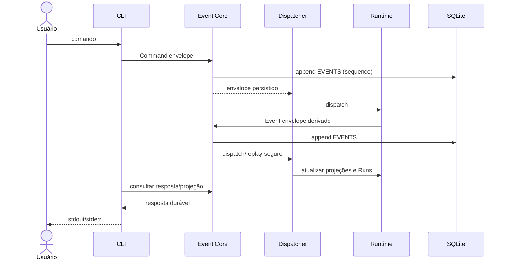

Status: TO-BE — planejado, não implementado

# Arquitetura alvo

Este é o desenho futuro; ele não descreve código disponível. A fotografia
implementada está em [AS-IS architecture](../as-is/architecture.md).

## Decisões canônicas

- A interface pública de entrada e resposta permanece **CLI-only**. Não haverá
  TUI, MCP nem HTTP público no harness; o HTTP do benchmark atual continua
  apenas um diagnóstico interno.
- O **Event Core** é a autoridade local central. Ele persiste envelopes de
  comandos e eventos em SQLite na tabela append-only `EVENTS` **antes** do
  dispatch para consumidores.
- `EVENTS` é histórico durável, não outbox descartável nem transporte apenas
  transitório. Cada envelope tem identidade, ordenação, correlação,
  causação, versão de schema e payload suficiente para replay.
- O reducer/consumidor aplica efeitos idempotentemente. Commit, dispatch,
  redelivery, restart e replay não podem duplicar uma transição ou efeito já
  confirmado.
- As seis tabelas de domínio/archive anteriores permanecem; `EVENTS` é a
  sétima tabela mínima. Qualquer store adicional exige justificativa explícita
  de necessidade e não substitui `EVENTS`.
- A configuração **Agent** é genérica e não declara `reports_to`, `parent` ou
  `depth`. `kind` identifica capability/configuração, não uma posição fixa.
  Delegação cria dinamicamente Execution Node/Run e a árvore de reporting é
  derivada desses vínculos runtime e do depth.

## Fronteiras

CLI valida argumentos e configurações, cria o envelope de comando e aguarda a
resposta derivada do Event Core. O Event Core grava o envelope, atribui
sequência e só então despacha. Consumers podem iniciar ou fechar Runs,
registrar chamadas, atualizar Work Items e produzir novos eventos; cada novo
evento retorna ao mesmo Core antes de ser despachado. O CLI apresenta somente
projeções/respostas do estado durável.

A implementação pode usar processos OTP, mas processo residente não é entidade
de negócio. Work Item, Run e Execution Node têm o ciclo de vida descrito em
[execution-model.md](execution-model.md); o formato do envelope e as regras de
replay estão em [event-model.md](event-model.md).

## Fluxo alvo

## Não-objetivos

Não introduzir uma hierarquia estática de Agents, uma API pública HTTP/MCP/TUI,
uma tabela de eventos por domínio, ou um mecanismo que trate `EVENTS` como
cache temporário. O benchmark `http-load` não é contrato do harness.
