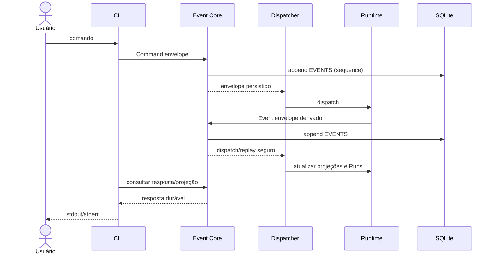

Status: TO-BE — planejado; Event Core, catálogo, interceptores e automações validados em spike (branch `spike/event-core`)

# Arquitetura alvo

Este é o desenho futuro; ele não descreve código disponível em `main`. A
fotografia implementada está em [AS-IS architecture](../as-is/architecture.md).
O que a spike validou e o que ela revelou está em
[../spike/event-core-spike.md](../spike/event-core-spike.md).

## Mapa dos documentos

| Documento | Responde | Status |
|---|---|---|
| [architecture.md](architecture.md) | decisões canônicas e fronteiras | planejado, spike |
| [requirements.md](requirements.md) | contrato observável | planejado, spike |
| [data-model.md](data-model.md) | tabelas, consistência, retenção | planejado, spike |
| [event-model.md](event-model.md) | envelope, append, dispatch, replay, cenários `conte até 10` | planejado, spike |
| [event-catalog.md](event-catalog.md) | tipos de envelope, interceptor, automação, portas da CLI | planejado, spike |
| [execution-model.md](execution-model.md) | Agent config, Execution Node, Run, delegação | planejado, spike |
| [session-model.md](session-model.md) | Session, workspaces, multi-repo, roteamento entre workspaces | proposta |
| [tool-policy.md](tool-policy.md) | teto, perfil, workspace, modos, três barreiras | proposta |
| [permission-negotiation.md](permission-negotiation.md) | pedido, arbitragem, escopo, validade, revogação | proposta |
| [recommendations.md](recommendations.md) | razões de terreno por trás de sessão, workspace e concierge | rationale |
| [harness-comparison.md](harness-comparison.md) | comparação com Pi, Claude Code e Codex | referência |

"Proposta" é contrato escrito e ainda não validado por código. "Spike" é
contrato exercitado na branch `spike/event-core`, ainda não em `main`.

## Decisões canônicas

- A interface pública de entrada e resposta permanece **CLI-only**. Não haverá
  TUI, MCP nem HTTP público no harness; o HTTP do benchmark atual continua
  apenas um diagnóstico interno.
- O **Event Core** é a autoridade local central. Ele persiste envelopes de
  comandos e eventos em SQLite na tabela append-only `EVENTS` **antes** do
  dispatch para consumidores.
- `EVENTS` é histórico durável, não outbox descartável nem transporte apenas
  transitório. Cada envelope tem identidade, ordenação, correlação,
  causação, versão de schema e payload suficiente para replay.
- O reducer/consumidor aplica efeitos idempotentemente. Commit, dispatch,
  redelivery, restart e replay não podem duplicar uma transição ou efeito já
  confirmado.
- As seis tabelas de domínio/archive anteriores permanecem; `EVENTS` é a
  sétima tabela mínima. Qualquer store adicional exige justificativa explícita
  de necessidade e não substitui `EVENTS`.
- A configuração **Agent** é genérica e não declara `reports_to`, `parent` ou
  `depth`. `kind` identifica capability/configuração, não uma posição fixa.
  Delegação cria dinamicamente Execution Node/Run e a árvore de reporting é
  derivada desses vínculos runtime e do depth.
- Todo tipo de envelope está em um **catálogo** único em código; o Core
  rejeita o que não está nele ([event-catalog.md](event-catalog.md)).
- Entre o commit e a entrega pode existir um **Interceptor** configurado por
  tipo de evento, que só observa ou veta. Consumidores externos são
  **automações** assíncronas sem poder de veto. De fora só entram comandos;
  para fora só saem eventos.
- Uma Run **nunca bloqueia** esperando outro agente ou humano: delegar,
  pedir trabalho a outro workspace ou pedir permissão conclui a Run com
  `outcome = waiting`; a resposta abre uma Run nova a partir do checkpoint
  ([execution-model.md](execution-model.md)).
- **Session** é agregado durável e **workspace** é membro da sessão e
  identidade do Execution Node; nenhum dos dois é processo
  ([session-model.md](session-model.md)).
- O que um nó pode invocar é a interseção de **teto por posição, teto por
  workspace e perfil**, pinada em `run.started` e aplicada em três barreiras
  independentes ([tool-policy.md](tool-policy.md)). Crescer durante a
  execução exige pedido e concessão registrados
  ([permission-negotiation.md](permission-negotiation.md)).

## Fronteiras

CLI valida argumentos e configurações, cria o envelope de comando e aguarda a
resposta derivada do Event Core. O Event Core grava o envelope, atribui
sequência e só então despacha. Consumers podem iniciar ou fechar Runs,
registrar chamadas, atualizar Work Items e produzir novos eventos; cada novo
evento retorna ao mesmo Core antes de ser despachado. O CLI apresenta somente
projeções/respostas do estado durável.

A implementação pode usar processos OTP, mas processo residente não é entidade
de negócio. Work Item, Run e Execution Node têm o ciclo de vida descrito em
[execution-model.md](execution-model.md); o formato do envelope e as regras de
replay estão em [event-model.md](event-model.md).

## Fluxo alvo

## Não-objetivos

Não introduzir uma hierarquia estática de Agents, uma API pública HTTP/MCP/TUI,
uma tabela de eventos por domínio, um segundo barramento além do Event Core,
um canal direto entre nodes de mesmo depth, ou um mecanismo que trate
`EVENTS` como cache temporário. O benchmark `http-load` não é contrato do
harness.
