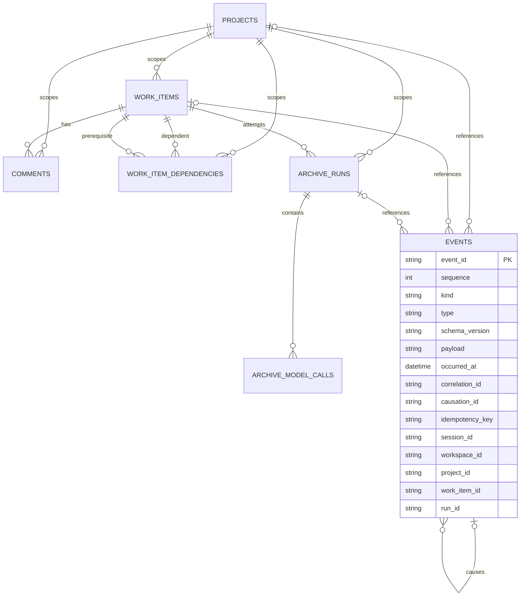
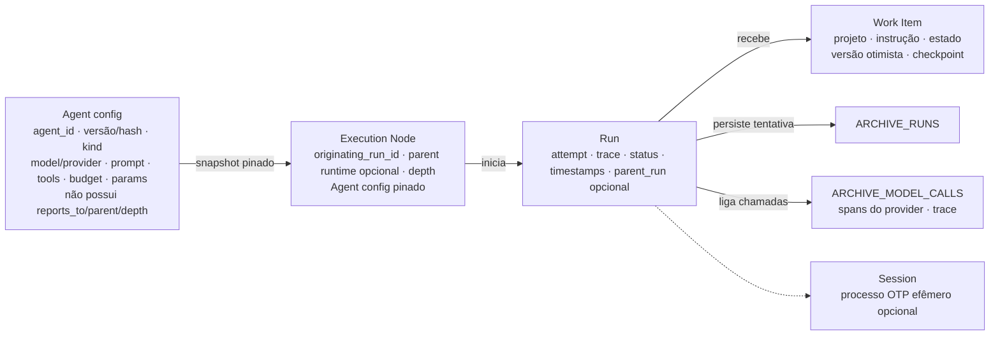

Status: TO-BE — planejado; sete tabelas e `PROJECTION_CURSORS` validadas em spike

# Modelo de dados alvo

O modelo é persistente em SQLite/WAL e combina seis tabelas de domínio/archive
com a autoridade central de eventos. O comportamento de envelopes está em
[event-model.md](event-model.md), e a topologia de execução em
[execution-model.md](execution-model.md). A versão atual, sem persistência, está
em [AS-IS data model](../as-is/data-model.md).

## Tabelas mínimas

As seis tabelas existentes no desenho de domínio/archive permanecem:

1. `PROJECTS`: escopo e identidade do projeto;
2. `WORK_ITEMS`: unidade durável de trabalho, estado, instrução, critérios,
   versão otimista, checkpoint e referências de projeto;
3. `COMMENTS`: colaboração, progresso, resultado e solicitações/respostas
   humanas duráveis;
4. `WORK_ITEM_DEPENDENCIES`: pré-requisitos entre Work Items do mesmo projeto;
5. `ARCHIVE_RUNS`: uma linha por tentativa iniciada, com status, attempt,
   timestamps, trace e referências ao resultado;
6. `ARCHIVE_MODEL_CALLS`: spans/chamadas do provider ligados à Run e ao trace.

A sétima tabela obrigatória é:

7. `EVENTS`: log central append-only de comandos e eventos, com `event_id`
  único, `sequence` monotônica, tipo, versão de schema, payload/envelope,
  `occurred_at`, `correlation_id`, `causation_id`, `idempotency_key`,
  `session_id`, `workspace_id` e referências opcionais a projeto/Work
  Item/Run. O Core é o único authority de append; consumidores não atualizam
  nem removem linhas.

Um store adicional foi justificado pela spike e passa a fazer parte do
contrato: `PROJECTION_CURSORS` guarda, por consumidor (projeção ou
automação), a última `sequence` aplicada. É checkpoint reconstruível, nunca
cópia de histórico, e existe para que aplicar um evento e avançar o cursor
aconteçam na mesma transação.

As relações entre as sete tabelas canônicas ficam resumidas no ER abaixo;
`EVENTS` permanece o log central append-only:

Colunas que as propostas acrescentam às projeções: `WORK_ITEMS` ganha
`workspace_id` e `requested_by` (Work Item criado entre workspaces);
`ARCHIVE_RUNS` ganha `workspace_id`, `profile` e `tools` (faixas expandidas
pinadas); `COMMENTS.kind` inclui `request` e `response` para pedidos humanos
de [permission-negotiation.md](permission-negotiation.md).

Não existe uma tabela de `Agent` exigida por este contrato: Agent é uma
configuração genérica versionada/pinada quando necessário, sem
`reports_to`/`parent`/`depth`. Um store adicional só pode ser introduzido com
justificativa de requisito e sem duplicar o log `EVENTS`.

A relação runtime, distinta das tabelas persistentes, é:

## Consistência e retenção

- Um comando aceito e cada evento derivado entram em `EVENTS` antes do dispatch.
- `event_id` é único; uma chave de idempotência/dedupe impede reaplicar o mesmo
  comando ou efeito. `sequence` fornece ordenação total do log local.
- `causation_id` aponta para o envelope que originou o evento; `correlation_id`
  acompanha o fluxo lógico completo.
- Work Item, Run e chamadas preservam as referências e pertencem ao mesmo
  projeto. Retry cria uma nova Run; uma Run fechada não é reaberta.
- O payload/schema é versionado. Retenção ou compactação de projeções não pode
  apagar o histórico necessário para replay da autoridade `EVENTS`.

## Estado derivado

As tabelas de domínio/archive são projeções duráveis e transacionais dos eventos
aceitos. Um reducer pode aplicar um evento somente se sua precondição e versão
esperadas forem válidas; redelivery stale vira no-op ou retorna o resultado
idempotente já existente. `COMMENTS` continua sendo a referência de texto de
resultado, sem tabela paralela de entrega.

O Event Core, dispatch, replay e dedupe estão detalhados em
[event-model.md](event-model.md); a relação runtime entre Agent config,
Execution Node, Run e Work Item está em [execution-model.md](execution-model.md).
