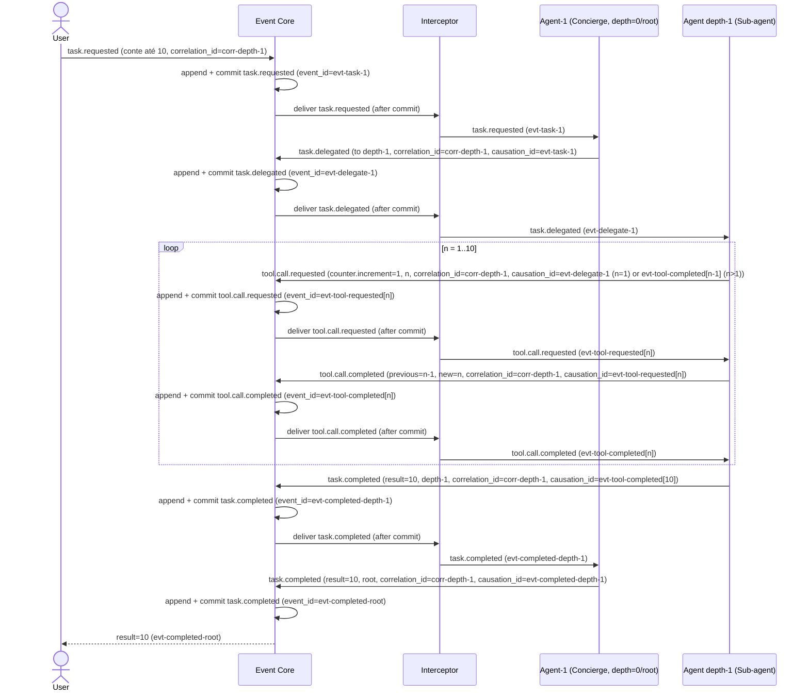
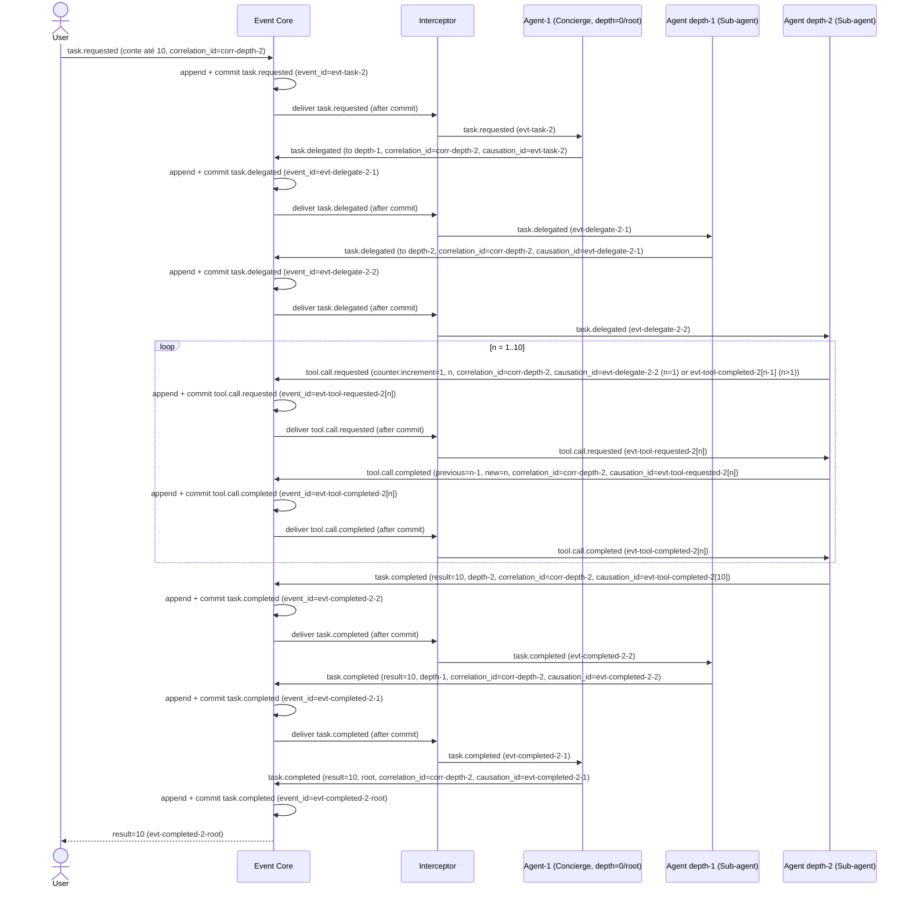
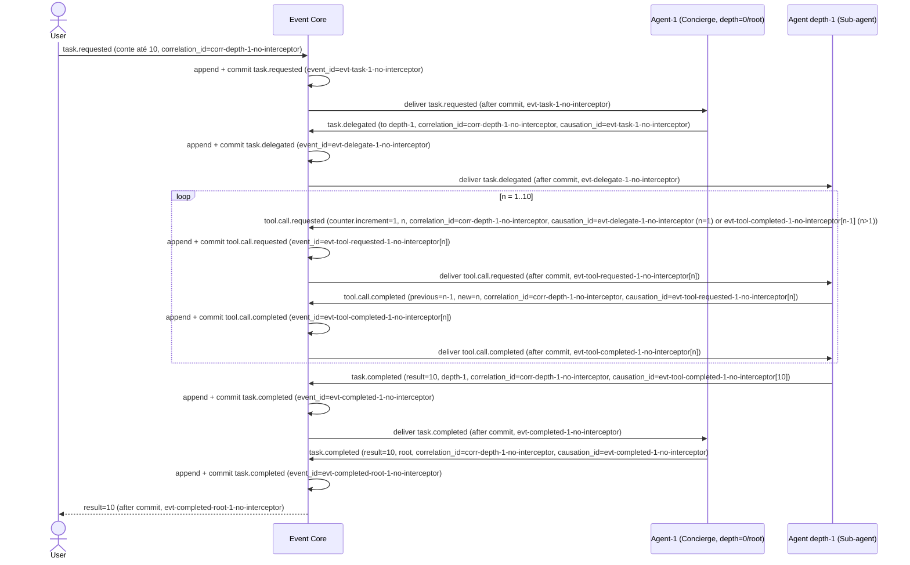
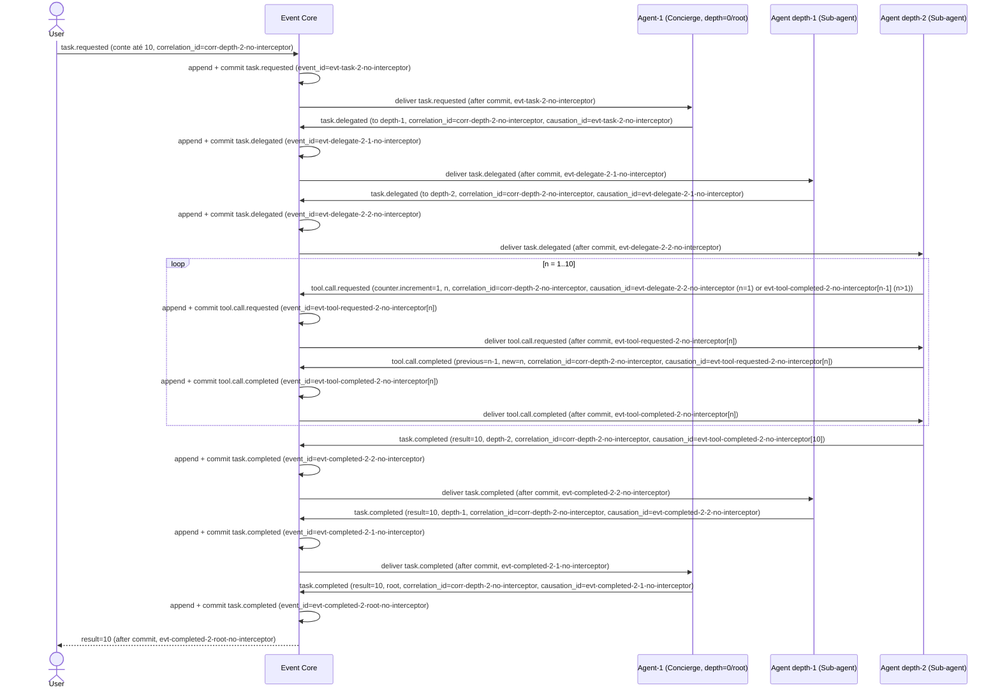

Status: TO-BE — planejado, não implementado

# Event Core e modelo de eventos

Este documento é a fonte canônica para `EVENTS`; os demais documentos apenas
referenciam suas regras. A arquitetura geral está em
[architecture.md](architecture.md).

## Envelope

Todo comando ou evento possui, no mínimo:

```text
event_id, kind, type, schema_version, sequence?, occurred_at,
correlation_id, causation_id?, idempotency_key?, project_id?,
work_item_id?, run_id?, payload
```

`kind` distingue `command` de `event`. O Core atribui `sequence` ao append e
preserva o payload versionado. `correlation_id` identifica uma operação lógica;
`causation_id` aponta para o envelope que causou o atual. `event_id` e a chave
de idempotência são estáveis em retries. Um payload novo exige
`schema_version` explícita e compatibilidade de consumidor ou migração
reproduzível.

## Persistência e dispatch

SQLite/WAL contém a tabela central `EVENTS`, append-only. O fluxo obrigatório é:

1. validar o comando/evento e suas referências;
2. consultar a chave de idempotência;
3. inserir o envelope em `EVENTS` e confirmar a transação;
4. só depois publicar ao dispatcher/consumer;
5. registrar eventos derivados novamente no Core antes de despachá-los.

O dispatcher pode entregar várias vezes e pode parar entre persistência e
entrega. Ele nunca é a autoridade do histórico e não apaga o evento aceito.
Consumers atualizam as projeções duráveis em transação, usando precondições e
versões esperadas. Falha de consumer deixa o evento disponível para retry.

## Dedupe e idempotência

Um `event_id` já existente com o mesmo conteúdo é redelivery idempotente. Uma
`idempotency_key` repetida deve devolver o resultado associado ao primeiro
comando, sem criar novo efeito; a mesma chave com payload incompatível é
conflito explícito. Efeitos externos usam uma identidade própria registrada
antes da chamada e estado posterior (`completed` ou `unknown`), para que
recovery não repita automaticamente um efeito confirmado.

Reducer que recebe evento stale pode fazer no-op seguro ou carregar o resultado
já persistido. CAS/precondições impedem que uma entrega concorrente aplique uma
transição incompatível. O sucesso da CLI significa append/commit durável, não
que todos os consumers terminaram.

## Replay e recuperação

Replay lê `EVENTS` pela `sequence`, valida `schema_version` e reconstrói as
projeções a partir do estado inicial/checkpoint. Reproduzir um intervalo ou o
log inteiro deve ser determinístico e manter `event_id`, causação e correlação.
Eventos já aplicados são ignorados pela marca/versão idempotente da projeção;
replay não chama novamente efeitos externos concluídos. Eventos com efeito
`unknown` bloqueiam retomada automática e exigem decisão operacional/humana.

O log durável é a fonte de recuperação após crash. Arquivo/retention de
projeções pode ser otimizado somente quando o prefixo necessário para replay
continua preservado; nunca se remove a autoridade `EVENTS` em favor de logs
transitórios.

## Cenários: a tarefa `conte até 10`

Os cenários abaixo descrevem o comportamento genérico do sistema para uma
tarefa, sem depender de sintaxe de CLI ou de uma implementação específica de
agente. Em cada cenário, todos os envelopes compartilham um único
`correlation_id`; cada `causation_id` referencia o envelope que originou o
seguinte. O Event Core sempre faz `append + commit` antes de qualquer entrega.

### Registro mínimo de eventos

| Tipo | Payload relevante | Causação |
|---|---|---|
| `task.requested` | tarefa e configuração genérica da execução | — (raiz da cadeia, sem `causation_id`) |
| `task.delegated` | tarefa, agente de destino e posição de execução | envelope `task.requested` ou `task.delegated` que ativou o nó runtime delegador; `task.completed` do filho anterior, quando representado |
| `tool.call.requested` | `counter.increment=1` e rodada `n` | envelope `task.delegated` ou `tool.call.completed[n-1]` (somente para `n>1`) |
| `tool.call.completed` | `previous=n-1`, `new=n` e rodada `n` | `tool.call.requested[n]` |
| `task.completed` | resultado e posição que o reportou | `tool.call.completed` final, para uma folha; ou `task.completed` do filho, para um pai |

`Agent-1 (Concierge)` é sempre a raiz. A profundidade pertence ao nó/run de
execução, não à configuração genérica do agente: a mesma configuração pode
ocupar posições diferentes em execuções distintas.

### Cenário 1 — execução em profundidade 1 com Interceptor

O Concierge recebe a tarefa, delega o trabalho de contagem ao sub-agente e
repassa seu resultado. Não existe uma raia para o contador: a operação aparece
somente no payload dos eventos de tool.



### Cenário 2 — execução em profundidade 2 com Interceptor

O caminho de submissão é o mesmo, mas o sub-agente de profundidade 1 delega a
contagem a um sub-agente de profundidade 2. O relatório sobe pela mesma cadeia,
com persistência antes de cada entrega.



### Cenário 3 — execução em profundidade 1 sem Interceptor

O Concierge recebe a tarefa, delega o trabalho de contagem ao sub-agente e
repassa seu resultado diretamente pelo Event Core, sem uma raia de Interceptor.
Não existe uma raia para o contador: a operação aparece somente no payload dos
eventos de tool.

Para comparar este cenário com harnesses atuais, veja [harness-comparison.md](harness-comparison.md).



### Cenário 4 — execução em profundidade 2 sem Interceptor

O caminho de submissão é o mesmo, mas o sub-agente de profundidade 1 delega a
contagem a um sub-agente de profundidade 2. O relatório sobe pela mesma cadeia,
sem uma raia de Interceptor e com persistência antes de cada entrega.


