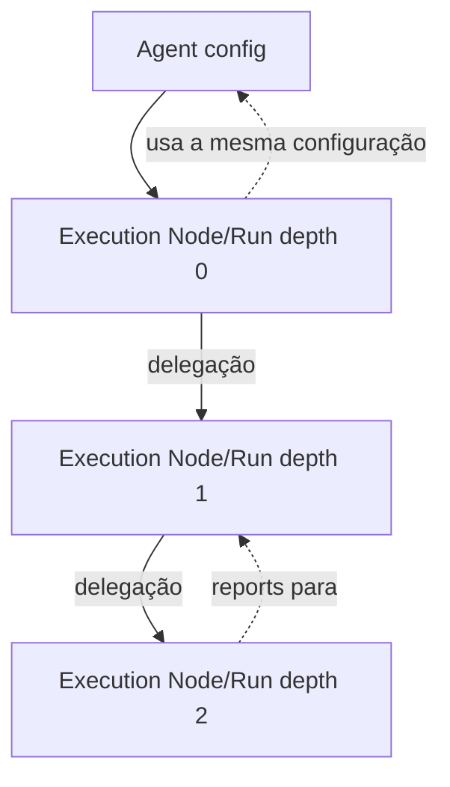

Status: TO-BE — planejado; Execution Node, Run, delegação e retomada validados em spike

# Modelo de execução e delegação

Este documento define as entidades de runtime. Persistência e envelopes estão
em [data-model.md](data-model.md) e [event-model.md](event-model.md).

Para a comparação do modelo de delegação com Pi, Claude Code e Codex, veja
[harness-comparison.md](harness-comparison.md).

## Agent como configuração

Agent é uma configuração genérica, identificada por `agent_id` e versão/hash,
com `kind`, model/provider, prompt, tools, budget e params. Um snapshot pode
ser pinado em um Work Item ou Run. `kind` descreve capability; inclusive
`supervisor` não é parent nem relação de reporte. A configuração **não** possui
`reports_to`, `parent` ou `depth`.

## Entidades de runtime

- **Work Item**: agregado durável de trabalho, com projeto, instrução, estado,
  versão otimista, dependências e checkpoint.
- **Execution Node**: instância lógica que identifica originador, parent
  runtime opcional, depth, workspace e Agent config pinado. Parent e depth
  pertencem ao node, não ao Agent. Em depth 0 e 1 a identidade é derivada de
  sessão e workspace e o node é reutilizado entre Runs; em depth 2 é criado
  por delegação ([session-model.md](session-model.md)).
- **Run**: tentativa durável de um Execution Node executar um Work Item. Tem
  identidade, attempt, trace, status, timestamps e vínculo opcional à Run
  parent. Run só nasce quando a execução inicia; retry gera outra Run.
  `run.started` pina o conjunto de tools ([tool-policy.md](tool-policy.md)).
- **Processo de sessão**: processo OTP efêmero que atende uma Run ativa, se a
  implementação usar processo para isso. Não é a fonte de estado durável e
  não é a Session, que é o agregado durável de
  [session-model.md](session-model.md).

A mesma configuração Agent pode aparecer em nodes com parents/depth diferentes
em execuções diferentes.

## Delegação e árvore dinâmica

Quando uma Run delega, ela apenda `task.delegated`; o runtime, ao receber a
entrega, valida aciclicidade e dependências e cria (ou reutiliza, em depth 1)
o Execution Node e abre uma Run com `originating_run_id`, `parent_run_id` e
`depth = parent.depth + 1`. Profundidade máxima e workspace de destino são
política de entrega: interceptores `DepthGate` e `WorkspaceGate` vetam a
delegação antes de o filho nascer, e o veto volta ao delegador como erro de
tool. O filho herda a autoridade de tools do pai e nunca a amplia. A relação de reporting é derivada dos vínculos das instâncias criadas;
não há uma árvore declarada no arquivo de Agent. Um node raiz possui depth 0.

A árvore pode ser vista como projeção de Runs e eventos de delegação. Fechar um
node não apaga seus eventos; falha, cancelamento e crash deixam status durável.

## Work Item e controle

Uma Run recebe um Work Item elegível, configurações pinadas e checkpoint
bounded. Claims e transições usam versão/ownership para evitar duas execuções
concorrentes. Conclusão, pausa/break, invalidação, archive, erro e retomada
são comandos/eventos persistidos pelo [Event Core](event-model.md). Uma retomada
cria uma nova tentativa; não reabre a Run anterior.

O contexto de uma Run pode incluir chamadas de modelo, observações de tools e
metadados de efeitos. Efeito externo confirmado é reproduzido sem reexecução;
efeito desconhecido exige decisão antes de continuar. O modelo não recebe
permissão para escapar do sandbox apenas por delegar.

A primitiva de espera é uma só: uma Run bloqueia até um envelope específico
ser entregue. Delegação espera `task.completed` do filho; trabalho entre
workspaces espera o `task.completed` da dependência; pedido de permissão
espera `permission.granted` ou `permission.denied`. Cada espera tem timeout
e o timeout é sempre o resultado seguro.
