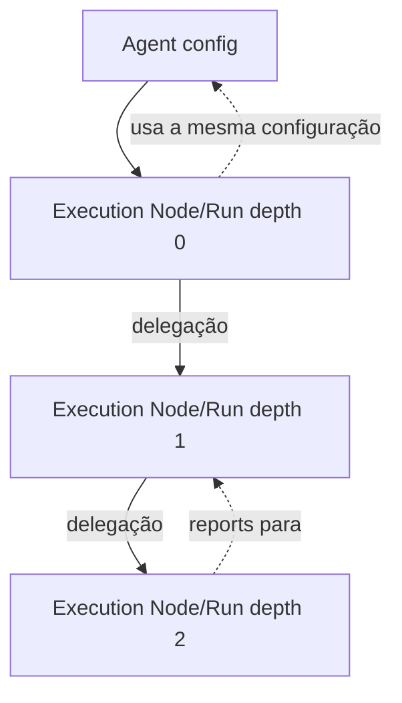
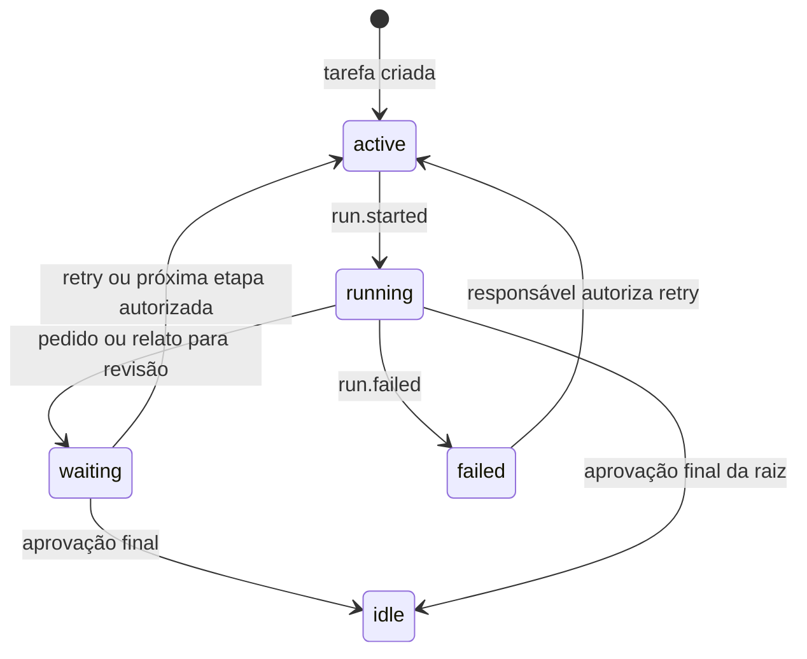

Status: TO-BE — planejado, validado; Execution Node, Run, delegação, pedir-é-concluir e retomada validados

# Modelo de execução e delegação

Este documento define as entidades de runtime. Persistência e envelopes estão
em [data-model.md](data-model.md) e [event-model.md](event-model.md).

Para a comparação do modelo de delegação com Pi, Claude Code e Codex, veja
[harness-comparison.md](harness-comparison.md).

## Agent como configuração

Agent é uma configuração genérica, identificada por `agent_id` e versão/hash,
com `kind`, model/provider, prompt, tools, budget e params. Um snapshot pode
ser pinado em um Work Item ou Run. `kind` descreve capability; inclusive
`supervisor` não é parent nem relação de reporte. A configuração **não** possui
`reports_to`, `parent` ou `depth`.

## Entidades de runtime

- **Work Item**: agregado durável de trabalho, com projeto, instrução, estado,
  versão otimista, dependências e checkpoint.
- **Execution Node**: instância lógica que identifica originador, parent
  runtime opcional, depth, workspace e Agent config pinado. Parent e depth
  pertencem ao node, não ao Agent. Em depth 0 e 1 a identidade é derivada de
  sessão e workspace e o node é reutilizado entre Runs; em depth 2 é criado
  por delegação ([session-model.md](session-model.md)).
- **Run**: tentativa durável de um Execution Node executar um Work Item. Tem
  identidade, attempt, trace, status, timestamps e vínculo opcional à Run
  parent. Run só nasce quando a execução inicia; retry gera outra Run.
  `run.started` pina o conjunto de tools ([tool-policy.md](tool-policy.md)).
- **Processo de sessão**: processo OTP efêmero que atende uma Run ativa, se a
  implementação usar processo para isso. Não é a fonte de estado durável e
  não é a Session, que é o agregado durável de
  [session-model.md](session-model.md).

A mesma configuração Agent pode aparecer em nodes com parents/depth diferentes
em execuções diferentes.

## Protocolo de comunicação dos agentes

O contrato de encerramento, correção automática e escalonamento está em
[relato, retries e break](run-report-and-break.md).

O resolver de chat compõe um system prompt com o protocolo comum, o papel
configurado em `[agents]`, a posição/workspace da execução e as instruções
do perfil selecionado. O protocolo explica delegação, retomada, revisão pelo
pai e entrega pelo executor. A lista de ferramentas exposta continua sendo
a autoridade efetiva; texto no prompt não concede ferramentas.

O pai delega objetivo, contexto, restrições e evidências esperadas. Ao receber
o relatório, avalia se ele satisfaz o pedido. `completed = false` e seu
comentário orientam a correção automática; `delegate` continua disponível
para novos pedidos ou verificações. O filho relata resultado, evidências e
pendências de forma proporcional à tarefa, respeitando formatos específicos
quando suficientes. Esses critérios são instruções para os agentes; não são
um schema universal de aceitação nem um gate semântico no runtime.

Instruções de execução do perfil são aplicadas pelo executor. O coordenador
as transmite e usa para avaliar a entrega; não assume ferramentas ausentes
nem abandona seu papel para executá-las. Seletores `agent`/`team` são opcionais:
omiti-los usa o roteamento configurado. Nomes explícitos devem vir do contexto
ou da descoberta disponível, não de nomes de ferramentas.

`run.completed` entrega o relato; `task.assessment_requested` solicita a
avaliação do responsável. Só após aprovação o harness avança a etapa ou
emite `task.completed`. A continuação do pai preserva suas mensagens e
recompõe o system prompt. Falhas geram break para inspeção; `task.resumed`
permite retomada explícita de execução que falhou.

## Delegação e árvore dinâmica

Quando uma Run delega, ela apenda `task.delegated`; o runtime, ao receber a
entrega, valida aciclicidade e dependências e cria (ou reutiliza, em depth 1)
o Execution Node e abre uma Run com `originating_run_id`, `parent_run_id` e
`depth = parent.depth + 1`. Profundidade máxima e workspace de destino são
política de entrega: interceptores `DepthGate` e `WorkspaceGate` vetam a
delegação antes de o filho nascer, e o veto volta ao delegador como erro de
tool. O conjunto de tools do filho vem da tabela de política para a
posição e o workspace dele, com o perfil da tarefa; o pai não o amplia nem
o estreita ([tool-policy.md](tool-policy.md)). A relação de reporting é derivada dos vínculos das instâncias criadas;
não há uma árvore declarada no arquivo de Agent. Um node raiz possui depth 0.

A árvore pode ser vista como projeção de Runs e eventos de delegação. Fechar um
node não apaga seus eventos; falha, cancelamento e crash deixam status durável.

## Work Item e controle

Uma Run recebe um Work Item elegível, configurações pinadas e checkpoint
bounded. Claims e transições usam versão/ownership para evitar duas execuções
concorrentes. Conclusão, pausa/break, invalidação, archive, erro e retomada
são comandos/eventos persistidos pelo [Event Core](event-model.md). Uma retomada
cria uma nova tentativa; não reabre a Run anterior.

O contexto de uma Run pode incluir chamadas de modelo, observações de tools e
metadados de efeitos. Efeito externo confirmado é reproduzido sem reexecução;
efeito desconhecido exige decisão antes de continuar. O modelo não recebe
permissão para escapar do sandbox apenas por delegar.

## Pedir é concluir: Runs não esperam

Uma Run nunca bloqueia esperando outro agente ou um humano. Quando o modelo
delega, pede trabalho a outro workspace ou pede permissão, **a conclusão
daquela Run é o próprio pedido**: ela apenda o envelope de pedido, grava seu
checkpoint e fecha com `run.completed` e `outcome = waiting`, dizendo qual
envelope aguarda. O Work Item passa a `waiting`. Não há processo vivo, não
há timeout de processo, e fechar o terminal não muda nada. Um pedido a
humano não tem vida útil: fica aberto até ser concedido ou negado.

Quando a resposta chega (`task.completed` do filho, `permission.granted` ou
`permission.denied`, `task.commented` de um humano), o Runtime abre uma
**Run nova** do mesmo Work Item, `attempt + 1`, com `reason = continuation`,
partindo do checkpoint e recebendo a resposta como primeira observação. A
causação dessa `run.started` é o envelope de resposta, então a cadeia mostra
exatamente o que reativou o trabalho. `awaiting` pode ser uma lista: um
líder que delegou a três membros é reaberto a cada resposta, e seu
checkpoint guarda o que ainda falta ([team-model.md](team-model.md)).

A continuação **sempre chama o modelo**, com uma observação que diz o que
chegou e o que ainda falta ("A completed: …. Still pending: B, C"). Uma
Run sem chamada de modelo seria um estado morto no log. Enquanto há
outras dependências, o relato da continuação é guardado como nota; a Run
encerra. Sem dependências, o relato segue ao responsável para aprovação,
conforme [o contrato atual](run-report-and-break.md).

O andamento e a execução são dimensões separadas. O contrato canônico é
[trabalho, execução, aprovação e break](run-report-and-break.md). O pai
aprova o relato; o harness avança a sequência opcional. Sem sequência,
aprovação conclui o Work Item. Nenhum `run.completed` aprova por si só.

O checkpoint de uma Run em `waiting` precisa bastar para continuar: as
mensagens da conversa até o pedido (ou um resumo delas), o estado das tools
e o `request_id` aguardado. Ele vai no payload de `run.completed` e é
referenciado em `WORK_ITEMS.checkpoint`. Pedidos não têm prazo: um Work
Item em `waiting` permanece assim, a custo zero, até a resposta chegar.

A mesma regra vale para retry após falha: `task.resumed` abre uma Run nova a
partir do último checkpoint. Há um único mecanismo de continuação, com três
motivos: `initial`, `continuation`, `retry`.
