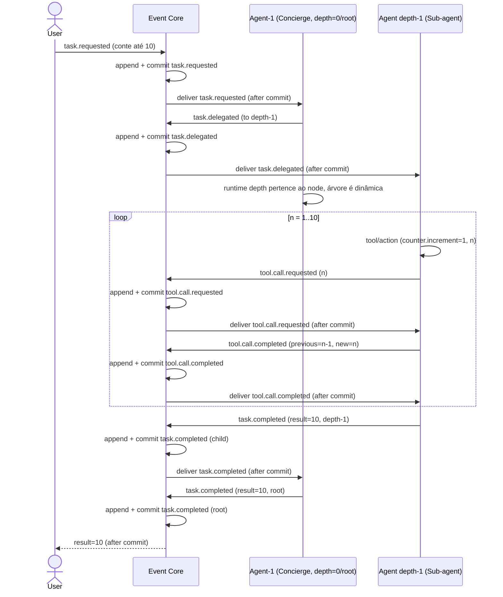
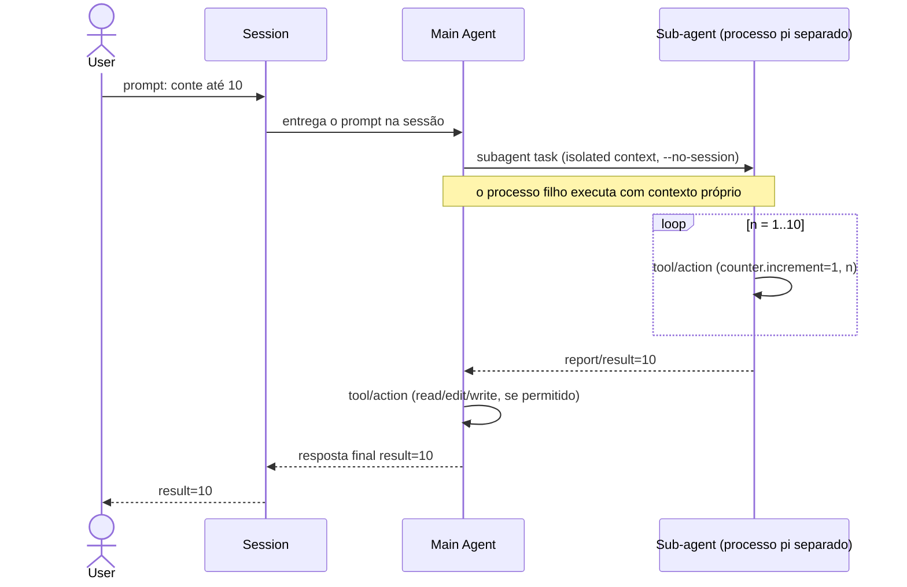
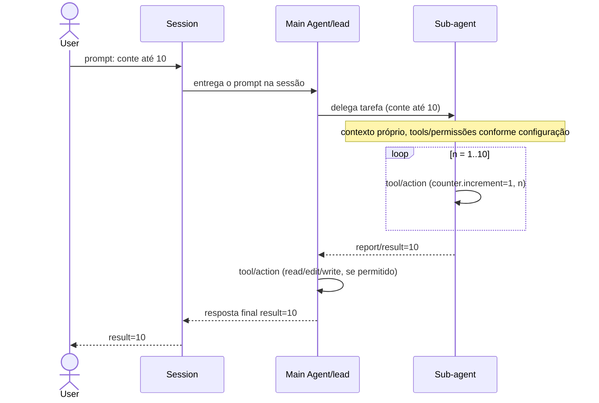
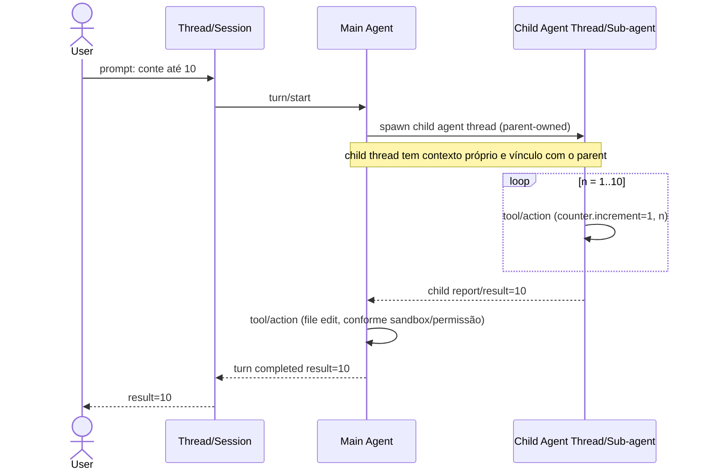

Status: comparação documental; Omunculus é TO-BE — planejado e não implementado.

# Comparação de harnesses pelo caso `conte até 10`

Este documento coloca o desenho TO-BE do Omunculus ao lado do comportamento
observável/documentado de Pi, Claude Code e Codex. O caso é sempre o mesmo:
o usuário pede `conte até 10`, e um agente principal pode delegar a contagem a
um subagente. Os diagramas não pretendem descrever internals privados. Onde a
documentação pública não expõe uma infraestrutura, a formulação é
**não exposto/documentado no modelo observável** — não uma afirmação de que
ela não exista.

## Premissas de leitura

- Em cada harness há uma única Session/Thread e um único Main Agent. O Main
  Agent pode editar quando as tools e permissões da execução permitirem.
- O Main Agent coordena a delegação e recebe o relatório do subagente. Uma
  implementação pode executar o subagente no mesmo processo, em outro
  processo ou em outra thread; isso é indicado apenas quando a fonte o torna
  observável.
- `counter` nunca é uma raia. Nos diagramas de harnesses existentes, a ação de
  tool aparece como self-message/payload do agente.
- O cenário mais próximo do formato híbrido usado hoje é o **Cenário 3** de
  [event-model.md](event-model.md): há Concierge/Main Agent e subagente, mas
  sem uma raia de Interceptor. A diferença decisiva é que o cenário 3 ainda
  coloca um Event Core explícito, com append + commit antes de cada entrega;
  isso não é uma semântica afirmada para os demais harnesses.

## Diagramas equivalentes

### 1. Omunculus TO-BE — cenário 3

Este é um desenho planejado, não implementado. O Event Core é a autoridade do
fluxo; o Interceptor foi removido. A profundidade é propriedade do runtime e
pode mudar conforme a árvore de execução (aqui, depth 0 → depth 1).

### 2. Pi — modelo atual observável

O Pi é extensível e o exemplo oficial de subagent adiciona uma tool que inicia
um processo `pi` separado, com contexto isolado; `--no-session` torna esse
processo efêmero. O Main Agent continua sendo o coordenador e pode usar as
próprias tools de edição. O exemplo abaixo mostra uma execução delegada.

O núcleo do coding agent não promete subagents como recurso padrão; a
capacidade observada aqui vem da extensão de exemplo. Portanto, “processo
separado” e `--no-session` descrevem esse caminho documentado, não todo uso
possível do Pi.

### 3. Claude Code — modelo atual observável

Subagents têm janela de contexto própria e devolvem resultado ao chamador; o
Main Agent gerencia o trabalho. Agent teams são uma opção experimental para
sessões independentes e não alteram a forma simples abaixo.

A documentação de [sub-agents](https://code.claude.com/docs/en/sub-agents)
descreve o retorno ao agente chamador. [Agent teams](https://code.claude.com/docs/en/agent-teams)
são experimentais, podem ter teammates em sessões independentes e não devem
ser lidos como um Event Core. A persistência e retomada de conversas são
tratadas como sessões; a semântica de envelopes duráveis do Omunculus é
**não exposta/documentada no modelo observável**.

### 4. Codex — modelo atual observável

No app-server, a unidade pública é Thread, com Turns e Items persistidos. A
colaboração Multi-Agent V2 cria um child agent thread controlado pelo parent;
o filho reporta ao Main Agent. As notificações do app-server são stream de
protocolo e não devem ser igualadas ao Event Core do Omunculus.

O modelo público de app-server descreve Thread, Turn e Item, incluindo
`parentThreadId` para subagents e notifications de progresso. Isso sustenta a
leitura de child thread parent-owned, mas não autoriza inferir um Event Core,
append-before-delivery ou replay determinístico nos termos do Omunculus.

## Matriz comparativa

| Dimensão | Omunculus TO-BE | Pi atual observável | Claude Code atual observável | Codex atual observável |
|---|---|---|---|---|
| **Session/Thread e ownership** | Event Core durável governa Work Item/Run; Session OTP atende uma Run ativa e não é a autoridade | Uma Session; extensão pode iniciar processo `pi` separado para o subagent | Uma Session; subagent tem janela própria; teams experimentais usam sessões independentes | Um Thread com Turns/Items; child thread é associado ao parent |
| **Main Agent** | Agent-1 (Concierge) é a raiz depth=0 e reporta ao usuário via Core | Um Main Agent na Session coordena a tool de subagent | Main Agent/lead coordena e sintetiza resultados | Main Agent conduz o turn e controla children |
| **Execução/contexto do subagente** | Execution Node/Run novo, parent runtime e depth dinâmicos; contexto e estado ligados à Run | Exemplo oficial: processo `pi` separado, contexto isolado e `--no-session` | Janela de contexto própria; recebe prompt/sistema e retorna resultado | Child Agent Thread próprio, parent-owned, com contexto/estado de thread |
| **Edição direta** | Agente edita via tools autorizadas; delegar não amplia sandbox | Main ou subagent edita conforme tools/permissões disponíveis | Main ou subagent edita conforme tools/permissões disponíveis | Main ou child edita conforme sandbox/permissões |
| **Coordenação e reporting** | Delegação e conclusão são eventos causados e persistidos; relatório sobe pela cadeia | Main chama subagent e recebe report/result | Main gerencia subagents e recebe resultado; teams adicionam messaging | Parent coordena child e recebe report/atividade |
| **Event Core explícito** | Sim: componente canônico, append + commit antes de dispatch | Não exposto/documentado no modelo observável | Não exposto/documentado no modelo observável | Não exposto/documentado no modelo observável; app-server notifications não equivalem ao Core |
| **Envelopes duráveis/replay** | Envelopes versionados em `EVENTS`, idempotência, replay e recovery são requisitos TO-BE | Sessões/transcripts podem ser persistidos; envelopes/replay de Event Core não expostos/documentados | Transcripts de sessão podem ser persistidos/retomados; envelopes/replay de Event Core não expostos/documentados | Thread history/Items são persistidos e retomáveis; envelopes/replay de Event Core não expostos/documentados |
| **Profundidade dinâmica** | Sim; depth pertence ao runtime e a política pode criar novos níveis | Delegação é extensível (single/parallel/chain no exemplo); depth não é contrato do núcleo | Não é uma dimensão declarada no modelo simples; teams/subagents têm regras próprias | Relações parent/ancestor de child threads são observáveis; uma política geral de depth não é afirmada aqui |

### Leitura do híbrido

O harness atual, visto pelo prisma comum da matriz, colapsa **Session + Main
Agent** em um fluxo local e usa subagents conforme a capacidade do produto. O
Omunculus TO-BE separa explicitamente **Event Core**, **Session** e **Execution
Node/Run**: a Session executa, enquanto o Core persiste e distribui. Por isso o
híbrido é estruturalmente mais próximo do **Cenário 3** (Concierge → subagent,
sem Interceptor), mas ainda não possui — nem deve ser descrito como possuindo —
as semânticas assertadas de Event Core, envelopes duráveis e replay.

## Prós e contras — leitura cética

Premissa desta seção: o **Omunculus TO-BE é tratado como implementado e
fiel** a [execution-model.md](execution-model.md), [event-model.md](event-model.md),
[requirements.md](requirements.md) e [architecture.md](architecture.md). A
comparação é entre **dois modelos de runtime**, não entre “papel” e “produto”.
O status de implementação do Omunculus não entra como argumento de pró ou
contra.

Regras TO-BE que a análise assume como fato:

- Agent é só config pinada (`kind`, model, prompt, **tools**, budget, params);
  não carrega `reports_to` / `parent` / `depth`.
- Depth, parent e reporting pertencem ao Execution Node/Run. O root tem
  `depth = 0` e **pode spawnar**; spawn cria filho com `depth = parent.depth + 1`.
  O que limita árvore é `max_depth`/budget/aciclicidade e a presença da tool de
  spawn — não o fato de estar em depth 0.
- Capacidade efetiva = **tools da config pinada ∩ limites do runtime**
  (`max_depth`, budget, sandbox). Delegar **não** amplia sandbox.
- Work Item tem **estados e gates**: transições configuradas podem exigir
  passos (ex.: verificação solicitado × implementado em contexto limpo) antes
  de avançar. Com o gate ligado, o runtime **não conclui** sem disparar esse
  passo; com o gate desligado / preset “harness normal”, o fluxo pode parecer
  Session+Main(+subagent) dos outros.
- Todo hop relevante passa pelo Event Core: append + commit em `EVENTS` antes
  de deliver; replay, idempotência e recovery são contrato, não opcional.

### Depth, tools e gates de estado

**Depth 0 não bloqueia spawn.** Depth descreve a posição do node na árvore
(`0` = root). Bloquear spawn exige ausência da tool de spawn ou estouro de
`max_depth`/budget — nunca “estar em depth 0”. O preset “harness normal” é
root (depth 0) com spawn + edit (e `max_depth` suficiente para filhos).

**Tools fecham capacidade; gates de estado fecham progresso.** Sem tools de
efeito no Concierge, ele não edita. Isso sozinho não impede `task.completed`
textual. O ponto do Omunculus — e o contraste com Pi/Claude/Codex — é poder
amarrar avanço de Work Item a **gates por estado**: se configurado, a
transição não fecha até o runtime executar o passo gated (ex.: spawn de
análise solicitado × implementado em contexto limpo). Nos outros harnesses,
o mesmo padrão só aparece se o usuário (ou uma integração externa) mandar o
modelo fazer isso; depende de tool-calling correto e protocolos frágeis. No
Omunculus configurado, a **orquestração do gate é certa** — o estado não
avança sem o passo.

**O que “100%” significa aqui.** Com gate ligado, é 100% certo que o *passo*
roda e fica no log antes do estado avançar — independentemente do modelo
“lembrar”. Isso é o ponto do Omunculus. O conteúdo do veredito dentro do passo
(agente ou checker) é outro problema; o runtime não finge resolver julgamento
semântico, só deixa de depender de disciplina humana/integração frágil para o
rito existir. Preset sem gates + root com spawn/edit continua sendo uso como
harness normal.

### O que o Omunculus ganha frente aos harnesses

| Pró do modelo Omunculus | Leitura cética |
|---|---|
| Event Core com append + commit antes de cada entrega | Autoridade única para audit, recovery e replay. Custo estrutural: no loop `conte até 10`, cada incremento gera pelo menos o par `tool.call.requested` / `tool.call.completed` persistido antes da entrega. Observabilidade dura e latência no hot path andam juntas. |
| Gates por estado (solicitado × implementado, etc.) | Diferencial de produto: orquestração do check não depende do modelo “lembrar” nem de glue externo. Custo: máquina de estados + Runs extras no gate. |
| Envelopes versionados, causação, correlação, idempotência | Recovery intermediário e debugging da cadeia são de primeira classe. Preço: superfície operacional (schema_version, efeitos `unknown`, CAS, retenção de `EVENTS`). |
| Separação Event Core / Session / Execution Node | Session não é dona do estado; Core governa, Session atende Run. Mais clareza em multi-run; menos economia cognitiva que Session+Main. |
| Depth no runtime + tools na config | Fronteira de capacidade e teto da árvore são explícitos. Root depth 0 com spawn é normal. Isolamento forte = tools restritas **e** gates; só um dos dois é incompleto. |
| Delegação/conclusão como eventos causados | Cadeia Concierge → filho → report (e passos gated) auditável ponta a ponta. Nos outros, o report ao Main é o ponto observável. |

### O que Pi / Claude Code / Codex ganham frente ao Omunculus

| Pró do modelo atual observável | Leitura cética em relação ao Omunculus |
|---|---|
| Modelo mental curto: Session/Thread → Main → subagent → report | Menos entidades no caminho feliz. O diagrama Omunculus gated é mais longo; hops de Core e Runs de verificação somam. |
| Hot path de tool sem mediador canônico | Sem append-before-delivery obrigatório por micro-evento no modelo observável. Mais barato no loop trivial. |
| Persistência alinhada a conversa/thread | Retomada de diálogo sem máquina de estados de Work Item. Mais simples quando não se quer gates. |
| Verificação ad hoc via subagent/sessão limpa | Dá para pedir “solicitado × implementado” manualmente. Flexível; **não** é garantia de que o passo ocorreu antes de “pronto”. Replicar o gate do Omunculus exige ferramentas externas + integrações frágeis e ainda depende do modelo chamar as tools certas. |

### Contras do Omunculus (do modelo, não do status de build)

1. **Custo de mediação no hot path.** Append + commit + deliver por evento de
   tool é requisito; gates somam Runs/eventos. SQLite/WAL e dispatcher entram
   no caminho crítico.
2. **Superfície operacional do Core + da máquina de estados.** Idempotência,
   redelivery, efeito `unknown`, schema_version, retenção de `EVENTS` e
   transições de Work Item são carga permanente. Transcript/thread aceita
   opacidade.
3. **Configuração: tools, depth/`max_depth`, sandbox e gates.** Isolamento e
   “certeza de que o check rodou” exigem alinhar os quatro. Preset frouxo
   (spawn+edit, gates off) é harness normal — válido, mas então o diferencial
   gated não está ativo. O ponto frágil é disciplina de preset, não depth 0.
4. **Preset “harness normal” aproxima opções; não clona o sistema.** Root
   depth 0 + spawn + edit (gates off) cobre editar/delegar como nos outros.
   Continuam diferentes: Event Core no hot path, filho como Execution
   Node/Run, Work Item como unidade. O contra residual é overhead de
   autoridade — não falta de capacidade de Main.
5. **Silêncio documental dos outros ≠ vácuo.** Internals podem ter hooks; o
   diferencial defensável é contrato explícito de estados/gates + Core, não a
   certeza de que Pi/Claude/Codex nunca verificam nada por baixo.

### Contras dos harnesses atuais (do modelo observável)

1. **Não há gate de estado como contrato.** “Pronto” pode significar só o Main
   declarou. Verificação solicitado × implementado é manual, por prompt, ou
   por integração externa frágil — e ainda depende do modelo chamar as tools
   certas. O Omunculus, com gate ligado, torna a orquestração desse passo
   certa.
2. **Recovery no meio da delegação não é contrato.** Morte do subagent no
   incremento 7 deixa, no observável, sobretudo a ausência de report.
3. **Sem depth + tools + gates como fechamento explícito.** Main com edit
   conclui sem delegar; não há dimensão pública uniforme de profundidade nem
   de transição gated.
4. **Causação da cadeia não é envelope correlacionado.** Depende de logs de
   produto, não de `correlation_id` / `causation_id` canônicos.
5. **Session/Thread como autoridade implícita.** Funciona na conversa;
   multi-run e projeções reconstruíveis favorecem Core + Work Item/Run.
6. **Contratos de subagent heterogêneos.** Extensão vs feature vs child thread:
   difícil a mesma política de depth, tools, gates e replay entre produtos.

### Veredito cético (não prescritivo)

- **Dois presets legítimos.** (A) Harness normal: root depth 0 + spawn + edit,
  gates off — mesmo espaço de opções dos outros; ainda paga o Core. (B) Gated:
  estados exigem o rito (ex. verificação em contexto limpo) — orquestração
  certa sem o usuário spawnar análise à mão. Isso é o diferencial; não é
  “Main editar/spawnar”, que o Omunculus já cobre no preset A.
- O que Pi/Claude/Codex não fecham no modelo observável: **transição de Work
  Item que não avança sem o rito configurado**, com histórico no Event Core.
  Replicar fora é glue + fé no tool-calling.
- Depth 0 não bloqueia spawn. Bloqueio é tool/`max_depth`/budget.
- Risco central do Omunculus: Core caro no hot path e disciplina de preset
  (gated vs harness normal). Risco central dos outros: verificação
  não-obrigatória quando a disciplina importa.

Hipótese falseável: com gate “solicitado × implementado” ligado, nenhuma
conclusão de Work Item ocorre sem o passo gated persistido em `EVENTS`, mesmo
se o Concierge tentar `task.completed` cedo. Com o mesmo pedido só via prompt
em Pi/Claude/Codex, o passo pode ser omitido.

## Fontes oficiais

As fontes abaixo sustentam apenas o que é público e observável/documentado em
cada projeto; não são evidência sobre internals privados.

### Pi

- [Repositório Pi](https://github.com/badlogic/pi-mono)
- [README do coding agent](https://github.com/badlogic/pi-mono/blob/main/packages/coding-agent/README.md)
- [README da extensão oficial de subagent](https://github.com/badlogic/pi-mono/blob/main/packages/coding-agent/examples/extensions/subagent/README.md)
- [Implementação da extensão de subagent](https://github.com/badlogic/pi-mono/blob/main/packages/coding-agent/examples/extensions/subagent/index.ts)
- [Formato de sessões](https://github.com/badlogic/pi-mono/blob/main/packages/coding-agent/docs/session-format.md) e [gerenciamento de sessões](https://github.com/badlogic/pi-mono/blob/main/packages/coding-agent/docs/sessions.md)

### Claude Code

- [Sub-agents](https://code.claude.com/docs/en/sub-agents)
- [Agent teams](https://code.claude.com/docs/en/agent-teams)
- [Sessions](https://code.claude.com/docs/en/sessions)

### Codex

- [Repositório OpenAI Codex](https://github.com/openai/codex)
- [README do app-server](https://github.com/openai/codex/blob/main/codex-rs/app-server/README.md)
- [Spawning de agents (fonte)](https://github.com/openai/codex/blob/main/codex-rs/core/src/agent/control/spawn.rs)
- [Controle e metadados de spawn (fonte)](https://github.com/openai/codex/blob/main/codex-rs/core/src/agent/control.rs)
- [Thread data do protocolo V2 (fonte)](https://github.com/openai/codex/blob/main/codex-rs/app-server-protocol/src/protocol/v2/thread_data.rs)
