Status: plano — ordem proposta para sair da spike e chegar ao TO-BE

# Plano de implementação

Sete fases, cada uma fechando com a suíte verde e uma parte da matriz de
`test/fixtures/config/README.md` passando. A ordem segue as dependências:
nada de permissão antes de política, nada de time antes de continuação,
nada de sessão antes de workspace no envelope.

## Regras do jogo

- Documento antes de código; um commit por intenção; nunca push.
- A branch `spike/event-core` continua sendo o lugar de trabalho até a fase
  2; ali ela vira base e vai para `main`. Os documentos `as-is/` são
  reescritos nesse momento.
- **Reutilizado como está**: `Envelope`, `EventCore`, `Store`, `Projector`,
  `Events`, `Interceptor` e `Automations`, `CLI.Events` (`events`, `emit`,
  `config check`), `Config`.
- **Reescrito**: `Runtime`, `Runtime.Run`, `SpikeAgents`, o comando `spike`.
- Cada fase muda o status de um documento de "proposta" para "planejado,
  validado" só quando o teste correspondente passa.

## Visão

```mermaid
gantt
    dateFormat X
    axisFormat %s
    section Base
    F0 Harness de teste            :f0, 0, 1
    F1 Pedir é concluir            :f1, after f0, 2
    F2 Política de tools           :f2, after f1, 2
    section Organização
    F3 Papéis, agentes e times     :f3, after f2, 2
    F4 Sessão e workspaces         :f4, after f3, 2
    section Interação
    F5 Permissões e inbox          :f5, after f4, 3
    F6 Trabalho entre linhagens    :f6, after f5, 2
    section Fora
    F7 Runtime residente e provider real :f7, after f6, 2
```

## Fase 0: harness de teste

Sem isso as fases seguintes não têm como ser afirmadas.

- `Chat.Fake` com script **por node** (função `agent_id, depth, workspace,
  team -> turnos`), não por depth.
- Helper `await_log(core, fun, timeout)`: espera um envelope aparecer no log,
  em vez de um processo responder.
- Fixtures carregáveis de diretório temporário, para os testes que editam
  TOML.
- Suíte parametrizada: uma função por nível da matriz que recebe base,
  overlay e tarefa e roda o bloco de invariantes (cadeia linear, log
  idêntico com e sem lane, replay igual, redelivery no-op, tools pinadas,
  contadores do interceptor).

Saída: os invariantes rodam contra os cenários 3 e 4 de hoje.

## Fase 1: pedir é concluir

Muda a primitiva da Run ([execution-model.md](execution-model.md)).

- `Run`: ao delegar, apenda `task.delegated`, grava checkpoint (mensagens,
  estado das tools, `awaiting`) em `run.completed` com `outcome = waiting`, e
  termina. Nenhum `receive` esperando filho.
- `Runtime`: ao entregar `task.completed` de um filho, abre Run nova do
  Work Item pai com `reason = continuation`, `attempt + 1`, causação na
  resposta, checkpoint restaurado e a resposta como primeira observação.
  `awaiting` como lista.
- `Projector`: `WORK_ITEMS.awaiting`, `ARCHIVE_RUNS.reason` e `outcome`.
- Catálogo: campos novos em `run.started` e `run.completed`.
- `spike --fail-at` continua funcionando: retomada é o mesmo mecanismo com
  `reason = retry`.

Testes: cenários 3 e 4 com duas Runs por Work Item de concierge; crash e
retomada; líder esperando três filhos reaberto três vezes.

Saída: nenhum processo de Run vivo entre pedido e resposta;
`Runtime.runs()` vazio durante a espera.

## Fase 2: política de tools

[tool-policy.md](tool-policy.md) e [config.md](config.md).

- Catálogo de tools com grupos (`fs.read`, `fs.write`) e versão
  (`tools_catalog`).
- `Policy`: normalização de cada entrada para quatro faixas; interseção
  faixa a faixa; tabela perfil × depth × workspace; hash.
- `Runtime.start_run` relê o config, normaliza, compara hash, apenda
  `policy.loaded` quando muda, consulta a linha, intersecta com a
  autoridade do pai vinda em `task.delegated`, pina em `run.started.tools`.
- `Agent` recebe lista pronta; schemas fixos por Run; `request_permission`
  exposta quando `negotiable ∪ human ≠ ∅` (só o schema, sem efeito ainda).
- `ToolGate`: interceptor em `tool.call.requested` lendo `run.started` do
  log.
- `config check` imprime as faixas expandidas; falha em perfil fora de
  teto e em `tools_catalog` desatualizado.
- CLI: `--profile` em `run` e `spike`; `--tools` vira estreitamento.
- Config inválido a quente vira `run.failed` com `policy_invalid`.
- `WORK_ITEMS.awaiting` na projeção; o Runtime localiza o pai que espera
  por consulta à projeção, não varrendo `task.delegated`.

Testes: `simple.toml` e `medium.toml`, com e sem `lane.toml`, com as duas
tarefas; edição do TOML entre duas Runs muda a segunda e não a primeira;
`--profile ask` bloqueia `edit` nas três barreiras.

Saída: metade da matriz verde. A branch vai para `main`; `as-is/` é
reescrito para descrever o que existe.

## Fase 3: papéis, agentes e times

[team-model.md](team-model.md).

- `[agents]` vira a fonte de chat e prompt; `[session].roles` atribui por
  depth; `SpikeAgents` morre.
- `[teams]`: `delegate` ganha `team` no depth 0 e `agent` no depth 1;
  `run.started` pina `team` e `agent_id`; perfil do time entra na tabela.
- O perfil do time **estreita** a linha da tarefa: `Policy.line(perfil
  da tarefa) ∩ normalize(perfil do time)`, nunca substitui.
- `TeamGate`: membro fora do time, time fora do workspace.
- Tool `workspaces` devolvendo times (ainda com um workspace só).

Testes: `medium-teams.toml` com e sem lane; roteamento por tipo de tarefa;
`TeamGate` vetando.

## Fase 4: sessão e workspaces

[session-model.md](session-model.md).

- Sessão padrão por usuário em `~/.omunculus/session.sqlite3`;
  `session.created`, `workspace.attached`, `workspace.detached`.
- Nodes de depth 0 e 1 com identidade derivada e reutilizados entre Runs,
  incluindo `scope = "node"` por time (movido da fase 3: não há node
  derivado antes daqui); `session_id` e `workspace_id` preenchidos em todo
  envelope.
- Sandbox `roots` por node; `WorkspaceGate`.
- CLI: `send`, `workspace attach|detach`, `session create|list`; `run
  <dir>` como atalho de sessão efêmera.
- Concierge de depth 0 roteando por `workspaces`; contexto reconstruído de
  `COMMENTS`.
- Interceptores com `workspaces = [...]`.
- Recuperação ao subir: o Runtime reconstrói do log as continuações
  pendentes (Work Item em `waiting` cujo filho já tem `task.completed`);
  a fila em memória da fase 1 deixa de ser a única fonte.

Testes: `complex.toml` sem a parte de permissão: dois workspaces, depth 2,
`infra` só leitura pelas três barreiras, automação disparando.

## Fase 5: permissões e inbox

[permission-negotiation.md](permission-negotiation.md).

- Tipos `permission.requested|granted|denied|revoked`, `policy.changed`,
  `task.commented`, `inbox.read` no catálogo.
- `request_permission` com efeito: `request_id = hash(tarefa, tool)` como
  `idempotency_key`; Run fecha em `waiting`; consulta prévia à política e
  ao log (concedido, negado, aberto).
- Árbitro: pai por autoridade, humano por faixa; Run de arbitragem com
  `grant`/`deny`/`escalate`; `permission.granted` de pai com `permanent`
  rejeitado pelo Core.
- Temporária por linhagem no `ToolGate`; permanente editando TOML e
  apendando `policy.changed`; `policy.changed` fechando pedidos abertos
  que satisfaz.
- `COMMENTS` com `kind = request|response`; CLI `inbox`, `inbox reply`,
  `inbox read`; `emit` com `request_id`.

Testes: os três blocos de "como testar permissões" do histórico de decisão:
temporária não vaza, herda para baixo, termina com a tarefa, dedupe na
mesma tarefa; permanente muda o arquivo, `policy.loaded` novo, fecha pedido
de outra tarefa; pai não concede permanente.

Saída: `complex.toml` inteiro, com e sem lane.

## Fase 6: trabalho entre linhagens

[team-model.md](team-model.md).

- `request_work`: LCA por linhagem; `routed` cria Work Item no alvo com
  `requested_by` e `WORK_ITEM_DEPENDENCIES`; `mediated` abre Run de
  arbitragem no LCA.
- `directory` com escopo por teto; `TeamGate` vetando pedido sem autoridade
  ou fora do escopo.
- `cross_lineage` no `[session]`.

Testes: `complex-teams.toml` com e sem lane; LCA no líder versus no depth
0; `mediated` reescrevendo instrução; asserção negativa de canal lateral em
toda a matriz.

Saída: matriz completa verde, dezoito a vinte casos.

## Fase 7: runtime residente e provider real

- Core percebendo appends externos (polling por `sequence` ou processo
  residente por sessão), para `emit` e `inbox reply` alcançarem uma sessão
  em execução sem reiniciar.
- `events follow` em tempo real sobre a sessão viva.
- Matriz de três níveis contra o `qwen3.5:4b`, com e sem lane, registrada
  no doc da spike.
- Remoção do comando `spike`: o que ele fazia passa a ser `send` com
  `--provider fake`.

Saída: TO-BE inteiro com status "planejado, validado"; `recommendations.md`
vira histórico.

## Critérios transversais

- Toda fase mantém: append antes de entrega, log idêntico com e sem lane,
  replay reconstruindo projeções, nenhum canal fora de `EVENTS`.
- Nenhuma fase introduz timer preso a processo, espera bloqueante entre
  agentes, ou permissão que não esteja no log.
- Um cenário real que falhe por modelo (deriva de instrução, resultado
  vazio) vira achado documentado, não teste quebrado.
