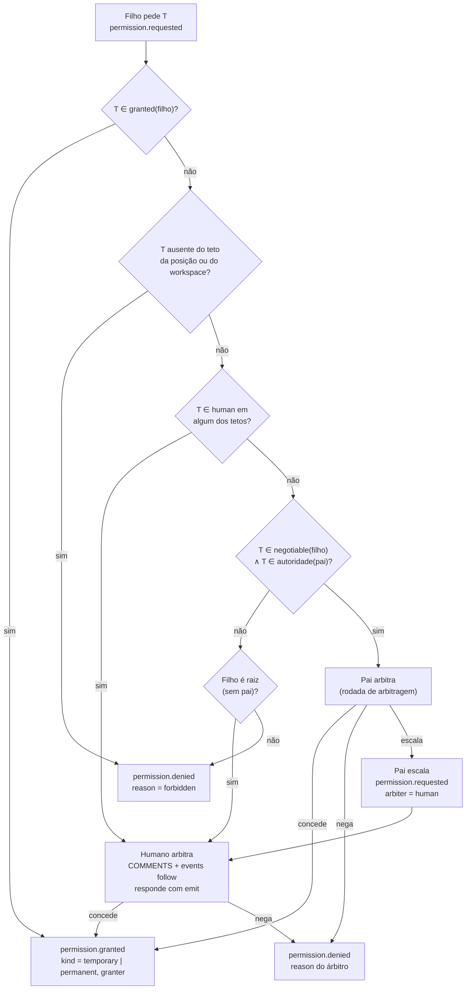
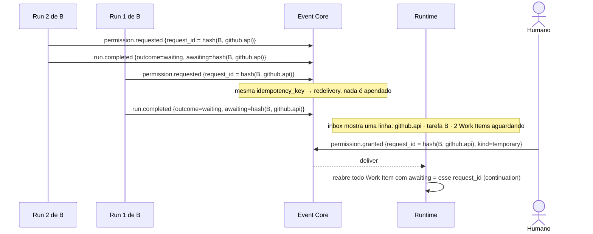
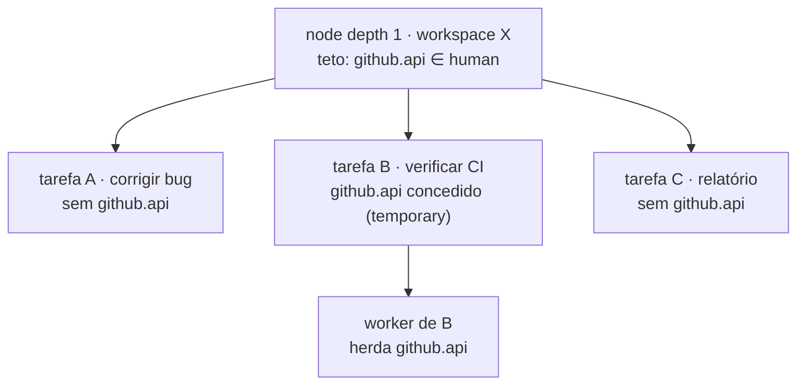
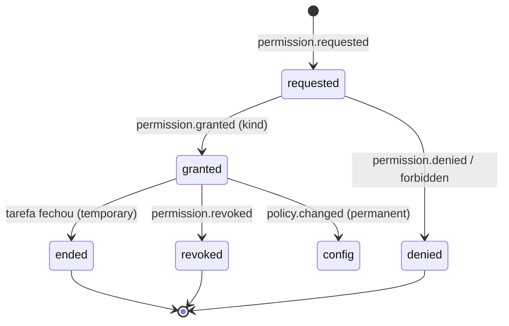

Status: TO-BE — proposta, aguardando avaliação

# Permissões temporárias e negociação

Complementa [tool-policy.md](tool-policy.md). Lá o conjunto efetivo de um nó
é fixado no nascimento. Aqui ele pode **crescer durante a execução**, mas só
por um caminho: um pedido registrado no log, arbitrado por quem tem
autoridade, temporário para aquela tarefa ou permanente na configuração, e
aplicado pelo mesmo `ToolGate`. Nada é concedido fora de `EVENTS`.

## As faixas que a negociação usa

As faixas `granted`, `negotiable`, `human` e proibido, os modos `allow` e
`deny` e a interseção estão definidos em [tool-policy.md](tool-policy.md).
Este documento só usa o resultado normalizado: uma tool é negociável para um
nó se, no efetivo, está em `negotiable`; vai ao humano se está em `human`; é
recusada sem escalar se está proibida.

```toml
[ceiling.depth1]
mode = "allow"
negotiable = ["edit", "write"]     # o pai pode conceder
human      = ["delete"]            # só um humano concede

[workspaces.infra]
roots = ["./infra"]
mode = "deny"
granted = ["read", "grep", "find", "ls"]
human   = ["edit"]                 # editar infra exige humano, sempre
```

| Faixa | Quem concede | Onde a decisão fica |
|---|---|---|
| `granted` | ninguém precisa; já é efetivo | `run.started.tools` |
| `negotiable` | o pai, dentro da própria autoridade | `permission.granted` com `granter = run:<parent>` |
| `human` | um humano, pela CLI | `permission.granted` com `granter = human:<origin>` |
| ausente | ninguém | `permission.denied` com `reason = forbidden`, sem escalar |

## Autoridade do pai

Um pai só concede o que ele mesmo poderia obter **sem humano**:

```
autoridade(pai) = granted(pai) ∪ negotiable(pai)
pai pode conceder T ao filho  ⇔  T ∈ negotiable(filho) ∧ T ∈ autoridade(pai)
```

Isso mantém a regra "delegar nunca amplia": a árvore não consegue, por
negociações sucessivas, chegar a uma tool que a raiz não poderia ter. O que
está em `human` em qualquer nível acima do filho continua exigindo humano.



Um pai pode **escalar** em vez de decidir: ele tem autoridade, mas prefere
que um humano avalie. A escalada é registrada; o filho não sabe quem decidiu,
só recebe o resultado.

## O pedido, visto pelo modelo

O modelo pede por uma tool sempre exposta, `request_permission`, com schema
fixo: `tool` e `reason`. Ele não escolhe se a concessão é temporária ou
permanente, nem quem arbitra. Isso é decisão de quem concede.

A Run do filho transforma a chamada em `permission.requested` e **fecha**:
grava o checkpoint, apenda `run.completed` com `outcome = waiting` e
`awaiting = {permission, request_id}`, e o processo termina. Não há espera
em processo; o Work Item fica em `waiting`
([execution-model.md](execution-model.md), "Pedir é concluir").

Quando `permission.granted` ou `permission.denied` é entregue, o Runtime
abre uma Run nova do mesmo Work Item a partir do checkpoint, com a decisão
como primeira observação: "edit granted for this task" ou "denied: …". Se concedido, essa Run expõe o schema da tool; allowlist e
`ToolGate` passam a aceitá-la.

```mermaid
sequenceDiagram
    participant CM as Modelo do filho
    participant C1 as Run filho #1 (depth 2)
    participant EC as Event Core
    participant RT as Runtime
    participant P as Run pai (arbitragem)
    participant C2 as Run filho #2 (continuation)
    participant G as ToolGate

    CM->>C1: request_permission(tool=edit, reason)
    C1->>EC: permission.requested {request_id, tool=edit}
    C1->>EC: run.completed {outcome=waiting, awaiting=request_id, checkpoint}
    Note over C1: processo termina
    EC->>EC: commit; Work Item → waiting
    Note over EC: edit ∈ negotiable(filho) ∧ edit ∈ autoridade(pai) → arbiter = run:pai
    EC-->>RT: deliver permission.requested
    RT->>P: abre Run de arbitragem no node do pai (reason=arbitration)
    P->>EC: permission.granted {request_id, granter=run:pai, kind=temporary}
    P->>EC: run.completed
    EC-->>RT: deliver permission.granted
    RT->>C2: run.started (attempt+1, reason=continuation, causation=permission.granted)
    C2-->>CM: checkpoint + "edit granted for this work item"
    CM->>C2: edit(...)
    C2->>EC: tool.call.requested (tool=edit)
    EC->>G: intercept
    Note over G: pinado ∪ grants da tarefa e de seus ancestrais − revogados ∋ edit → :deliver
    EC-->>C2: deliver
    C2->>C2: executa edit
```

A arbitragem do pai também é uma Run: curta, no node do pai, com
`reason = arbitration`, expondo três tools efêmeras, `grant`, `deny` e
`escalate`. O pai não estava esperando: ele já tinha fechado sua Run em
`waiting` ao delegar. A decisão do modelo vira comando no log com `reason`,
então a auditoria mostra por que um pai concedeu.

## Um pedido por tool por tarefa

Dentro de uma tarefa pode haver várias Runs ao mesmo tempo: continuações e
workers. Duas delas podem descobrir, cada uma por si, que não têm a mesma
tool. Não podem existir dois pedidos abertos para a mesma tool na mesma
tarefa: o humano veria duas linhas na inbox para decidir uma coisa só.

A solução é identidade derivada, não coordenação entre processos. O
`request_id` de um pedido é `hash(tarefa, tool)`, onde tarefa é o Work Item
raiz da linhagem a que a concessão se ligaria. Esse `request_id` é também a
`idempotency_key` do envelope. O que acontece com o segundo pedido segue
das regras de dedupe do Core, sem código novo:

| Estado do pedido `hash(B, T)` no log | Run 1 de B chama `request_permission(T)` |
|---|---|
| não existe | apenda `permission.requested`; Run fecha em `waiting` sobre ele |
| aberto (Run 2 já pediu) | o append é redelivery idempotente, nada novo no log; Run 1 fecha em `waiting` sobre o **mesmo** `request_id` |
| concedido | nenhum pedido: a Run recebe a observação "já concedido para esta tarefa" e expõe a tool na rodada seguinte |
| negado | nenhum pedido: observação "negado para esta tarefa: motivo". Só um humano reabre, respondendo ao pedido negado pela inbox |



Quando a resposta chega, o Runtime reabre **todos** os Work Items que
fecharam aguardando aquele `request_id`, cada um por continuação a partir do
próprio checkpoint. A inbox mostra o pedido uma vez, com quantos Work Items
esperam por ele.

Uma Run que já estava em andamento quando a concessão chegou não pede: a
tool não estava na exposição dela, mas se o modelo tentar, o `ToolGate` lê a
concessão na linhagem e entrega; se o modelo chamar `request_permission`, cai
na linha "concedido" da tabela. Nos dois casos nenhum pedido novo nasce.

## Escalada ao humano

Quando o árbitro é humano, o pedido usa o que o TO-BE já reserva para
"solicitações e respostas humanas duráveis": vira uma linha em `COMMENTS`
com `kind = request`, aparece em `omunculus events follow` e em qualquer
automação que escute `permission.requested`. O humano responde pela CLI:

```sh
omunculus emit permission.granted --db ./harness.sqlite3 \
  --payload '{"request_id":"req-…","kind":"temporary"}'
```

```mermaid
sequenceDiagram
    participant C as Run filho
    participant EC as Event Core
    participant RT as Runtime
    participant A as automação notify
    actor H as Humano
    participant CLI as omunculus emit

    C->>EC: permission.requested {tool=edit, workspace=infra}
    C->>EC: run.completed {outcome=waiting}
    Note over EC: edit ∈ human(workspaces.infra) → arbiter = human
    EC->>EC: append + commit; Projector grava COMMENTS(kind=request)
    EC-->>A: deliver
    A->>H: notificação com request_id, tool, reason, workspace
    H->>CLI: emit permission.granted {request_id, kind}
    CLI->>CLI: request_id existe, ainda aberto, tool ∈ human(teto)?
    CLI->>EC: append permission.granted (granter = human:<origin>)
    EC-->>RT: deliver → Run nova do filho (continuation)
    Note over EC: sem resposta, o pedido fica aberto indefinidamente; nada expira
```

Regras da escalada:

- **um pedido não tem vida útil.** Fica aberto até um humano conceder ou
  negar. Não há prazo, não há negação automática, não há expiração de
  pedido. Uma concessão temporária termina com a tarefa; uma permanente
  vira configuração;
- nenhum processo fica vivo esperando. O Work Item está em `waiting` no
  log, o pedido aparece na inbox, o humano responde quando quiser, e a
  resposta abre a Run nova. Um pedido aberto por dias custa zero;
- um humano pode negar de vez com `permission.denied`, e pode incluir um
  comentário que vira observação para o modelo na continuação.

## Temporária ou permanente

Uma concessão é de um de dois tipos. Quem concede escolhe; o modelo não
opina.

| `kind` | Vale para | Sobrevive a continuação e retry? | Termina |
|---|---|---|---|
| `temporary` | a **tarefa** que pediu: o Work Item solicitante e todo Work Item que ele delegar depois da concessão | sim | quando a tarefa fecha (`task.completed` ou falha definitiva) |
| `permanent` | a configuração: o workspace, o teto ou o perfil que barrava | sim | nunca; é mudança de TOML |

Temporária não vaza para o lado. No exemplo de um workspace sem a API do
GitHub habilitada:

1. `send "corrija o bug X"` abre a tarefa A no depth 1 desse workspace. Ela
   segue trabalhando.
2. `send "verifique o histórico de CI no GitHub"` abre a tarefa B no mesmo
   node. B precisa de `github.api`, que está em `human` no workspace, e pede.
3. Você concede **temporária**. `permission.granted` com `kind = temporary`
   fica ligado à tarefa B. B continua, delega o que precisar, e os workers
   dela herdam a concessão porque são descendentes de B.
4. A tarefa A não sabe de nada: a concessão não está na linhagem dela, e o
   `ToolGate` só olha a linhagem da Run que pede.
5. `send "gere o relatório de releases"` abre a tarefa C no mesmo workspace.
   C não tem `github.api`: a concessão era de B, e B já fechou ou é outra
   linhagem.
6. Se em vez disso você tivesse concedido **permanente**, o harness teria
   editado o TOML do workspace e registrado `policy.changed`; C, e qualquer
   tarefa seguinte, resolveria a política nova antes de nascer.





**Permanente não é concessão que dura, é mudança de política.** Ela edita o
TOML (o mesmo que `omunculus policy grant --permanent` faria) e registra
`policy.changed` no log com o diff. O log guarda o fato; o TOML guarda o
estado. Só humano concede permanente: `permission.granted` com
`kind = permanent` e `granter = run:*` é rejeitado pelo Core.

## Revogação

`permission.revoked` é um comando com `request_id` ou `grant_id`. Pode vir
do humano (CLI) ou do pai que concedeu. Vale a partir da próxima verificação
do `ToolGate`; uma chamada já entregue termina. A Run recebe a revogação como
observação na rodada seguinte e deixa de expor a tool.

## Como o ToolGate aplica

O `ToolGate` de [tool-policy.md](tool-policy.md) passa a calcular, por Run e
a cada `tool.call.requested`:

```
permitido(run, T) = T ∈ run.started.tools
                  ∨ ∃ grant temporário para T ligado a run.work_item
                      ou a um ancestral de run.work_item
                      ∧ tarefa da concessão ainda aberta ∧ não revogado
```

Em palavras: a Run pode usar T se T foi pinada no nascimento, ou se existe
uma concessão temporária de T ligada ao seu próprio Work Item ou a um
ancestral dele, a tarefa dessa concessão ainda não fechou, e ninguém
revogou. Concessão permanente nem entra aqui: ela já chegou pela política
resolvida em `run.started`.

Tudo isso é derivado do log, nunca do processo. É a mesma leitura que o
replay faz, então o conjunto efetivo de qualquer rodada passada é
reconstruível. Não há evento de expiração: a concessão temporária termina
porque a tarefa fechou, e isso já está no log.

## Catálogo: tipos novos

| Tipo | Kind | Emitido por | Interceptável | Injetável |
|---|---|---|---|---|
| `permission.requested` | event | Run | sim | não |
| `permission.granted` | command | Run (pai) ou CLI (humano) | sim | sim |
| `permission.denied` | command | Run (pai), CLI (humano) ou Runtime (forbidden) | não | sim |
| `permission.revoked` | command | Run (pai) ou CLI | sim | sim |
| `policy.changed` | event | CLI | não | não |

`permission.granted` e `permission.revoked` são interceptáveis de propósito:
uma organização pode colocar um interceptor que veta qualquer concessão de
`write` fora do horário comercial, e o veto fica no log como
`delivery.rejected`.

## Configuração completa de um caso

```toml
[ceiling.depth0]
mode = "deny"
granted    = ["fs.read", "delegate"]
negotiable = ["edit"]

[ceiling.depth1]
mode = "deny"
granted    = ["fs.read", "delegate"]
negotiable = ["edit", "write"]
human      = ["delete"]

[workspaces.app]
roots = ["./apps/web"]
mode = "allow"
negotiable = ["delete"]

[workspaces.infra]
roots = ["./infra"]
mode = "deny"
granted = ["fs.read"]
human   = ["edit", "write"]

[profiles.fix]
mode = "deny"
granted = ["fs.read", "edit"]
```

Leitura de dois pedidos:

- worker em depth 1, workspace `app`, pede `write`: está em `negotiable` do
  depth 1 e em `granted` do workspace; o pai (depth 0) tem `write`? Não está
  na autoridade dele (`granted ∪ negotiable` do depth 0 não inclui `write`).
  Resultado: pai não pode; filho não é raiz; **negado como forbidden**. Para
  permitir, `write` precisaria entrar em `negotiable` do depth 0.
- worker em depth 1, workspace `infra`, pede `edit`: está em `human` do
  workspace. Vai direto ao humano, mesmo que o pai tivesse autoridade.

## Não-objetivos

Não há concessão fora do log, não há concessão implícita por delegação, não
há "modo confiável" que pule o `ToolGate`, e o modelo nunca escolhe validade
nem árbitro. Pedido não expira. Temporária morre com a tarefa. Permanente é
TOML.

## Impacto e ordem

Depende de [tool-policy.md](tool-policy.md) implementado (faixas, modos e
`ToolGate`). Depois:

1. cálculo de `autoridade` do pai e do árbitro por faixa; `config check`
   valida.
2. tool `request_permission`, tipos `permission.*` no catálogo, espera no
   Run e projeção em `COMMENTS`.
3. arbitragem do pai como rodada efêmera com `grant`/`deny`/`escalate`.
4. `emit permission.granted|denied|revoked` com validação de `request_id` e
   de faixa; `forbidden` materializado pelo Runtime.
5. `ToolGate` lendo concessões temporárias por linhagem no log.
6. `policy grant --permanent` e `policy.changed`.
