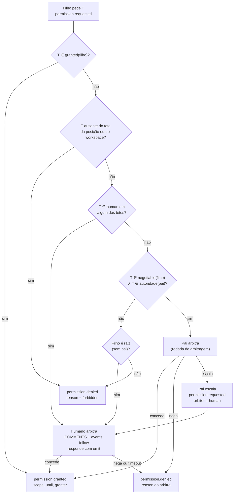
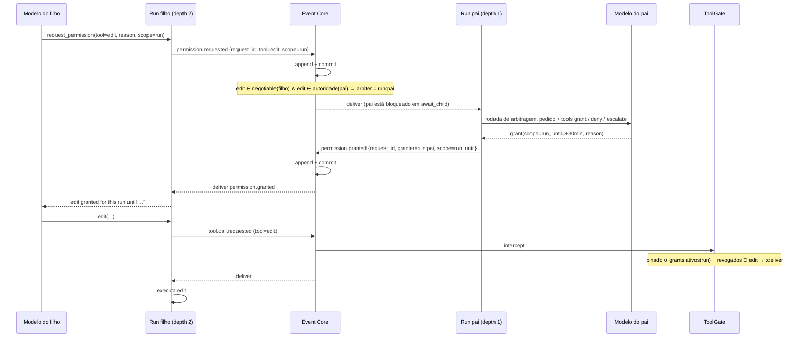
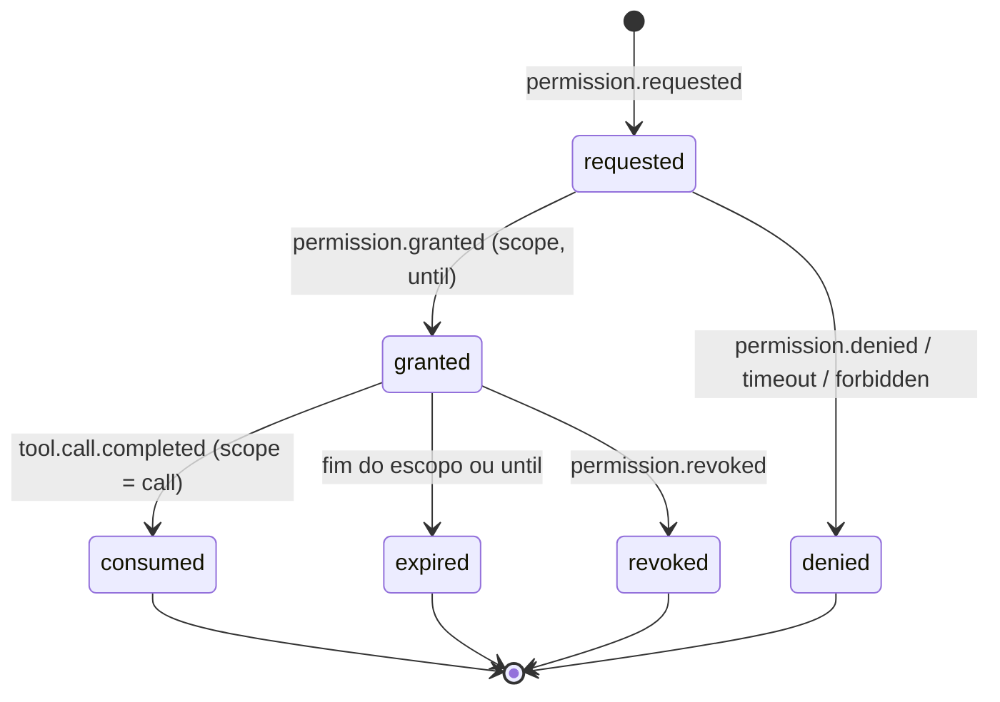

Status: TO-BE — proposta, aguardando avaliação

# Permissões temporárias e negociação

Complementa [tool-policy.md](tool-policy.md). Lá o conjunto efetivo de um nó
é fixado no nascimento. Aqui ele pode **crescer durante a execução**, mas só
por um caminho: um pedido registrado no log, arbitrado por quem tem
autoridade, com escopo e validade explícitos, e aplicado pelo mesmo
`ToolGate`. Nada é concedido fora de `EVENTS`.

## As faixas que a negociação usa

As faixas `granted`, `negotiable`, `human` e proibido, os modos `allow` e
`deny` e a interseção estão definidos em [tool-policy.md](tool-policy.md).
Este documento só usa o resultado normalizado: uma tool é negociável para um
nó se, no efetivo, está em `negotiable`; vai ao humano se está em `human`; é
recusada sem escalar se está proibida.

```toml
[ceiling.depth1]
mode = "allow"
negotiable = ["edit", "write"]     # o pai pode conceder
human      = ["delete"]            # só um humano concede

[workspaces.infra]
roots = ["./infra"]
mode = "deny"
granted = ["read", "grep", "find", "ls"]
human   = ["edit"]                 # editar infra exige humano, sempre
```

| Faixa | Quem concede | Onde a decisão fica |
|---|---|---|
| `granted` | ninguém precisa; já é efetivo | `run.started.tools` |
| `negotiable` | o pai, dentro da própria autoridade | `permission.granted` com `granter = run:<parent>` |
| `human` | um humano, pela CLI | `permission.granted` com `granter = human:<origin>` |
| ausente | ninguém | `permission.denied` com `reason = forbidden`, sem escalar |

## Autoridade do pai

Um pai só concede o que ele mesmo poderia obter **sem humano**:

```
autoridade(pai) = granted(pai) ∪ negotiable(pai)
pai pode conceder T ao filho  ⇔  T ∈ negotiable(filho) ∧ T ∈ autoridade(pai)
```

Isso mantém a regra "delegar nunca amplia": a árvore não consegue, por
negociações sucessivas, chegar a uma tool que a raiz não poderia ter. O que
está em `human` em qualquer nível acima do filho continua exigindo humano.



Um pai pode **escalar** em vez de decidir: ele tem autoridade, mas prefere
que um humano avalie. A escalada é registrada; o filho não sabe quem decidiu,
só recebe o resultado.

## O pedido, visto pelo modelo

O modelo pede por uma tool sempre exposta, `request_permission`, com schema
fixo: `tool`, `reason`, `scope`. Ele não escolhe validade nem árbitro. Isso é
decisão de quem concede.

O Run do filho transforma a chamada em `permission.requested` e **bloqueia**
esperando `permission.granted` ou `permission.denied` com o mesmo
`request_id`, a mesma primitiva com que hoje espera o `task.completed` de uma
delegação. O resultado volta como observação de tool: "granted until …" ou
"denied: …". Se concedido, o Run passa a expor o schema da tool na rodada
seguinte; a lista de allowlist e o `ToolGate` passam a aceitá-la.



A "rodada de arbitragem" do pai é uma chamada ao seu próprio modelo com o
pedido como mensagem e três tools efêmeras: `grant`, `deny`, `escalate`.
Ela acontece dentro da espera da delegação, sem reabrir o loop principal do
pai. A decisão do modelo vira comando no log com `reason`, então a auditoria
mostra por que um pai concedeu.

## Escalada ao humano

Quando o árbitro é humano, o pedido usa o que o TO-BE já reserva para
"solicitações e respostas humanas duráveis": vira uma linha em `COMMENTS`
com `kind = request`, aparece em `omunculus events follow` e em qualquer
automação que escute `permission.requested`. O humano responde pela CLI:

```sh
omunculus emit permission.granted --db ./harness.sqlite3 \
  --payload '{"request_id":"req-…","scope":"work_item","until":"2026-09-06T21:00:00Z"}'
```

```mermaid
sequenceDiagram
    participant C as Run filho
    participant EC as Event Core
    participant A as automação notify
    actor H as Humano
    participant CLI as omunculus emit

    C->>EC: permission.requested {tool=edit, workspace=infra}
    Note over EC: edit ∈ human(workspaces.infra) → arbiter = human
    EC->>EC: append + commit; Projector grava COMMENTS(kind=request)
    EC-->>A: deliver
    A->>H: notificação com request_id, tool, reason, workspace
    H->>CLI: emit permission.granted {request_id, scope, until}
    CLI->>CLI: request_id existe, ainda aberto, tool ∈ human(teto)?
    CLI->>EC: append permission.granted (granter = human:<origin>)
    EC-->>C: deliver
    Note over C: timeout do pedido expirou? → tratado como permission.denied (reason = timeout)
```

Regras da escalada:

- o filho espera até `request_timeout` (configurável por perfil). Estourar é
  `permission.denied` com `reason = timeout`, registrado pelo Runtime. O
  padrão seguro é negar, nunca liberar;
- enquanto espera, a Run não consome orçamento de modelo; se o processo
  cair, a retomada reencontra o pedido aberto no log e volta a esperar;
- um humano pode negar de vez com `permission.denied`, e pode incluir um
  comentário que vira observação para o modelo.

## Escopo e validade

Toda concessão tem `scope` e, opcionalmente, `until`. Quem concede escolhe
os dois; o modelo só sugere o escopo no pedido.

| `scope` | Vale para | Sobrevive a retry? | Expira |
|---|---|---|---|
| `call` | a próxima invocação daquela tool | não | ao ser consumida |
| `run` | a Run atual | não | em `run.completed`/`run.failed` |
| `work_item` | todas as tentativas do Work Item | sim | em `task.completed` |
| `session` | toda a correlação/sessão | sim | ao fim da sessão |
| `permanent` | configuração | sim | nunca; é mudança de TOML |

`until` é um teto de tempo em cima do escopo: `run` até 30 minutos, por
exemplo. Expirou o que vier primeiro.

**Permanente não é concessão, é mudança de política.** Um humano que quer
tornar `edit` permanente em `docs` edita o TOML, ou usa
`omunculus policy grant --permanent`, que edita o TOML e registra
`policy.changed` no log com o diff. O log guarda o fato; o TOML guarda o
estado. Um pai jamais concede permanente: `permanent` só é válido com
`granter = human:*`, e o `emit` recusa o resto.



## Revogação

`permission.revoked` é um comando com `request_id` ou `grant_id`. Pode vir
do humano (CLI) ou do pai que concedeu. Vale a partir da próxima verificação
do `ToolGate`; uma chamada já entregue termina. A Run recebe a revogação como
observação na rodada seguinte e deixa de expor a tool.

## Como o ToolGate aplica

O `ToolGate` de [tool-policy.md](tool-policy.md) passa a calcular, por Run e
a cada `tool.call.requested`:

```
permitido(run, T) = T ∈ run.started.tools
                  ∨ ∃ grant ativo para T com escopo cobrindo run
                      ∧ não revogado ∧ não expirado ∧ (scope ≠ call ∨ não consumido)
```

Tudo isso é derivado do log, nunca do processo. É a mesma leitura que o
replay faz, então o conjunto efetivo de qualquer rodada passada é
reconstruível. O Runtime materializa `permission.expired` quando fecha uma
Run ou um Work Item, para que a projeção não dependa de relógio.

## Catálogo: tipos novos

| Tipo | Kind | Emitido por | Interceptável | Injetável |
|---|---|---|---|---|
| `permission.requested` | event | Run | sim | não |
| `permission.granted` | command | Run (pai) ou CLI (humano) | sim | sim |
| `permission.denied` | command | Run (pai), CLI (humano) ou Runtime (timeout, forbidden) | não | sim |
| `permission.revoked` | command | Run (pai) ou CLI | sim | sim |
| `permission.expired` | event | Runtime | não | não |
| `policy.changed` | event | CLI | não | não |

`permission.granted` e `permission.revoked` são interceptáveis de propósito:
uma organização pode colocar um interceptor que veta qualquer concessão de
`write` fora do horário comercial, e o veto fica no log como
`delivery.rejected`.

## Configuração completa de um caso

```toml
[ceiling.depth0]
mode = "deny"
granted    = ["fs.read", "delegate"]
negotiable = ["edit"]

[ceiling.depth1]
mode = "deny"
granted    = ["fs.read", "delegate"]
negotiable = ["edit", "write"]
human      = ["delete"]

[workspaces.app]
roots = ["./apps/web"]
mode = "allow"
negotiable = ["delete"]

[workspaces.infra]
roots = ["./infra"]
mode = "deny"
granted = ["fs.read"]
human   = ["edit", "write"]

[profiles.fix]
mode = "deny"
granted = ["fs.read", "edit"]
request_timeout = "10m"
```

Leitura de dois pedidos:

- worker em depth 1, workspace `app`, pede `write`: está em `negotiable` do
  depth 1 e em `granted` do workspace; o pai (depth 0) tem `write`? Não está
  na autoridade dele (`granted ∪ negotiable` do depth 0 não inclui `write`).
  Resultado: pai não pode; filho não é raiz; **negado como forbidden**. Para
  permitir, `write` precisaria entrar em `negotiable` do depth 0.
- worker em depth 1, workspace `infra`, pede `edit`: está em `human` do
  workspace. Vai direto ao humano, mesmo que o pai tivesse autoridade.

## Não-objetivos

Não há concessão fora do log, não há concessão implícita por delegação, não
há "modo confiável" que pule o `ToolGate`, e o modelo nunca escolhe validade
nem árbitro. Timeout é negação. Permanente é TOML.

## Impacto e ordem

Depende de [tool-policy.md](tool-policy.md) implementado (faixas, modos e
`ToolGate`). Depois:

1. cálculo de `autoridade` do pai e do árbitro por faixa; `config check`
   valida.
2. tool `request_permission`, tipos `permission.*` no catálogo, espera no
   Run e projeção em `COMMENTS`.
3. arbitragem do pai como rodada efêmera com `grant`/`deny`/`escalate`.
4. `emit permission.granted|denied|revoked` com validação de `request_id` e
   de faixa; timeout no Runtime.
5. `ToolGate` lendo grants do log; `permission.expired` no fechamento.
6. `policy grant --permanent` e `policy.changed`.
