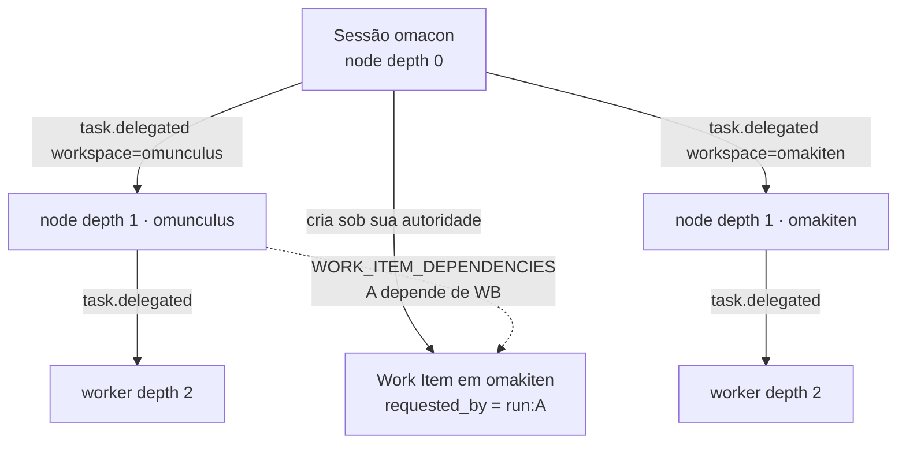
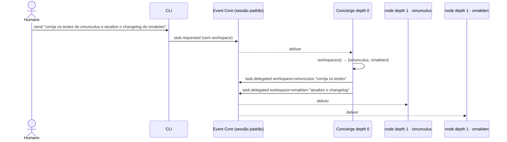

Status: TO-BE — planejado, validado; sessão, attach/detach, nodes derivados, WorkspaceGate e inbox validados; resume e request_work permanecem proposta

# Sessão e workspaces

Este documento especifica o que [recommendations.md](recommendations.md)
reservou: Session como agregado durável, workspace como membro da sessão e
identidade do Execution Node, e o trabalho com vários repositórios na mesma
sessão. Entidades de runtime estão em
[execution-model.md](execution-model.md); a política de tools por workspace
em [tool-policy.md](tool-policy.md); times, interação entre linhagens e
descoberta em [team-model.md](team-model.md).

## Entidades

- **Session**: agregado durável identificado por `session_id`. É o que o
  humano nomeia, sobrevive ao TTY e administra trabalho em vários
  workspaces. Um log `EVENTS` por sessão.
- **Workspace**: identidade estável (`workspace_id`, slug) mais sandbox
  (`roots[]`) mais teto de tools. Pertence à configuração; vira membro da
  sessão por `workspace.attached`.
- **Execution Node**: instância lógica com `originating_run_id`, parent
  opcional, depth, workspace e configuração Agent pinada. Em depth 0 e 1 a
  identidade é **derivada**; em depth 2 é criada por delegação.
- **Run**: tentativa durável de um node executar um Work Item. Um node pode
  ter várias Runs ao longo da sessão.
- **Processo de sessão**: processo OTP efêmero que atende uma Run. Não é a
  Session e não é fonte de estado.

`session_id` é diferente de `correlation_id`: a correlação é uma operação
lógica (um `send`, um attach); a sessão é a orquestra inteira. Os dois
campos existem no envelope.

## Profundidade é posição, não tipo

| Depth | Papel | Workspace | Identidade do node |
|---|---|---|---|
| 0 | concierge da sessão: administra, delega, roteia | nenhum | `hash(session_id, 0)` |
| 1 | concierge de um workspace, ou líder de um time nele | um, fixo | `hash(session_id, workspace_id, 1)`; com time de `scope = "node"`, `hash(session_id, workspace_id, team, 1)` |
| 2 | worker | herdado do pai | gerado na delegação |

A mesma configuração Agent pode ocupar qualquer depth. `kind` é capability,
não posição. Não se promove worker a concierge; muda-se o node em que ele
roda.

## Configuração

```toml
[workspaces.omunculus]
roots = ["~/Projects/omacon/omunculus"]
mode = "allow"
negotiable = ["delete"]

[workspaces.omakiten]
roots = ["~/Projects/omacon/omakiten"]
mode = "allow"

[policy.depth.0]
mode = "deny"
granted    = ["delegate", "workspaces"]
negotiable = ["request_work"]

[policy.depth.1]
mode = "allow"
negotiable = ["edit", "write", "request_work"]
```

Depth 0 não tem tools de arquivo e não tem `roots`: administra, não toca
repositório.

## Ciclo de vida

```mermaid
sequenceDiagram
    actor U as Humano
    participant CLI
    participant EC as Event Core
    participant RT as Runtime

    U->>CLI: session create omacon
    CLI->>EC: session.created {session_id}
    U->>CLI: workspace attach omunculus
    CLI->>EC: workspace.attached {workspace_id, roots, teto}
    EC-->>RT: deliver
    RT->>RT: cria node depth 1 (hash(sessão, omunculus, 1)); nenhuma Run ainda
    U->>CLI: workspace attach omakiten
    CLI->>EC: workspace.attached
    U->>CLI: send "faça X no omunculus e Y no omakiten"
    CLI->>EC: task.requested {session_id}
    EC-->>RT: deliver
    RT->>RT: Run no node depth 0
    Note over RT: depth 0 delega com workspace=omunculus e omakiten, fecha com outcome=waiting
    Note over RT: cada task.delegated abre uma Run no node existente de depth 1
    Note over RT: cada task.completed dos filhos reabre o depth 0 (continuation)
```

1. `session create` apenda `session.created`. Um log SQLite por sessão, uma
   `sequence` só. A sessão padrão do usuário é criada implicitamente no
   primeiro `send`.
2. `workspace attach` apenda `workspace.attached` e cria o node de depth 1
   daquele workspace, **sem Run**. Anexar é membership, não spawn.
3. `send` apenda `task.requested` com `session_id`. Nasce uma Run no node de
   depth 0.
4. Depth 0 delega com `workspace = …`. A delegação **não cria** node novo:
   abre uma Run no node de depth 1 daquele workspace. Delegar para workspace
   não anexado é vetado (ver interceptores abaixo).
5. Depth 1 delega normalmente; workers em depth 2 nascem por delegação e
   herdam o workspace.
6. `workspace detach` apenda `workspace.detached`. O node e o histórico
   permanecem; Runs abertas naquele workspace são fechadas como `failed`
   com motivo `detached`.

Determinismo: toda ativação vem de evento entregue, os ids de node de depth
0 e 1 são derivados, nenhuma decisão usa relógio. Replay reconstrói a mesma
árvore e o mesmo grafo de dependências. A única não-determinação é o texto
que o modelo escreve, e isso já está no payload.

## Trabalho entre workspaces

Concierges de depth 1 **não conversam entre si**. A árvore continua árvore
(autoridade e reporte). O que existe é uma aresta no grafo de dependências:
um Work Item no outro workspace, criado sob a autoridade do depth 0.



Quando o concierge do omunculus precisa de algo do omakiten, chama a tool
`request_work` com o alvo e a instrução. É o caso particular do pedido pelo
ancestral comum de [team-model.md](team-model.md) em que o LCA é o depth 0.
O Run apenda `task.requested` com `requested_by = run:A`, `workspace =
omakiten` e o `session_id`. Em sequência:

- o **runtime** valida que o workspace destino está anexado e que A tem
  `request_work` efetivo ou concedido;
- em `cross_lineage = "routed"`, o Work Item nasce no node de depth 1 do
  destino, parented ao node da sessão, e A ganha uma linha em
  `WORK_ITEM_DEPENDENCIES`. A Run de A fecha com `outcome = waiting`; o
  `task.completed` do destino abre uma Run nova de A a partir do checkpoint
  ([execution-model.md](execution-model.md)). Zero chamadas de modelo no
  depth 0;
- em `"mediated"`, antes de o Work Item nascer o depth 0 faz uma rodada de
  arbitragem com seu modelo, como na negociação de permissão: repassa,
  reescreve ou nega. A decisão fica no log com motivo. Custa uma chamada e
  cria um ponto onde a instrução pode derivar.

Nada de canal direto entre A e B: seria um segundo barramento, e o replay
não o reproduziria.

## Interceptores com escopo

O envelope carrega `session_id` e `workspace_id`, então um interceptor pode
ser restrito por workspace. Há um único Event Core por sessão: o interceptor
vê todos os workspaces e filtra pelo campo.

```toml
[interceptors.infra-readonly]
events = ["tool.call.requested", "permission.granted"]
workspaces = ["infra"]
module = "Omunculus.Interceptors.ToolGate"

[interceptors.no-cross-into-infra]
events = ["task.requested"]
module = "Omunculus.Interceptors.WorkspaceGate"
options = { deny_targets = ["infra"] }
```

`WorkspaceGate` veta `task.requested` cruzado para workspace não anexado ou
proibido, e `task.delegated` com `workspace` fora da sessão. `ToolGate` lê o
teto do workspace do envelope, não o do pai. O veto vira `delivery.rejected`
e volta ao solicitante como erro de tool.

## Contexto do concierge da sessão

Cada `send` abre uma Run nova no node de depth 0. O contexto não vem do
processo anterior, que já morreu: vem do log. A Run reconstrói um resumo a
partir de `COMMENTS` da sessão (resultados anteriores, pedidos humanos) e
dos Work Items abertos. É a mesma regra de tudo o mais: se não está em
`EVENTS`, não existe.

## Tipos no catálogo

| Tipo | Kind | Emitido por | Interceptável | Injetável |
|---|---|---|---|---|
| `session.created` | command | CLI | não | sim |
| `workspace.attached` | command | CLI | sim | sim |
| `workspace.detached` | command | CLI | sim | sim |
| `task.commented` | command | CLI (humano) ou Runtime | sim | sim |
| `inbox.read` | command | CLI | não | sim |

`task.requested` ganha `requested_by` e `workspace`; `task.delegated` ganha
`workspace`, válido só a partir do depth 0.

## Ponto de entrada: o concierge resolve, não a flag

O humano não escolhe sessão nem workspace a cada comando. Ele fala com o
concierge da sessão, e o concierge é quem entende o pedido e o atribui ao
workspace certo. Por isso:

- existe **uma sessão padrão por usuário**, criada na primeira vez que
  `send` roda, em `~/.omunculus/session.sqlite3`. `send "…"` sem flag vai
  para ela;
- o concierge de depth 0 vê os workspaces anexados pela tool `workspaces`
  e delega com `workspace = …`. Um pedido que toca dois repositórios vira
  duas delegações; um pedido ambíguo vira uma pergunta ao humano, por
  `COMMENTS`, não uma adivinhação;
- `--workspace w` é uma **dica** opcional: pina o workspace de destino e
  tira a decisão do concierge. Serve para o atalho e para automações, que
  não devem depender de interpretação;
- `--session s` é opcional e raro: só para quem mantém mais de uma
  orquestra. `OMUNCULUS_SESSION` no ambiente faz o mesmo. Sem nenhum dos
  dois, é a sessão padrão do usuário;
- `run <dir>` continua sendo o atalho "sessão efêmera com um único
  workspace igual ao diretório", sem concierge de roteamento.



## Inbox: toda interação com o humano

O harness só fala com o humano por `COMMENTS`: uma pergunta é uma linha com
`kind = request`, uma resposta é um comando pela CLI que vira `kind =
response`. Não existe outro canal; o que a CLI imprime é projeção do log.
Perguntam ao humano: pedido de permissão em faixa `human` ou escalado pelo
pai, pedido ambíguo do concierge, efeito externo `unknown` na recuperação.

**Inbox** é a projeção dos pedidos abertos e dos resultados não lidos.

- `omunculus inbox`: lista pedidos sem resposta agrupados por workspace e
  tool, com `request_id`, tipo, tarefa e quantos Work Items aguardam; e os
  `task.completed` de raiz ainda não lidos;
- `omunculus inbox reply <request_id> --grant [--permanent] | --deny [--reason "…"] | "texto"`:
  açúcar sobre `emit permission.granted`, `emit permission.denied` e
  `emit task.commented`, preenchendo `request_id`, `correlation_id` e
  `idempotency_key`;
- `omunculus inbox read <id>` marca um resultado como lido; a marca é um
  comando no log (`inbox.read`), então vale em qualquer terminal.

`send` espera o resultado da raiz por padrão e o imprime. `send --detach`
volta na hora; o resultado cai na inbox. Nos dois casos o resultado está na
inbox, porque ela deriva do log e não de quem estava olhando o terminal.
Fechar o terminal durante um `send` não perde nada: os Work Items estão em
`waiting` ou `running` no log, e a inbox mostra o que precisa de você.

## Verbos da CLI

- `send [--profile p] [--workspace w] [--session s] [--detach] "…"`: só o
  texto é obrigatório;
- `inbox`, `inbox reply`, `inbox read`;
- `workspace attach|detach <nome> [--session s]`;
- `session create|resume|list`: administração, não uso diário;
- `events follow [--session s]` (viewport, não membership).

Follow é o que o cliente assiste; attach é o que pertence à sessão. Pode-se
seguir uma sessão sem anexar um workspace, e anexar sem estar olhando.

## Não-objetivos

Não introduzir uma quarta camada, um canal entre nodes de mesmo depth, uma
sessão que seja processo OTP, sandbox na configuração Agent, ou um workspace
implícito a partir do `cwd`. `run <dir>` continua existindo como atalho para
"sessão efêmera com um workspace igual ao diretório", e nada mais.
