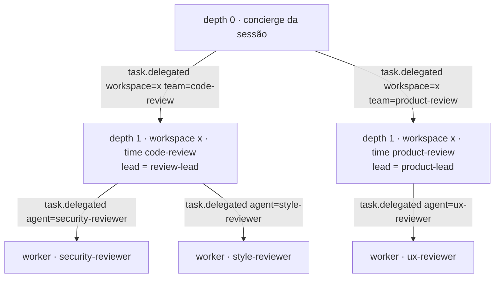

Status: TO-BE — proposta, aguardando avaliação

# Times, interação entre linhagens e descoberta

Complementa [session-model.md](session-model.md). Um **time** é uma
formação nomeada: um agente líder, agentes membros e um perfil. O concierge
da sessão escolhe o time ao delegar; o líder escolhe membros pelo nome;
times e workers só interagem por pedido de trabalho que sobe até o
ancestral comum e por leitura de resultados no log. Não existe canal
lateral em nenhuma profundidade.

## Configuração

```toml
[agents.review-lead]
model = "…"
prompt = "Você coordena uma revisão. Delegue por especialidade e consolide."

[agents.security-reviewer]
prompt = "…"

[agents.style-reviewer]
prompt = "…"

[teams.code-review]
lead    = "review-lead"
members = ["security-reviewer", "style-reviewer", "test-reviewer"]
profile = "review"            # estreita; nunca amplia o workspace
scope   = "node"              # ou "task"

[teams.product-review]
lead    = "product-lead"
members = ["ux-reviewer", "copy-reviewer"]
profile = "ask"
scope   = "task"

[workspaces.x]
roots = ["~/x"]
teams = ["code-review", "product-review"]
default_team = "default"

[session]
cross_lineage = "routed"      # ou "mediated"
```

A configuração Agent continua sem saber de posição, workspace ou time.
Um mesmo agente pode ser membro de vários times.

## Escopo do time: node ou tarefa

| `scope` | Identidade do node de depth 1 | Quando usar |
|---|---|---|
| `node` | `hash(session_id, workspace_id, team, 1)`: um node próprio, com histórico, checkpoints e permissões separados dos outros times do mesmo workspace | times que vivem no repositório e acumulam contexto |
| `task` | `hash(session_id, workspace_id, 1)`: o node do workspace; a formação é pinada no Work Item e em `run.started` | formações ad hoc |

A interação entre times independe dessa escolha: ela é por **linhagem de
Work Item**, e a linhagem existe nos dois casos.

## Roteamento por time

A tool `workspaces` do depth 0 devolve os workspaces **e seus times**, cada
um com a descrição do líder. `delegate` ganha `team`. "Verifique as PRs do
projeto X" vira `task.delegated` com `workspace = x` e `team = code-review`;
um pedido que exige as duas revisões vira duas delegações. `--team` na CLI
é dica opcional, como `--workspace`. Sem time, vale `default_team`.

No depth 1, `delegate` ganha `agent`, restrito aos `members` do time. O
Runtime pina a configuração daquele agente no worker. Nome fora da lista é
`delivery.rejected` pelo `TeamGate`.



## Espera por vários filhos

O líder delega três revisões e fecha em `waiting` com `awaiting` contendo
os três Work Items. Cada `task.completed` de membro reabre o líder por
continuação com aquela resposta; o checkpoint dele guarda o que ainda
falta. Uma resposta, uma continuação, sem mecanismo novo
([execution-model.md](execution-model.md)). O líder consolida quando o
último chega.

## Interação entre linhagens: pelo ancestral comum

Um worker do time A precisa de algo do time B. Não fala com B, não fala com
o líder de B, e o líder de A não fala com o líder de B. O pedido sobe até o
**ancestral comum mais próximo** (LCA) das duas linhagens e desce de lá.

1. O worker chama `request_work` com o alvo (`workspace`, `team` ou
   `agent`) e a instrução. Sua Run fecha em `waiting`.
2. O Runtime calcula o LCA entre a linhagem de quem pediu e o alvo. Dois
   times no mesmo workspace: depth 0. Dois workers do mesmo líder: o
   líder. Dois workspaces: depth 0.
3. No LCA, em `cross_lineage = "routed"`, o Runtime cria o Work Item no
   node alvo, parented ao LCA, com `requested_by`, e liga
   `WORK_ITEM_DEPENDENCIES`. Em `"mediated"`, o LCA abre uma Run de
   arbitragem e seu modelo repassa, reescreve ou nega, com motivo no log.
4. O `task.completed` do alvo reabre quem pediu por continuação.

```mermaid
sequenceDiagram
    participant A1 as worker de A
    participant EC as Event Core
    participant RT as Runtime
    participant S as LCA (depth 0)
    participant B as time B

    A1->>EC: task.requested {requested_by=run:A1, target=team:B, instruction}
    A1->>EC: run.completed {outcome=waiting, awaiting=…}
    EC-->>RT: deliver
    RT->>RT: LCA(linhagem A1, B) = depth 0; A1 tem request_work? alvo no escopo?
    alt routed
        RT->>EC: Work Item em B (parent = S) + WORK_ITEM_DEPENDENCIES(A1 → WB)
    else mediated
        RT->>S: Run de arbitragem (reason=arbitration)
        S->>EC: repassa, reescreve ou nega
    end
    B->>EC: task.completed (WB)
    EC-->>RT: deliver
    RT->>A1: run.started (continuation)
```

`cross_workspace` de [session-model.md](session-model.md) é o caso
particular em que o LCA é o depth 0 e o alvo é outro workspace.

Autoridade: o LCA só cria o Work Item se quem pediu tem `request_work` no
efetivo ou concedido, e se o alvo está no escopo de descoberta dele. O
`TeamGate` veta o resto com `delivery.rejected`, que volta ao solicitante
como erro de tool.

### Por que não "pai fala com pai"

Seria um canal lateral em depth 1: dois nodes sem autoridade um sobre o
outro combinando trabalho. Nada no log diria quem autorizou, e o replay
teria que reproduzir uma conversa que não passou por ancestral algum.

### Por que não "sempre o concierge"

Dois workers do mesmo líder que precisam um do outro não deveriam consumir o
depth 0. O LCA resolve isso no líder. O concierge só entra quando a aresta
cruza times ou workspaces.

## Descoberta

Runs não são endereçáveis: são efêmeras. O que se descobre são **nodes e
Work Items**, por uma tool de leitura, `directory`, que lê a projeção da
sessão: workspaces, times, agentes de cada time, Work Items abertos e seus
resultados em `COMMENTS`. O escopo é política do teto:

```toml
[ceiling.depth2]
directory = "subtree"      # só o próprio time
[ceiling.depth1]
directory = "session"      # todos os times e workspaces
```

Ler resultado alheio é a forma barata de interagir: o revisor de segurança
lê os achados do revisor de estilo em `COMMENTS` sem pedir trabalho.
`request_work` é para quando precisa de algo que ainda não existe.

## O que muda no contrato

- `task.requested` e `task.delegated` ganham `team` e `agent`;
  `run.started` ganha `team`.
- `awaiting` em `run.completed` aceita uma lista.
- Tools novas no catálogo de tools: `request_work` (substitui
  `cross_workspace`) e `directory`; `workspaces` devolve times.
- Interceptor `TeamGate`: veta `agent` fora dos membros, `team` fora do
  workspace e `request_work` sem autoridade ou fora do escopo.
- `[teams]` com `scope`; `[session].cross_lineage` substitui
  `cross_workspace`.
- A tabela de política ganha o perfil do time como origem possível do
  perfil; nada mais muda em [tool-policy.md](tool-policy.md).

## Não-objetivos

Não introduzir canal entre nodes de mesmo depth, mensagens entre Runs,
endereçamento de processos, ou um time que amplie o teto do workspace.
Time é formação mais perfil; interação é pedido pelo ancestral comum e
leitura pelo log.
