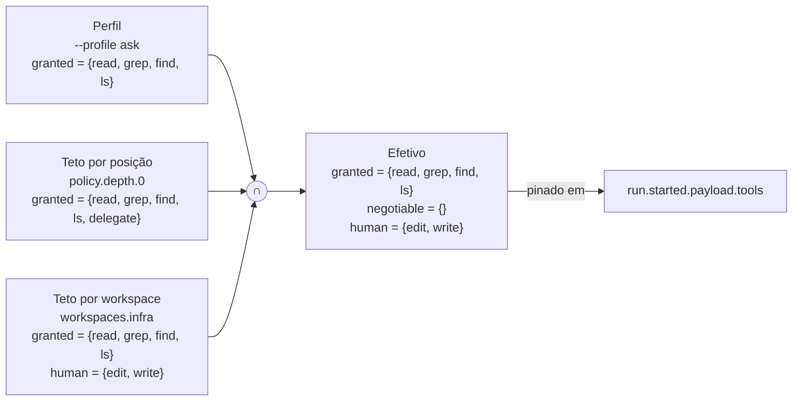
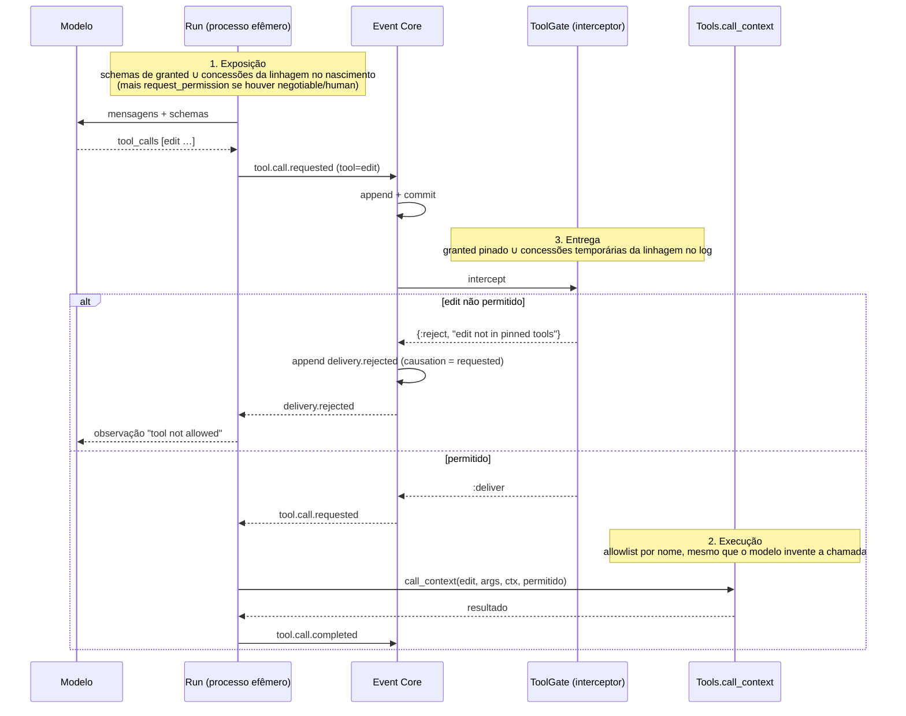
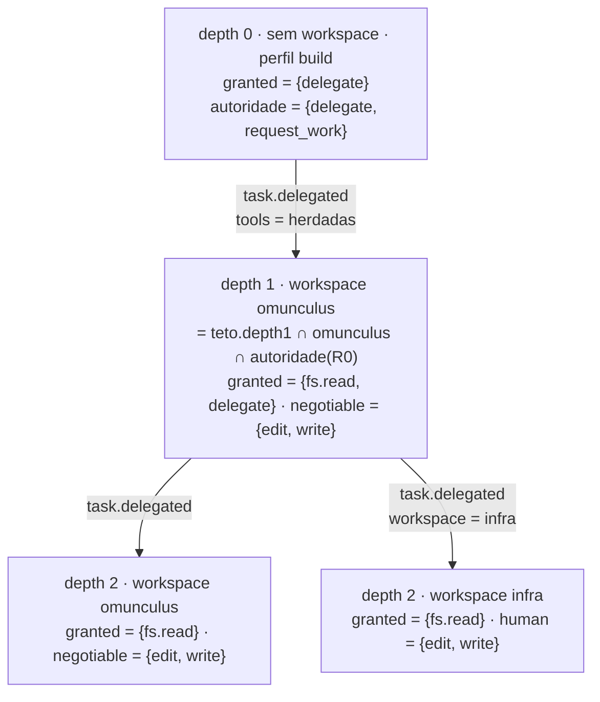
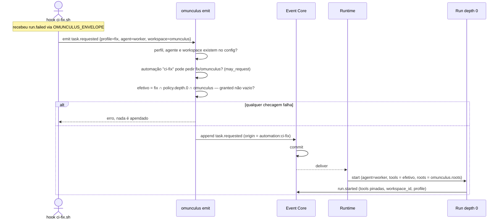

Status: TO-BE — proposta, aguardando avaliação

# Política de tools: teto, perfil, workspace e modos

Este documento define como um nó recebe suas tools e como o harness garante
que nenhum parâmetro, delegação ou automação amplie o que a política permite.
O crescimento do conjunto durante a execução, por pedido e concessão, está
em [permission-negotiation.md](permission-negotiation.md). Sessão e
workspaces como membros estão em [session-model.md](session-model.md).

## Problema

A configuração Agent por posição decidia ao mesmo tempo **o que o nó pode**
e **o que o modelo vê**. Não dava para dizer "o concierge nunca edita" e ao
mesmo tempo "nesta pergunta quero que ele leia arquivos e responda sem
delegar". Toda mudança de interação virava mudança de permissão. E o
inverso também precisa existir: quem quer dar acesso total a um repositório
não pode ter que listar tool por tool.

## Três conceitos, três donos

| Conceito | Responde | Quem define | Pode ampliar? |
|---|---|---|---|
| **Teto** (`ceiling`) | o que um nó naquela posição pode invocar | configuração, por depth | nunca |
| **Workspace** | onde o nó atua (`roots[]`) e o teto daquele lugar | configuração; escolhido pelo comando ou herdado | nunca |
| **Perfil** (`profile`) | o que o modelo vê nesta interação | quem dispara, por parâmetro | só estreita |

O conjunto efetivo de um nó é a interseção dos três, faixa a faixa. Um perfil
que pede algo fora do teto é **erro na inicialização**, não estreitamento
silencioso.



## Faixas

Cada entrada de teto, de workspace e de perfil resolve para **quatro faixas**
disjuntas que cobrem todo o catálogo de tools:

| Faixa | Significado | Quem concede |
|---|---|---|
| `granted` | efetivo desde o início | ninguém precisa |
| `negotiable` | o pai pode conceder ao filho durante a execução | o pai, dentro da própria autoridade |
| `human` | só um humano concede | humano, pela CLI |
| proibido | ninguém concede | — |

A interseção é faixa a faixa e pende para o mais restritivo: uma tool é
`granted` no efetivo só se é `granted` nos três; é `negotiable` se em algum é
`negotiable` e em nenhum é `human` ou proibida; é `human` se em algum é
`human`; é proibida se em algum é proibida.

## Modos: o valor padrão do que não foi escrito

Escrever as quatro faixas tool por tool não escala nem para quem quer tudo
liberado nem para quem quer tudo bloqueado. Por isso cada entrada declara um
`mode`, e o modo decide **onde cai o que não foi citado**:

- `mode = "allow"`: o que não é citado é `granted`. As linhas são exceções
  que movem tools para `negotiable`, `human` ou `deny` (proibido).
- `mode = "deny"`: o que não é citado é proibido. As linhas são permissões
  que movem tools para `granted`, `negotiable` ou `human`.

Se a mesma tool aparece em mais de uma lista, vale a mais restritiva:
`deny` > `human` > `negotiable` > `granted`. Nenhuma linha amplia; só move
para baixo. Entrada ausente equivale a `mode = "allow"` sem exceções: quem
não configurou nada mantém o comportamento atual do preset `coding`.

```toml
# tudo liberado, exceções por linha
[workspaces.omunculus]
roots = ["~/Projects/omacon/omunculus"]
mode = "allow"
negotiable = ["delete"]
human      = []
deny       = []

# tudo bloqueado, permissões por linha
[workspaces.infra]
roots = ["./infra"]
mode = "deny"
granted    = ["read", "grep", "find", "ls"]
negotiable = []
human      = ["edit", "write"]

[policy.depth.0]                  # concierge da sessão
mode = "deny"
granted    = ["delegate", "workspaces"]
negotiable = ["request_work"]

[policy.depth.1]                  # concierge de um repositório
mode = "allow"
negotiable = ["edit", "write", "request_work"]
human      = ["delete"]

# [policy.depth.2] ausente: allow, o worker é limitado pelo workspace e pelo perfil

[profiles.full]
mode = "allow"

[profiles.ask]
mode = "deny"
granted = ["fs.read"]
instructions = "Responda. Não altere arquivos. Não delegue."

[profiles.review]
mode = "allow"
deny = ["fs.write", "delegate"]

[profiles.fix]
mode = "deny"
granted = ["fs.read", "edit"]
```

O modo existe só na escrita. Na inicialização tudo é **normalizado** contra o
catálogo de tools, que é finito, e vira as quatro faixas explícitas. Teto,
interseção, negociação e `ToolGate` nunca veem um "tudo" ou um "nada", só
listas.

### Grupos

O catálogo de tools declara grupos, e qualquer lista aceita grupo ou tool.
`fs.read` expande para `read`, `grep`, `find`, `ls`; `fs.write` para `edit`,
`write`. Grupo é açúcar de configuração: desaparece na normalização.

### Full access a um repositório

Três entradas permissivas, porque a interseção continua valendo:

```toml
[workspaces.sandbox]
roots = ["~/lab/sandbox"]
mode = "allow"

[profiles.full]
mode = "allow"
```

`omunculus send --profile full --workspace sandbox "…"` dá ao agente tudo que
o catálogo tem, em qualquer profundidade cujo teto seja `allow`. Quem
configurou `infra` como `deny` continua protegido mesmo com `--profile full`,
porque `full ∩ infra` é só leitura.

### O que `config check` mostra

Para cada combinação perfil × depth × workspace, as faixas expandidas:

```
profile=full depth=1 workspace=infra
  granted    read grep find ls
  negotiable —
  human      edit write
  forbidden  delegate delete
```

Ninguém calcula interseção de cabeça.

### O único buraco do modo allow, e como fechar

Se uma versão nova do harness adiciona uma tool ao catálogo, toda entrada em
`allow` a ganharia em silêncio. Duas defesas:

- `run.started.tools` é sempre a lista **expandida**. Replay de uma execução
  antiga não muda de conjunto porque o catálogo cresceu;
- a configuração pina `tools_catalog = "1"`. Tools que não existiam nessa
  versão do catálogo entram como **proibidas** nas entradas `allow`, e
  `config check` avisa. Subir o pin é a decisão humana de aceitar as novas.

## Quando e onde o conjunto é montado

Hoje a lista de tools nasce dentro do `Agent`, a partir do preset ou da flag,
no momento em que a Run começa. No alvo ela é resolvida pelo Runtime **antes
de cada Run**, em qualquer profundidade, lendo o arquivo de configuração
naquele instante. O config é editável a quente: uma edição em perfis, tetos
ou workspaces vale para a próxima Run que nascer, sem reiniciar nada. Runs
em andamento não mudam; o que elas podem está pinado no log.

```mermaid
flowchart TD
    subgraph run["Antes de cada Run (qualquer depth)"]
        F1["~/.omunculus/config.toml"] --> M["merge por chave<br/>(o arquivo mais específico substitui a entrada inteira)"]
        F2["omunculus.toml do projeto"] --> M
        F3["--config"] --> M
        M --> N["normalização<br/>modos → faixas explícitas<br/>grupos → tools<br/>tools_catalog pin → tools novas proibidas em allow"]
        C["catálogo de tools<br/>(módulos + grupos)"] --> N
        N --> V{"válido?<br/>nomes existem? perfil cabe no teto?"}
        V -->|não| X["Run não nasce<br/>run.failed reason=policy_invalid<br/>Work Item fica elegível para retomada"]
        V -->|sim| L{"hash da política<br/>igual ao último policy.loaded?"}
        L -->|não| PL["append policy.loaded<br/>(tabela + hash)"]
        L -->|sim| RT
        PL --> RT["linha(perfil da tarefa, depth do node, workspace do node)"]
        RT --> PA["∩ autoridade do pai<br/>(só em delegação, vem de task.delegated)"]
        PA --> RS["run.started.tools (faixas pinadas) + policy_hash"]
        RS --> AG["Agent recebe granted ∪ concessões temporárias da linhagem<br/>+ request_permission se negotiable ∪ human ≠ ∅"]
        AG --> SC["schemas = Tools.schemas(lista) · fixos durante a Run"]
        SC --> PV["POST /chat/completions · \"tools\": [...]"]
    end
```

Regras:

1. **Resolução por Run, não por processo.** O Runtime lê e normaliza o config
   a cada `run.started`. Editar o arquivo entre duas Runs muda a segunda.
   Editar durante uma Run não muda aquela Run: o conjunto dela está em
   `run.started.tools` e só cresce por concessão ou encolhe por revogação
   registradas no log.
2. **`policy.loaded` só quando a política muda.** A tabela normalizada tem
   um hash; se difere do último `policy.loaded` da sessão, o Runtime apenda
   uma nova antes de `run.started`. Cada Run referencia o `policy_hash`
   vigente. Assim o log tem toda política que já valeu, sem repetir a mesma
   tabela a cada Run.
3. **Replay não lê arquivo.** `ToolGate`, retomada e reconstrução leem
   `policy.loaded` e `run.started` do log. O TOML é a fonte de edição; o log
   é a fonte de execução.
4. **Config inválido não derruba o harness; impede a Run.** Nome inexistente,
   perfil fora de todo teto ou TOML malformado viram `run.failed` com
   `reason = policy_invalid`, o Work Item fica elegível para `task.resumed`,
   e `config check` mostra o erro. Uma edição errada a quente não mata a
   sessão nem as Runs que já estão rodando.
5. **Edição a quente nunca amplia uma árvore em andamento.** Um filho que
   nasce depois da edição resolve com a política nova, mas continua
   intersectado com a autoridade do pai que veio em `task.delegated`, que
   foi pinada com a política antiga. Para ampliar de fato, é uma tarefa nova
   ou uma concessão explícita.
6. **Retomada resolve de novo.** `task.resumed` abre uma Run nova, e Run nova
   lê o config atual. Perfil e workspace são os do Work Item e não mudam;
   as faixas podem mudar. Concessões temporárias da tarefa continuam
   valendo enquanto a tarefa estiver aberta.
7. **Depth não entra na conta do Agent.** O Agent recebe uma lista pronta.
   Quem sabe de depth, workspace e perfil é o Runtime, no momento de abrir a
   Run.
8. **`--tools` vira estreitamento ad hoc.** A flag antiga continua existindo,
   mas só como perfil anônimo: precisa caber em `granted` da linha
   resolvida, senão é erro de uso. Nunca amplia.
9. **A configuração Agent não lista tools.** `[agents.concierge]` e
   `[agents.worker]` trazem modelo, prompt e budget; a sessão atribui agente
   por depth (`depth0 = "concierge"`, `depth2 = "worker"`) ou o time atribui
   líder e membros ([team-model.md](team-model.md)); tools vêm da tabela. O
   perfil de um time é uma origem possível do perfil da linha, e só
   estreita. É o que faz a mesma configuração servir a qualquer posição.
10. **Schemas são fixos durante a Run.** A lista que o modelo vê é montada
    no nascimento: `granted` mais as concessões temporárias já presentes na
    linhagem, mais `request_permission`. Uma concessão que chega depois não
    altera a Run em andamento; ela chega por continuação, porque pedir é
    concluir ([execution-model.md](execution-model.md)). Nada muda no meio
    de uma Run.

O que muda no código de hoje: `Config.resolve` passa a produzir a tabela
normalizada e a ser chamado pelo `Runtime.start_run`, não pela CLI;
`Runtime` compara o hash, apenda `policy.loaded` quando preciso e pina em
`run.started`; `SpikeAgents` deixa de decidir tools por depth; o `Agent`
recebe a lista pronta e mantém `state.schemas` fixo, como hoje.

## Onde a permissão é aplicada

A lista de schemas enviada ao modelo **não é** a barreira. São três
verificações independentes, e as três leem o mesmo conjunto pinado no log:



- **Exposição** decide o que o modelo vê. Um modelo pequeno que inventa um
  nome, como o tool call sem nome observado na spike, não passa da próxima.
- **Execução** é o `Tools.call_context` de hoje, que já recusa por nome. Ele
  passa a receber o conjunto permitido, não a lista do preset.
- **Entrega** é o `ToolGate`, um interceptor do catálogo em
  `tool.call.requested`. Ele não confia no processo da Run: lê as tools
  pinadas em `run.started` daquela `run_id`, soma as concessões ativas de
  [permission-negotiation.md](permission-negotiation.md), e veta a entrega se
  não bater. O veto fica no histórico como `delivery.rejected`.

## Delegação nunca amplia

O filho nasce com `teto[posição do filho] ∩ teto[workspace do filho] ∩
autoridade(pai)`, onde `autoridade(pai) = granted(pai) ∪ negotiable(pai)`: o
que o pai poderia obter sem humano. O workspace é herdado, salvo se a
delegação apontar outro workspace anexado à sessão. Não existe caminho em que
descer na árvore aumente o conjunto.



Decisão registrada: o filho herda a **autoridade** do pai, não o efetivo do
perfil. Um concierge em `--profile build` (efetivo só `delegate`) ainda gera
workers com `edit` negociável, porque `edit` está na autoridade do depth 1.
Se a alternativa for preferida, a interseção usa o efetivo do pai e o caso
"só delega, mas os workers editam" deixa de existir.

## Automação que dispara um agente

Uma automação não spawna nada. Ela emite um comando com **pedidos**, e cada
pedido é validado antes de o nó nascer.

```toml
[automations.ci-fix]
events = ["run.failed"]
run = "./hooks/ci-fix.sh"
may_request = { profiles = ["fix", "ask"], workspaces = ["omunculus"] }
```

```sh
omunculus emit task.requested --db ./harness.sqlite3 \
  --payload '{"instruction":"corrija os testes","profile":"fix","agent":"worker","workspace":"omunculus"}' \
  --idempotency-key "ci-fix:$OMUNCULUS_EVENT_ID"
```



O comando carrega `origin`, então o histórico mostra que foi o hook, não um
humano, que pediu. `may_request` é o teto **do injetor**: um hook só consegue
pedir os perfis e workspaces que a configuração lhe deu.

## O que fica pinado em cada envelope

| Envelope | Campos no payload |
|---|---|
| `task.requested` | `profile`, `agent`, `workspace`, `origin` |
| `task.delegated` | `workspace`, `tools` (faixas calculadas pelo runtime) |
| `policy.loaded` | tabela normalizada e `policy_hash`; apendado quando a política muda |
| `run.started` | `profile`, `tools` (faixas expandidas), `roots`, `policy_hash`; `workspace_id` no envelope |
| `delivery.rejected` | já existe; `interceptor = "tool-gate"` |

Retomada (`task.resumed`) abre uma Run nova e resolve a política de novo
contra o config atual, mantendo perfil e workspace do Work Item e as
concessões temporárias da tarefa. Trocar perfil ou
workspace é uma tarefa nova, nunca uma retomada.

## Casos de uso

| Situação | Como fica |
|---|---|
| Acesso total a um repositório | workspace e perfil em `allow` sem exceções |
| "Só quero perguntar" a um agente que normalmente só delega | `--profile ask`: lê, não edita, não delega; o teto do depth 0 não muda |
| Concierge nunca edita, workers editam | `policy.depth.0` em `deny` sem `edit`; `policy.depth.1` em `allow` |
| Diretório de infra só leitura, para qualquer agente | `workspaces.infra` em `deny` com `fs.read`; independe de perfil e depth |
| Tudo liberado menos apagar | `mode = "allow"`, `human = ["delete"]` |
| Hook de CI abre um agente de correção | `emit` com `profile=fix`, limitado por `may_request` |
| Modelo pequeno inventa tool | cai na exposição, na execução e no `ToolGate`; fica `delivery.rejected` no log |

## Não-objetivos

Perfil não escolhe diretório: sandbox é do workspace. Perfil não escolhe
modelo: isso é configuração Agent. Automação não define teto: só pede dentro
dele. Modo não é um caminho de permissão: só decide o padrão do que não foi
escrito. E nenhum desses mecanismos cria um segundo canal fora do log; se a
decisão não está em `EVENTS`, ela não aconteceu.

## Ordem de implementação proposta

1. `[policy.depth]`, `[profiles]`, `[workspaces]` com `mode`, faixas e grupos no
   `Config`; normalização e interseção em `resolve`; `config check` imprime
   as faixas expandidas e valida `tools_catalog`.
2. `tools`, `profile`, `workspace` nos payloads de `task.requested`,
   `task.delegated` e `run.started`; herança na delegação no `Runtime`.
3. `ToolGate` no catálogo de interceptores, lendo o snapshot do log.
4. `--profile` e `--workspace` em `run`, `spike` e `emit`; `may_request` e
   `origin` nas automações.

Cada passo é um commit e nenhum depende de provider real.
