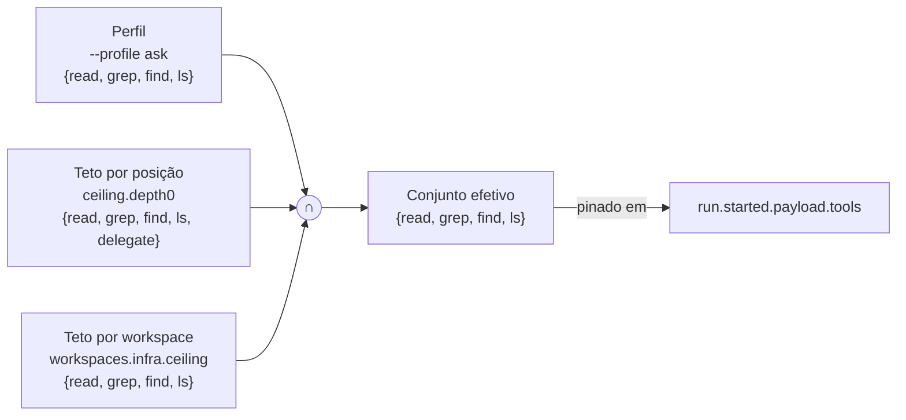
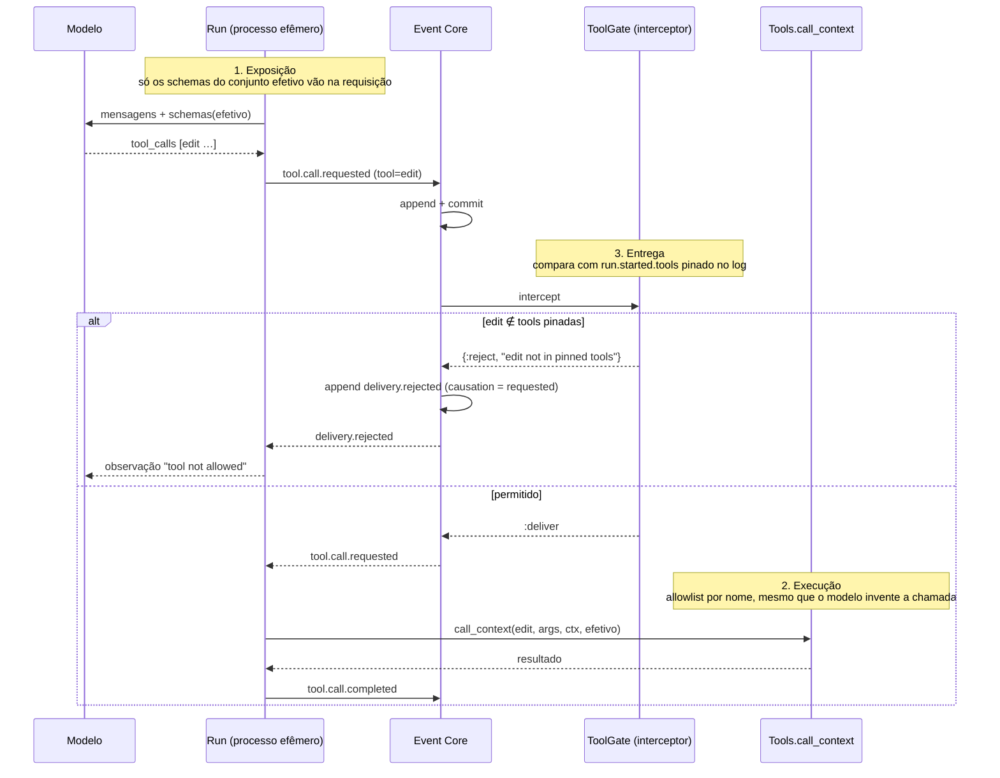
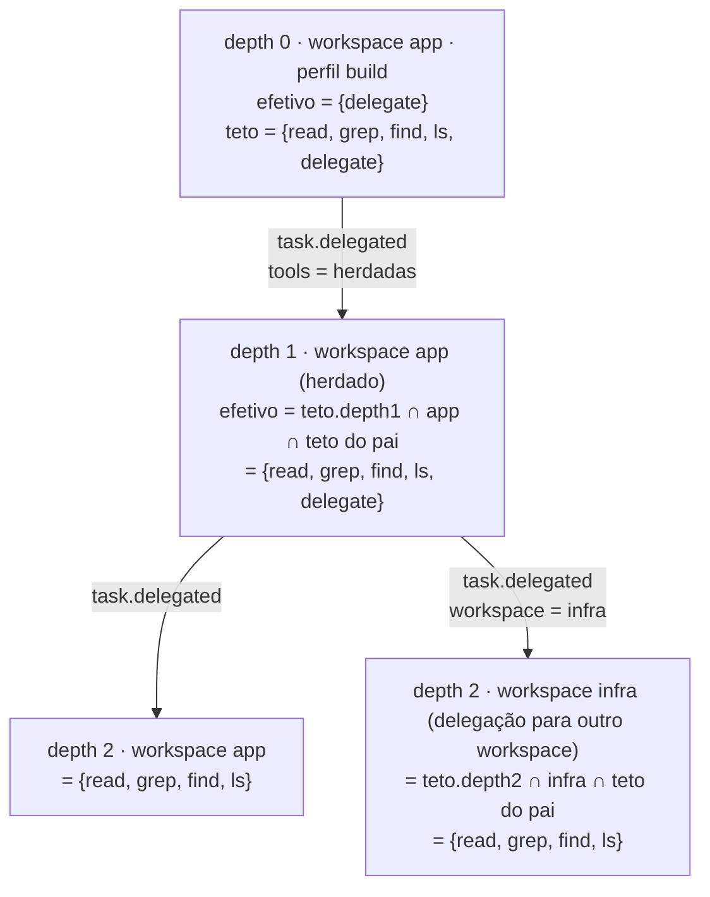
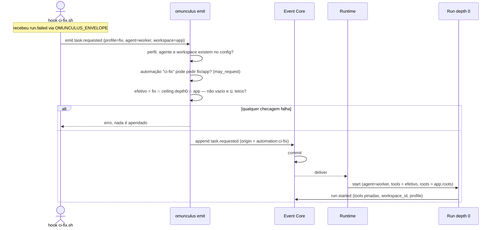

Status: TO-BE — proposta, aguardando avaliação

# Política de tools: teto, perfil e workspace

Este documento define como um nó recebe suas tools e como o harness garante
que nenhum parâmetro, delegação ou automação amplie o que a política permite.
Complementa [event-catalog.md](event-catalog.md) (tipos e interceptores),
[execution-model.md](execution-model.md) (Execution Node) e
[recommendations.md](recommendations.md) (workspace no nó). O crescimento do
conjunto efetivo durante a execução, por pedido e concessão, está em
[permission-negotiation.md](permission-negotiation.md).

## Problema

Hoje a configuração Agent por posição decide ao mesmo tempo **o que o nó
pode** e **o que o modelo vê**. Não dá para dizer "o concierge nunca edita" e
ao mesmo tempo "nesta pergunta quero que ele leia arquivos e responda sem
delegar". Toda mudança de interação vira mudança de permissão.

## Três conceitos, três donos

| Conceito | Responde | Quem define | Pode ampliar? |
|---|---|---|---|
| **Teto** (`ceiling`) | o que um nó naquela posição e naquele workspace pode invocar | configuração, por depth/kind e por workspace | nunca |
| **Perfil** (`profile`) | o que o modelo vê nesta interação | quem dispara, por parâmetro | só estreita |
| **Workspace** | onde o nó atua (`roots[]`) e o teto daquele lugar | configuração; escolhido pelo comando ou herdado | nunca |

O conjunto efetivo de um nó é a interseção dos três. Um perfil que pede algo
fora do teto é **erro na inicialização**, não estreitamento silencioso.



## Configuração

```toml
[ceiling]
depth0 = ["read", "grep", "find", "ls", "delegate"]                 # concierge nunca edita
depth1 = ["read", "grep", "find", "ls", "edit", "write", "delegate"]
depth2 = ["read", "grep", "find", "ls", "edit", "write"]

[workspaces.app]
roots = ["./apps/web"]
ceiling = ["read", "grep", "find", "ls", "edit", "write"]

[workspaces.docs]
roots = ["./docs"]
ceiling = ["read", "grep", "find", "ls", "write"]

[workspaces.infra]
roots = ["./infra"]
ceiling = ["read", "grep", "find", "ls"]

[profiles.ask]
tools = ["read", "grep", "find", "ls"]
instructions = "Responda. Não altere arquivos. Não delegue."

[profiles.build]
tools = ["delegate"]

[profiles.fix]
tools = ["read", "grep", "find", "ls", "edit"]
```

`omunculus config check` valida que todo nome em `profiles.*.tools`,
`ceiling.*` e `workspaces.*.ceiling` existe no catálogo de tools, e que cada
perfil cabe em pelo menos um teto. A configuração Agent continua genérica: ela
não sabe em que workspace vai rodar nem qual perfil foi pedido.

## Onde a permissão é aplicada

A lista de schemas enviada ao modelo **não é** a barreira. São três
verificações independentes, e as três leem o mesmo conjunto pinado no log:



- **Exposição** decide o que o modelo vê. Um modelo pequeno que inventa um
  nome, como o tool call sem nome observado na spike, não passa da próxima.
- **Execução** é o `Tools.call_context` de hoje, que já recusa por nome. Ele
  passa a receber o conjunto efetivo, não a lista do preset.
- **Entrega** é o `ToolGate`, um interceptor do catálogo em
  `tool.call.requested`. Ele não confia no processo da Run: lê as tools
  pinadas em `run.started` daquela `run_id` e veta a entrega se não bater.
  O veto fica no histórico como `delivery.rejected`.

## Delegação nunca amplia

O filho nasce com `teto[posição do filho] ∩ teto[workspace do filho] ∩
efetivo do pai`. O workspace é herdado, salvo se a delegação apontar outro
workspace anexado à sessão. Não existe caminho em que descer na árvore
aumente o conjunto.



Repare que o pai em depth 0 tem `delegate` no teto mas não tem `edit`; por
isso nenhum descendente ganha `edit` mesmo com `ceiling.depth1` permitindo.
É a regra "o modelo não escapa do sandbox por delegar" de
[execution-model.md](execution-model.md) aplicada a tools. Em `task.delegated`
o campo `tools` carrega o resultado da interseção, e o `ToolGate` também o
valida contra o teto do pai.

## Automação que dispara um agente

Uma automação não spawna nada. Ela emite um comando com **pedidos**, e cada
pedido é validado antes de o nó nascer.

```toml
[[automations]]
name = "ci-fix"
events = ["run.failed"]
run = "./hooks/ci-fix.sh"
may_request = { profiles = ["fix", "ask"], workspaces = ["app"] }
```

```sh
omunculus emit task.requested --db ./harness.sqlite3 \
  --payload '{"instruction":"corrija os testes","profile":"fix","agent":"worker","workspace":"app"}' \
  --idempotency-key "ci-fix:$OMUNCULUS_EVENT_ID"
```



O comando carrega `origin`, então o histórico mostra que foi o hook, não um
humano, que pediu. `may_request` é o teto **do injetor**: um hook só consegue
pedir os perfis e workspaces que a configuração lhe deu. A garantia de que o
agente não faça o que não é permitido não vem do perfil; vem das três
barreiras acima, que só olham para o conjunto pinado.

## O que fica pinado em cada envelope

| Envelope | Campos novos no payload |
|---|---|
| `task.requested` | `profile`, `agent`, `workspace`, `origin` |
| `task.delegated` | `workspace`, `tools` (interseção calculada pelo runtime) |
| `run.started` | `profile`, `workspace_id`, `tools` (conjunto efetivo), `roots` |
| `delivery.rejected` | já existe; `interceptor = "tool-gate"` |

Retomada (`task.resumed`) usa o snapshot de `run.started` da tentativa
anterior. Trocar perfil ou workspace é uma tarefa nova, nunca uma retomada.

## Casos de uso que isso cobre

| Situação | Como fica |
|---|---|
| "Só quero perguntar algo" com um agente que normalmente só delega | `--profile ask`: lê, não edita, não delega; o teto do depth 0 não muda |
| Concierge nunca edita, workers editam | `ceiling.depth0` sem `edit`; `ceiling.depth1` com `edit`; delegação herda e o filho ganha `edit` só se o pai tinha no teto (não no efetivo) |
| Diretório de infra só leitura para qualquer agente | `workspaces.infra.ceiling` sem `edit`/`write`; independe de perfil e depth |
| Hook de CI abre um agente de correção | `emit` com `profile=fix`, limitado por `may_request` |
| Modelo pequeno inventa tool | cai na exposição, na execução e no `ToolGate`; fica `delivery.rejected` no log |

## Impacto no que já existe

- `Config.resolve` passa a calcular a interseção e a falhar em perfil fora do
  teto; `config check` valida os nomes.
- `SpikeAgents` deixa de decidir tools por depth; recebe o conjunto efetivo.
- Catálogo ganha os campos de payload da tabela acima e o interceptor
  `Omunculus.Interceptors.ToolGate`.
- `run`, `spike` e `emit` ganham `--profile` e `--workspace`.
- Core, Projector e o formato do envelope não mudam. `workspace_id` já está
  reservado no envelope.

## Não-objetivos

Perfil não escolhe diretório: sandbox é do workspace. Perfil não escolhe
modelo: isso é configuração Agent. Automação não define teto: só pede dentro
dele. E nenhum desses mecanismos cria um segundo canal de permissão fora do
log; se a decisão não está em `EVENTS`, ela não aconteceu.

## Ordem de implementação proposta

1. `[ceiling]`, `[profiles]`, `[workspaces]` no `Config`, interseção em
   `resolve`, validação em `config check`.
2. `tools`, `profile`, `workspace` nos payloads de `task.requested`,
   `task.delegated` e `run.started`; herança na delegação no `Runtime`.
3. `ToolGate` no catálogo de interceptores, lendo o snapshot do log.
4. `--profile` e `--workspace` em `run`, `spike` e `emit`; `may_request` e
   `origin` nas automações.

Cada passo é um commit e nenhum depende de provider real.
